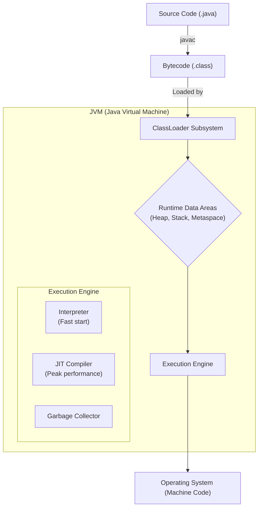
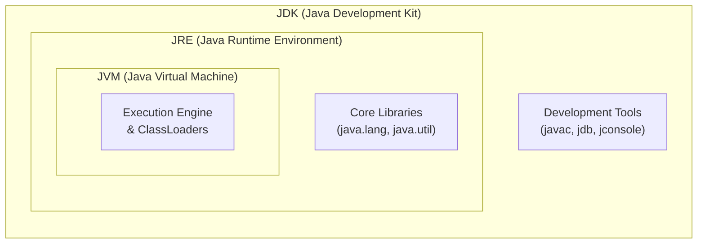

# ⚙️ 1.1 The Execution Engine (JVM Internals & Bytecode)
**★★★ Deep**

> [!TIP]
> **The 30-Second Interview Pitch**
> "Java achieves its 'Write Once, Run Anywhere' capability by acting as both a compiled and an interpreted language. The source code is compiled by the **JDK's `javac`** into platform-independent **bytecode** (`.class` files). At runtime, the **JRE** provides the **JVM** (Java Virtual Machine) which loads these classes via the **ClassLoader**. The JVM's Execution Engine then runs the code by interpreting it initially for fast startup, while simultaneously using a **JIT (Just-In-Time) Compiler** to compile 'hot' bytecode directly into native machine code for maximum performance."



## 🌉 Node.js & C++ Translation
> [!NOTE]
> **Node.js Developers:** Node's V8 engine takes JavaScript directly and JIT-compiles it to machine code on the fly. Java introduces a strict intermediate step: you *must* compile the code to `.class` bytecode first. The JVM acts similarly to V8 but operates on this strictly typed bytecode.
> **C++ Developers:** In C++, `g++` compiles source code directly into OS-specific native binaries (`.exe` or `.out`), which is why C++ is incredibly fast but platform-dependent. Java's compiler targets a *virtual machine* instead. The JVM is effectively a software-simulated CPU that translates bytecode to native code at runtime.

## 📦 1. The JDK vs JRE vs JVM Hierarchy

Understanding this nesting is fundamental for any backend engineer:



1. **JVM (Java Virtual Machine):** The abstract specification and actual engine that executes bytecode. It is platform-dependent (you download a specific JVM for Windows, Mac, or Linux).
2. **JRE (Java Runtime Environment):** The minimum physical software needed to *run* a Java application. It contains the JVM, plus core libraries (`java.lang.*`, `java.util.*`) and configuration files.
3. **JDK (Java Development Kit):** The full developer toolkit. It contains the entire JRE, plus development tools like the compiler (`javac`), debugger (`jdb`), and profiling tools (`jconsole`).

*Formula:* `JDK = JRE + Development Tools` | `JRE = JVM + Core Libraries`

## 🧠 2. Inside the JVM: The ClassLoader Subsystem
Before the JVM can run your code, it must load the `.class` files into memory. It does this dynamically at runtime using the ClassLoader Subsystem, which follows a strict hierarchy:

1. **Bootstrap ClassLoader:** Written in native C/C++. Loads the absolute core Java libraries (like `java.lang.String` and `java.util.List`).
2. **Extension ClassLoader:** Loads classes from the JDK extension directories.
3. **Application/System ClassLoader:** Loads the classes *you* wrote, finding them via your system's `CLASSPATH` environment variable.

*Note: ClassLoaders follow the **Delegation Principle**. The Application ClassLoader always asks the Extension ClassLoader first, which asks the Bootstrap ClassLoader. If the parent cannot find it, the child tries to load it.*

## ⚡ 3. Inside the JVM: The Execution Engine
Once the classes are loaded into memory, the Execution Engine takes over. This is where the magic happens.

1. **The Interpreter:** Reads the bytecode line-by-line and executes it. This is very fast to start but inherently slow for repetitive execution because it translates the same code repeatedly.
2. **The JIT (Just-In-Time) Compiler:** The JVM monitors the code being run. If a method is executed frequently (a "hot spot"), the JIT compiler steps in. It compiles that entire block of bytecode directly into native machine code. The next time that method is called, the JVM runs the native code directly, achieving speeds comparable to C++.
3. **The Profiler:** Constantly analyzes the code to find these "hot spots" for the JIT compiler.
4. **The Garbage Collector:** Runs in the background (as a daemon thread) to free up memory on the Heap.

## 🛑 4. Right vs Wrong: Execution Workflows

```java
public class App {
    public static void main(String[] args) {
        System.out.println("Running!");
    }
}
```

```bash
# ❌ ERROR: Running the launcher on an uncompiled file (Pre-Java 11)
$ java App.java // Fails. You must compile first.

# ✅ CORRECT: The standard enterprise workflow
$ javac App.java  # Compiles to App.class
$ java App        # Runs the App.class bytecode

# ✅ CORRECT: The Java 11+ Scripting Workflow
$ java App.java   # Works ONLY for single-file scripts without compiling!
```

> [!WARNING]
> The `java App.java` single-file trick introduced in Java 11 compiles the file entirely in memory and leaves no `.class` file on the hard drive. It is excellent for quick scripts, but **useless** for multi-file enterprise projects where you must use `javac` (or Maven/Gradle).

## 🎯 Common Interview Questions

**Q1: Is Java a compiled language or an interpreted language?**
It is **both**. Source code (`.java`) is strictly *compiled* into bytecode (`.class`). Then, at runtime, the JVM uses an *interpreter* to run the bytecode, while simultaneously using a *JIT compiler* to natively compile frequently executed code for maximum performance.

**Q2: How does Java achieve platform independence?**
Through Bytecode and the JVM. The `javac` compiler does not compile code for a specific operating system (like Windows or Linux); it compiles for the JVM. As long as a machine has a JVM installed for its specific OS, that JVM will understand the universal bytecode and translate it to local machine code. "Write Once, Run Anywhere."

**Q3: Explain the role of the JIT Compiler.**
The Just-In-Time compiler is an optimization engine inside the JVM. While the interpreter executes bytecode line-by-line (which is slow), the JIT compiler monitors the code to identify "hot spots" (frequently run methods). It compiles these hot spots into native machine code at runtime so subsequent calls execute at near-C++ speeds.
