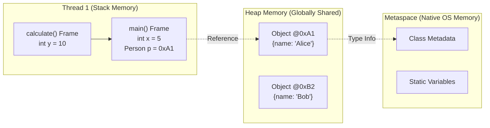

# 🧠 1.3 Memory Management Basics (Stack vs Heap)
**★★★ Deep**

> [!TIP]
> **The 30-Second Interview Pitch**
> "Java abstracts memory management away from the developer using the **Garbage Collector**, but understanding the underlying architecture is critical for performance. Memory is divided into the **Stack** (which is thread-local, operates LIFO, and stores method frames containing primitives and object references) and the **Heap** (which is globally shared across all threads and stores the actual Object instances). OutOfMemoryErrors usually occur in the Heap, while StackOverflowErrors occur in the Stack."



## 🌉 Node.js & C++ Translation
> [!NOTE]
> **Node.js Developers:** The V8 engine manages memory similarly, but Node is single-threaded (mostly). In Java, *every single thread* gets its own independent Stack, but they all share the *same* Heap. This is why shared state in the Heap causes race conditions in Java.
> **C++ Developers:** In C++, you manually allocate memory using `new` and explicitly destroy it using `delete` or `free()`. If you forget, you get a memory leak. In Java, you use `new`, but you **never** delete. The JVM's Garbage Collector automatically destroys objects when they no longer have any active references pointing to them from any Stack.

## 🥞 1. Stack Memory (The Execution Environment)
The Stack is responsible for the actual execution of your code. 

- **Thread-Local:** Every time a new thread is created, it gets its own private Stack.
- **LIFO (Last-In, First-Out):** When a method is called, a new "Frame" is pushed to the top of the stack. When the method finishes (returns), that frame is popped off and instantly destroyed.
- **What lives here:** 
  - Local Primitive Variables (`int x = 10`).
  - **References** to Objects (the actual memory address pointing to the Heap).
- **Errors:** Deep recursive method calls will exhaust this memory, throwing a `java.lang.StackOverflowError`.

## 🌍 2. Heap Memory (The Storage Environment)
The Heap is responsible for storing the actual data (objects) that your application creates.

- **Globally Shared:** There is only ONE Heap per JVM instance. All threads read and write to this shared space.
- **Dynamic Allocation:** Memory is allocated here at runtime using the `new` keyword.
- **What lives here:**
  - All Objects (e.g., `new ArrayList()`, `new String()`, `new Person()`).
  - Instance variables (even if they are primitives! If `class Person` has `int age`, that `int` lives in the Heap inside the Person object).
- **Errors:** If you create too many objects and the Garbage Collector cannot clean them up fast enough, the JVM throws a `java.lang.OutOfMemoryError: Java heap space`.

## 🗄️ 3. Metaspace (Formerly PermGen)
To be perfectly accurate, the JVM uses a third distinct memory area called **Metaspace** (which replaced PermGen in Java 8).
- It lives in native OS memory, separate from the Heap.
- **What lives here:** Class definitions (metadata), method bytecode, and **Static variables**.

## 🛑 4. Right vs Wrong: Memory Leaks in Java
Wait, Java has a Garbage Collector. Can you still have memory leaks? **YES.**

A memory leak in Java happens when you unintentionally maintain an active reference to an object you no longer need. Because a reference still points to it from a living object, the GC refuses to clean it up.

```java
// ❌ ERROR (Architectural): The classic Java Memory Leak
public class CacheManager {
    // A static map lives forever (in Metaspace/Heap). 
    // If you keep adding items but never remove them, the Heap will fill up and crash.
    private static Map<String, Object> cache = new HashMap<>();

    public void addToCache(String key, Object data) {
        cache.put(key, data); 
    }
}

// ✅ CORRECT: Use proper eviction strategies
public class CacheManager {
    // Use a WeakHashMap or a library like Caffeine that automatically evicts old entries.
    private static Map<String, Object> cache = new WeakHashMap<>();
}
```

## 🎯 Common Interview Questions

**Q1: If `int` is a primitive, why can it sometimes live on the Heap?**
Primitives live on the Stack *only if* they are local variables declared inside a method. If a primitive is an *instance variable* (a field inside a class), it lives on the Heap as part of that object's allocated memory block. 

**Q2: How does the Garbage Collector know what to delete?**
The GC uses a "Mark and Sweep" algorithm. It starts at the "GC Roots" (active threads, local variables on Stacks, and static variables). It follows every reference from those roots. Any object on the Heap that *cannot* be reached by following these references is marked as "garbage" and deleted.

**Q3: What causes a `StackOverflowError` vs an `OutOfMemoryError`?**
A `StackOverflowError` is caused by excessive method calls (usually infinite recursion), which fills up the Stack memory. An `OutOfMemoryError` is caused by creating too many Objects (or holding onto them unnecessarily) so that the globally shared Heap space fills up.
