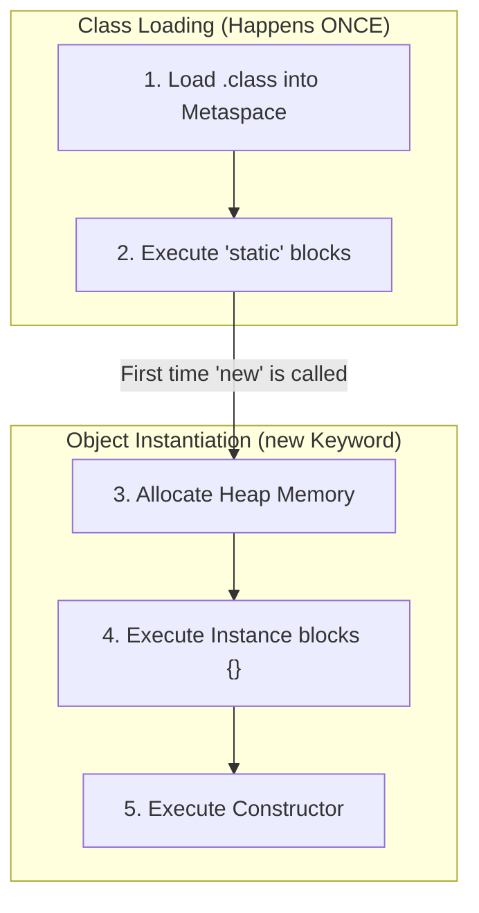

# 🏗️ 2.1 Classes, Objects & Constructors
**★★★ Deep**

> [!TIP]
> **The 30-Second Interview Pitch**
> "In Java, a Class is the strict blueprint, and an Object is the instance allocated on the Heap. The lifecycle begins with the **ClassLoader**, which triggers `static` initialization blocks once. When `new` is called, memory is allocated, instance initialization blocks run, and finally, the **Constructor** executes to set the initial state. The `this` keyword resolves naming ambiguities and enables constructor chaining (`this()`), ensuring DRY (Don't Repeat Yourself) initialization."



## 🌉 Node.js & C++ Translation
> [!NOTE]
> **Node.js Developers:** ES6 `class` syntax is just "syntactic sugar" over JavaScript's prototype chain. You can still add methods dynamically at runtime. Java is strictly class-based; once compiled, the class structure cannot be altered. 
> **C++ Developers:** In C++, you have Constructors and **Destructors** (`~MyClass()`). Java has NO destructors because memory is handled by the Garbage Collector. You do not manually free objects.

## 📐 1. The Blueprint vs The Instance
- **Class (Blueprint):** A logical construct defining state (fields) and behavior (methods). It does not consume Heap memory.
- **Object (Instance):** A physical manifestation of the class created using the `new` keyword, residing in Heap memory.

## 🏗️ 2. Constructors
A Constructor is a special block of code called when an object is instantiated.
- It MUST have the exact same name as the class.
- It MUST NOT have a return type (not even `void`).

### The Default Constructor
If you write a class with **no constructors**, the Java compiler automatically injects a hidden, empty, no-argument constructor.
*Trap:* If you write *any* constructor (e.g., one with parameters), the compiler **removes** the default one. If you still want a no-args constructor, you must explicitly write it.

```java
public class User {
    String name;

    // Parameterized Constructor
    public User(String name) {
        this.name = name;
    }
}

// ❌ ERROR: User u = new User(); // Fails! The default constructor no longer exists.
```

## 🔗 3. The `this` Keyword
The `this` keyword is a reference to the *current object* on the Heap.

**1. Resolving Ambiguity (Shadowing):**
Used when a local method parameter has the same name as an instance variable.
```java
public User(String name) {
    this.name = name; // 'this.name' is the Heap variable, 'name' is the Stack parameter
}
```

**2. Constructor Chaining (`this()`):**
Used to call one constructor from another *within the same class* to prevent duplicated code. It **must be the absolute first line** in the constructor. 
> *Why?* Java guarantees that an object is fully constructed and initialized before any logic runs on it. If you were allowed to write code *before* calling `this()` (or `super()`), that code might accidentally try to use variables that haven't actually been initialized by the constructor chain yet!
```java
public class User {
    String name;
    int age;

    public User() {
        this("Unknown", 0); // Chains to the parameterized constructor below
    }

    public User(String name, int age) {
        this.name = name;
        this.age = age;
    }
}
```

## 🔒 4. Private Constructors (and Default Access)
Generally, constructors are `public`. 
- If you make a constructor **`private`**, no other class can create an instance of it using `new`. 
- If you provide **no modifier at all** (e.g., `DatabaseConnection() {}`), it becomes **package-private**. Only classes living in the *exact same package/folder* can use `new` to instantiate it.

Why would you make a constructor private?
1. **Utility Classes:** Classes like `java.lang.Math` only contain `static` methods. They make their constructor private so nobody can accidentally type `new Math()`.
2. **The Singleton Pattern:** When you want to guarantee that exactly **one** instance of a class exists in the entire application (e.g., a Database Connection Manager).

```java
public class DatabaseConnection {
    // 1. Create the single instance internally
    private static DatabaseConnection instance = new DatabaseConnection();

    // 2. Make constructor private so nobody else can use 'new'
    private DatabaseConnection() { }

    // 3. Provide a public static method to return the single instance
    public static DatabaseConnection getInstance() {
        return instance;
    }
}
```

## ⚙️ 5. Initialization Blocks & Execution Order
Java allows you to write raw blocks of code directly inside the class body. This is a massive interview topic.

1. **Static Initialization Blocks (`static {}`):** Run **exactly once** when the class is first loaded into memory by the ClassLoader.
2. **Instance Initialization Blocks (`{}`):** Run **every time** an object is created, *before* the constructor runs.

```java
public class Database {
    // 1. Runs ONCE when the class is loaded
    static {
        System.out.println("Static Block: Loading database drivers...");
    }
    
    // 2. Runs EVERY TIME 'new' is called, BEFORE the constructor
    {
        System.out.println("Instance Block: Preparing connection...");
    }
    
    // 3. Runs LAST
    public Database() {
        System.out.println("Constructor: Connected!");
    }
}
```

### The Ultimate Initialization Order:
1. Static variables are initialized.
2. `static {}` blocks execute (Top to bottom).
3. Instance variables are initialized.
4. `{}` Instance blocks execute (Top to bottom).
5. Constructor executes.

## 🛑 6. Right vs Wrong: Constructor Typos

```java
public class Server {
    String status;

    // ❌ ERROR: This is NOT a constructor! It has a 'void' return type.
    // It is just a normal method that happens to be named 'Server'.
    public void Server() {
        this.status = "Running";
    }
}

// ✅ CORRECT: No return type.
public class Server {
    public Server() {
        this.status = "Running";
    }
}
```

## 🎯 Common Interview Questions

**Q1: What happens if you define a constructor but also need a no-arguments constructor?**
If you define *any* constructor, the compiler does not provide the default no-args constructor. You must explicitly type out a no-args constructor if your application (or a framework like Hibernate/Spring) requires it.

**Q2: Can you use `this()` and `super()` in the same constructor?**
No. Both `this()` (constructor chaining) and `super()` (parent constructor call) mandate that they must be the **first line** of the constructor. Therefore, they are mutually exclusive.

**Q3: What is the exact execution order of static blocks, instance blocks, and constructors?**
When a class is loaded, all `static` variables and `static {}` blocks run once. When `new` is called, instance variables are initialized, then `{}` instance blocks run, and finally, the constructor runs.
