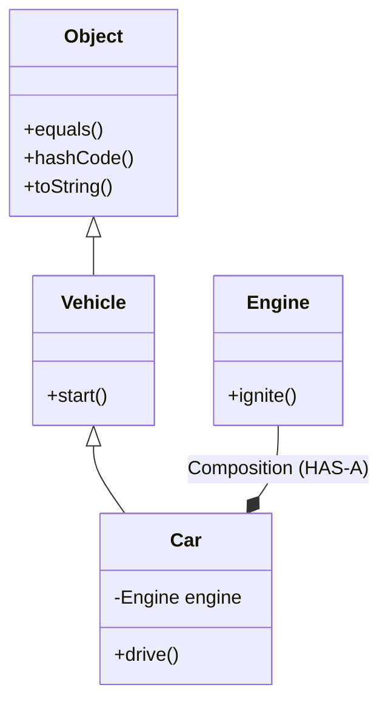

# 🧬 2.3 Inheritance Deep Dive (Extends, Super & The Object Class)
**★★★ Deep**

> [!TIP]
> **The 30-Second Interview Pitch**
> "Inheritance allows a child class to inherit the state and behavior of a parent class, establishing an **'IS-A'** relationship using the `extends` keyword. To prevent the 'Diamond Problem', Java strictly enforces **Single Class Inheritance**. Internally, the child uses the `super` keyword to access parent members or chain parent constructors. Furthermore, every single class in Java implicitly sits beneath the master `java.lang.Object` class in the inheritance tree."



## 🌉 Node.js & C++ Translation
> [!NOTE]
> **Node.js Developers:** JavaScript utilizes Prototypal Inheritance (`__proto__`). When you look for a method, JS walks up the prototype chain. Java is similar conceptually but rigidly verified at compile-time.
> **C++ Developers:** C++ allows **Multiple Inheritance** (`class Car : public Vehicle, public Machine`). Java completely forbids this for classes. A Java class can only `extends` ONE parent class to prevent ambiguity (the Diamond Problem). Multiple inheritance in Java is achieved via Interfaces, not classes.

## 🧬 1. The Mechanics of `extends`
Inheritance allows code reuse and establishes a strict hierarchy.

- The Child (Subclass) inherits all non-private fields and methods from the Parent (Superclass).
- **Rule:** A class can only extend ONE class.

```java
public class Vehicle {
    protected int speed = 0;
    public void start() { System.out.println("Starting..."); }
}

public class Car extends Vehicle {
    public void drive() {
        speed = 60; // Has direct access to 'protected' fields of the parent
        start();    // Can call parent methods directly
    }
}
```

## ⬆️ 2. The `super` Keyword
The `super` keyword refers directly to the parent class object. It is used in two primary ways:

### 1. Accessing Parent Members
If the child class shadows a parent variable or overrides a method, you can use `super` to bypass the child and hit the parent directly.
```java
public class Car extends Vehicle {
    @Override
    public void start() {
        super.start(); // Calls Vehicle's start()
        System.out.println("Vroom!");
    }
}
```

### 2. Constructor Chaining (`super()`)
Just like `this()`, `super()` must be the **absolute first line** of a constructor.
- If you don't write it, the Java compiler silently inserts a hidden `super();` (a call to the parent's no-args constructor) on the first line.
- If the parent class *only* has a parameterized constructor, you MUST explicitly write `super(args)` on the first line, or your child class will not compile.

## 👑 3. The `java.lang.Object` Class
If a class doesn't explicitly `extends` anything, Java automatically injects `extends Object`. **Every class in Java is a descendant of `Object`.**

Because of this, every single class automatically inherits these crucial methods:
1. `toString()`: Returns the string representation. (Override this to print meaningful data instead of memory hashes).
2. `equals(Object obj)`: Compares memory addresses by default. (Override this to compare actual data values).
3. `hashCode()`: Returns an integer hash. (Must be overridden if `equals()` is overridden).

> [!WARNING]
> **The `equals` and `hashCode` Contract**
> Why must they be overridden together? Hash-based collections (like `HashMap` or `HashSet`) use `hashCode()` to decide which memory "bucket" to place an object in. 
> If you override `equals()` to say two `User` objects with the same ID are "equal", but you *forget* to override `hashCode()`, they will generate different hashes (based on their default memory addresses). The `HashMap` will place them in different buckets. You will end up with duplicate "equal" users in a `HashSet`, or you will completely fail to retrieve your data from a `HashMap`!

## 👻 4. Method Hiding (Static Inheritance)
Can you inherit and override `static` methods? **No.**
Static methods belong to the *Class*, not the *Object*. 
If a child class writes a static method with the exact same signature as the parent's static method, it does not override it; it **hides** it. This means the method executed depends strictly on the *reference type* at compile-time, not the actual object at runtime.

## 🛑 5. Right vs Wrong: Inheritance vs Composition
A massive interview topic is "Composition over Inheritance".
- **Inheritance (IS-A):** Use only when the child *is truly a specific type* of the parent.
- **Composition (HAS-A):** Use when a class *needs the functionality* of another class.

```java
// ❌ ERROR (Architectural): The Fragile Base Class
class Engine {
    public void ignite() {}
}
class Car extends Engine { } // WRONG! A Car IS NOT an Engine. 

// ✅ CORRECT: Composition
class Car {
    private Engine engine; // RIGHT! A Car HAS-A Engine.
    
    public void startCar() {
        this.engine.ignite();
    }
}
```

## 🎯 Common Interview Questions

**Q1: Why doesn't Java support multiple inheritance for classes?**
To prevent the **Diamond Problem**. If `Class B` and `Class C` both inherit from `Class A` and override a method `print()`, and `Class D` inherits from both `B` and `C`, the compiler wouldn't know which `print()` implementation `Class D` should use.

**Q2: Does a subclass inherit the private members of its superclass?**
No. Private members are strictly bound to the class they are declared in. However, the subclass object *contains* that private data in memory (since the superclass constructor ran to build the base of the object), it just cannot access it directly. It must use public/protected getters/setters.

**Q3: Explain "Composition over Inheritance".**
Inheritance tightly couples classes together (if the parent changes, all children are affected). Composition loosely couples classes by passing instances (HAS-A) rather than inheriting behavior (IS-A). It leads to much more flexible, testable, and maintainable code architectures.
