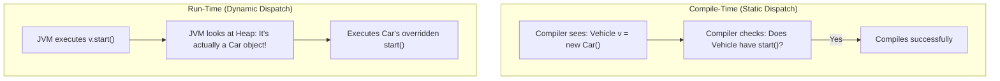

# 🎭 2.4 Polymorphism & Method Dispatch
**★★★ Deep**

> [!TIP]
> **The 30-Second Interview Pitch**
> "Polymorphism means 'many forms'. Java implements this in two distinct phases. **Compile-Time Polymorphism** is achieved via **Method Overloading**, where methods share the same name but have different parameter signatures. **Run-Time Polymorphism** is achieved via **Method Overriding**, where a child class replaces the implementation of a parent's method. Java relies on **Dynamic Method Dispatch** to look at the actual Object on the Heap at runtime to decide which overridden method to execute, regardless of the reference type on the Stack."



## 🌉 Node.js & C++ Translation
> [!NOTE]
> **Node.js Developers:** JavaScript does not support Method Overloading. If you write two functions with the same name, the second one simply overwrites the first. In Java, as long as the parameters differ, you can have 50 methods named `print()`.
> **C++ Developers:** In C++, methods are NOT polymorphic by default; you must explicitly use the `virtual` keyword to enable Run-Time polymorphism. **In Java, all non-static, non-final methods are inherently `virtual` by default.**

## 🛠️ 1. Compile-Time Polymorphism (Overloading)
**Overloading** happens in the same class. Methods share the exact same name, but have a **different parameter signature**.
The compiler decides which method to call based on the arguments you pass at compile-time.

**Rules for Overloading:**
1. The number, type, or order of parameters MUST be different.
2. You CANNOT overload a method by *only* changing its return type (the compiler wouldn't know which one you meant to call if you didn't assign the result to a variable).

```java
public class Printer {
    public void print(String text) { ... }
    public void print(int number) { ... }
    public void print(String text, int count) { ... }
}
```

## 🏃 2. Run-Time Polymorphism (Overriding)
**Overriding** happens between a Parent and a Child class. The child provides a specific implementation for a method already provided by its parent.

**Rules for Overriding:**
1. The method signature (Name + Parameters) must be **exactly the same**.
2. Always use the `@Override` annotation. It forces the compiler to verify that you are actually overriding something (preventing spelling typos).
3. The access modifier cannot be *more restrictive* than the parent. (If parent is `protected`, child can be `protected` or `public`, but NOT `private`).

## 🧠 3. Dynamic Method Dispatch (The Core of OOP)
> **The Perfect Interview Answer:** "Dynamic Method Dispatch is the mechanism by which a call to an overridden method is resolved at *Run-Time* rather than *Compile-Time*. When a Parent reference holds a Child object, the compiler only verifies that the method exists in the Parent. However, at runtime, the JVM dynamically dispatches the call to the actual Child object's overridden implementation on the Heap."

To trigger this, you first use **Upcasting** (using a Parent Reference Type to hold a Child Object):
```java
Vehicle myVehicle = new Car(); // Upcasting
```
- **At Compile-Time (Static Check):** The compiler looks at the *Reference Type* (`Vehicle`). It verifies that `Vehicle` actually has the method you are trying to call. If it doesn't, it throws an error.
- **At Run-Time (Dynamic Dispatch):** The JVM looks at the *Object Type* (`Car` on the Heap). If `Car` has overridden the method, the JVM ignores the Parent's code and executes the `Car`'s version.

```java
Vehicle v = new Car();
v.start(); // Compiler statically checks Vehicle. JVM dynamically dispatches to Car's version.

// v.turnOnRadio(); // ❌ COMPILE ERROR: The compiler only looks at 'Vehicle', which has no radio!
```

## 🧬 4. Covariant Return Types
When you override a method, you are allowed to change the return type—**but only if the new return type is a subclass of the original return type.**

```java
class AnimalFactory {
    public Animal create() { return new Animal(); }
}

class DogFactory extends AnimalFactory {
    @Override
    public Dog create() { return new Dog(); } // VALID! Dog is a subclass of Animal.
}
```

## 🛑 5. Right vs Wrong: Overloading Pitfalls

```java
// ❌ ERROR: Changing only the return type is invalid.
public int calculate() { return 5; }
public double calculate() { return 5.5; } // Compiler error!
```
**Why does this fail?** 
In Java, you are allowed to call a method and *ignore* its return value. 
Imagine someone writes this line of code: `calculate();` 
Because there are no arguments provided, the compiler has absolutely no idea if you meant to call the `int` version or the `double` version. Since the compiler cannot guarantee which method to execute, it bans this outright.

```java
// ✅ CORRECT: Changing the parameters is valid.
public int calculate(int x) { return x; }
public double calculate(double x) { return x; }
```

## 🎯 Common Interview Questions

**Q1: What is the difference between Overloading and Overriding?**
Overloading occurs at compile-time within the same class using different parameters. Overriding occurs at run-time between parent and child classes using the exact same signature.

**Q2: Can you override a `private` or `static` method?**
No. `private` methods are completely invisible to the child class. `static` methods belong to the class, not the instance. If a child defines a static method with the same signature, it *hides* the parent's method, but it does not override it (it will not participate in Dynamic Method Dispatch).

**Q3: What happens if a Parent throws an Exception, does the overridden Child method have to throw it?**
If a parent method throws a *Checked Exception*, the overriding child method can choose to throw the same exception, a *subclass* of that exception, or throw *no exception* at all. However, the child CANNOT throw a new or broader checked exception that the parent didn't declare.
