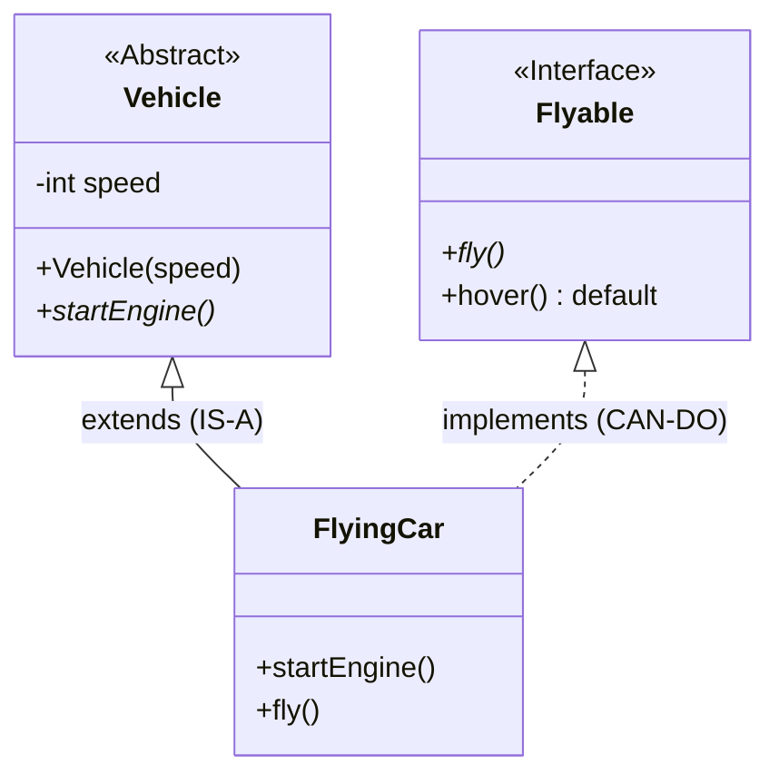

# 📜 2.5 Abstract Classes vs Interfaces (Java 8+)
**★★★ Deep**

> [!TIP]
> **The 30-Second Interview Pitch**
> "An **Abstract Class** establishes a strong 'IS-A' relationship, providing a partial blueprint with shared mutable state, constructors, and behavior for closely related classes. An **Interface** establishes a 'CAN-DO' contract, defining capabilities across completely unrelated classes. While Java 8 blurred the lines by adding `default` methods to interfaces, the core difference remains: Interfaces support multiple inheritance but **cannot** hold instance state, whereas Abstract Classes hold state but restrict you to single inheritance."



## 🌉 Node.js & C++ Translation
> [!NOTE]
> **Node.js (TypeScript) Developers:** In TypeScript, `interface` is purely a compile-time construct that disappears in the final JavaScript. In Java, interfaces exist at runtime and can even contain actual executable code (via `default` methods).
> **C++ Developers:** C++ doesn't have an `interface` keyword. You achieve it by creating an abstract class where every method is a "pure virtual function" (e.g., `virtual void doWork() = 0;`). Java treats them as two fundamentally different language constructs.

## 🧩 1. Abstract Classes (The Partial Blueprint)
Used when classes are closely related and share a common foundation.

- **Cannot be instantiated:** You cannot do `new Vehicle()`.
- **Can have state:** Can contain instance variables (e.g., `protected int speed;`).
- **Can have constructors:** To initialize the shared state (called via `super()` in the child).
- **Abstract Methods:** Methods declared with `abstract` have no body and *must* be implemented by the first concrete child class.

```java
public abstract class Vehicle {
    protected int fuel; // State!

    public Vehicle(int fuel) { this.fuel = fuel; }

    public abstract void drive(); // Must be implemented by child
    
    public void refuel() { fuel = 100; } // Shared concrete behavior
}
```

## 📜 2. Interfaces (The Contract)
Used to define what an object can *do*, even if the objects are completely unrelated (e.g., a `Bird` and an `Airplane` both implement `Flyable`).

- **Implicit Modifiers:** All fields are implicitly `public static final` (constants). All standard methods are implicitly `public abstract`.
- **No State:** Interfaces cannot hold instance variables.
- **No Constructors:** Interfaces cannot be instantiated and have no constructors.

```java
public interface Flyable {
    int MAX_ALTITUDE = 10000; // Implicitly public static final

    void fly(); // Implicitly public abstract
}
```

## 🚀 3. The Java 8 Revolution (`default` methods)
Historically, if you added a new method to a popular interface (like Java's `List`), it would instantly break the code of millions of developers who implemented that interface, because they wouldn't have the new method implemented.

**Java 8 solved this by introducing `default` methods.**
You can now provide a concrete implementation directly inside the interface!

```java
public interface Drivable {
    void drive(); // Standard abstract method

    // A concrete method inside an interface!
    default void honk() {
        System.out.println("Beep beep!");
    }
}
```

## 🔀 4. Multiple Inheritance & The Diamond Problem
Java strictly bans extending multiple classes, but **allows implementing multiple interfaces**.
But wait! What if you implement two interfaces that both have the *same* `default` method? This brings back the Diamond Problem!

**Java's Solution:** The compiler will crash and **force** the child class to override the conflicting method and manually resolve the ambiguity.

```java
interface Drone { default void fly() { System.out.println("Drone flying"); } }
interface Bird { default void fly() { System.out.println("Bird flying"); } }

public class RobotBird implements Drone, Bird {
    @Override
    public void fly() {
        // Manually resolving the conflict!
        Drone.super.fly(); 
    }
}
```

## ⚖️ 5. The Ultimate Comparison Table

| Feature | Abstract Class | Interface |
| :--- | :--- | :--- |
| **Inheritance** | Single (extends 1 class) | Multiple (implements many) |
| **Instance State (Fields)** | ✅ Yes (can have normal variables) | ❌ No (only `public static final` constants) |
| **Constructors** | ✅ Yes | ❌ No |
| **Relationship Type** | Strong "IS-A" | Loose "CAN-DO" / Contract |
| **Default Access** | Can be `protected`, `default`, etc. | Everything is strictly `public` |

## 🛑 6. Right vs Wrong: Interface State

```java
// ❌ ERROR (Architectural): Trying to add mutable state to an Interface
public interface User {
    private int age = 0; // Compiler Error! Cannot have instance state.
}

// ✅ CORRECT: If it needs state, it must be an Abstract Class.
public abstract class User {
    protected int age = 0; 
}
```

## 🎯 Common Interview Questions

**Q1: Since Java 8 allows `default` methods in interfaces, why do we still need Abstract Classes?**
The main difference is **State**. Interfaces can execute code via `default` methods, but they **cannot hold instance variables** (mutable state) or have constructors. If your design requires shared mutable state (like a base `DatabaseConnection` class holding a connection string variable), you *must* use an Abstract Class.

**Q2: Can an Abstract class have a constructor if it can't be instantiated?**
Yes. Even though you cannot call `new` on an abstract class, its constructor is executed via `super()` from the child class's constructor to initialize the shared state (instance variables) located in the abstract parent.

**Q3: What happens if a class implements an interface but doesn't implement all of its methods?**
The compiler will force the class to either implement all the missing abstract methods, or the class itself must be declared `abstract`.
