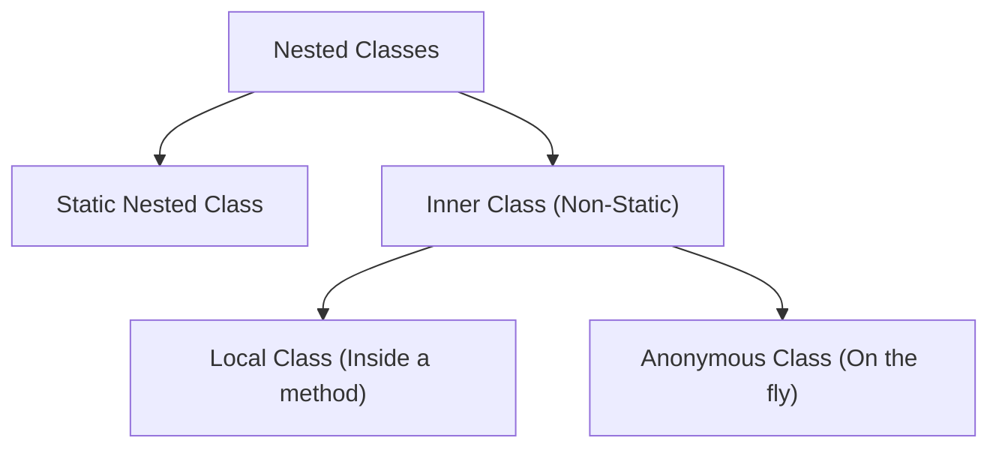

# 🪆 2.6 Advanced Class Types (Inner, Anonymous & Enums)
**★★ Medium**

> [!TIP]
> **The 30-Second Interview Pitch**
> "Java provides nested classes to logically group code that is only used in one place, increasing encapsulation. **Static Nested Classes** act like normal top-level classes, while **Non-Static Inner Classes** are physically bound to a specific instance of the outer class, allowing them to access its private members. **Anonymous Classes** allow us to implement an interface on the fly without creating a dedicated file. Finally, Java **Enums** are extremely powerful—they are full-fledged classes that can have their own fields, methods, and constructors."



## 🌉 Node.js & C++ Translation
> [!NOTE]
> **Node.js Developers:** TypeScript has Enums, but they compile down to simple JavaScript objects. Java Enums are actual classes—they can have complex logic, constructors, and even implement interfaces! Anonymous classes in Java operate somewhat similarly to passing an inline closure or callback function in Node.
> **C++ Developers:** Java's Static Nested Class is exactly like a C++ Nested Class. Java's Non-Static Inner Class is different—it automatically contains a hidden reference pointer to the specific instance of the Outer Class that created it.

## 🪆 1. Static Nested vs Non-Static Inner Classes

### Static Nested Class
Used to group related utilities together. It does **not** have access to the outer class's instance variables.
```java
public class LinkedList {
    // Static: It doesn't need a specific LinkedList instance to exist.
    public static class Node {
        int data;
        Node next;
    }
}
// Instantiation:
LinkedList.Node n = new LinkedList.Node();
```

### Non-Static Inner Class
Used when the nested class *requires* deep access to the outer class's state.
```java
public class Car {
    private boolean engineRunning = false;

    // Non-Static: Bound to a specific Car instance!
    public class Engine {
        public void start() {
            engineRunning = true; // Has direct access to outer class private fields!
        }
    }
}
// Instantiation (Requires an outer object first!):
Car myCar = new Car();
Car.Engine myEngine = myCar.new Engine(); // Notice the strange 'new' syntax
```
*Trap:* Because Non-Static Inner Classes hold a hidden reference to the outer class, they can easily cause **Memory Leaks** in Android or long-running applications if the inner class object is passed around and outlives the outer class object.

## 👻 2. Anonymous Classes
An anonymous class is a one-time use class without a name. It is primarily used to implement an interface on the fly (often used before Java 8 Lambdas were introduced).

```java
public interface ButtonClickListener {
    void onClick();
}

public class UI {
    public void setup() {
        // Creating an anonymous class that implements ButtonClickListener right here!
        ButtonClickListener btn = new ButtonClickListener() {
            @Override
            public void onClick() {
                System.out.println("Button was clicked!");
            }
        };
    }
}
```

## 🚦 3. Java Enums (Enums on Steroids)
In C or early languages, an Enum is just a wrapper for integer constants (`0, 1, 2`).
In Java, an Enum is a **full-fledged Class**. You can give it properties, constructors, and methods.

```java
public enum CoffeeSize {
    // These are actually calls to the private constructor!
    SMALL(250), 
    MEDIUM(350), 
    LARGE(500);

    // Enums can have fields
    private final int milliliters;

    // Enums can have constructors (Must be private/package-private)
    CoffeeSize(int milliliters) {
        this.milliliters = milliliters;
    }

    // Enums can have methods
    public int getMilliliters() {
        return this.milliliters;
    }
}
```

> [!NOTE]
> **What is `SMALL(250)` actually doing?**
> In C++ or JavaScript, an enum is just a label for an integer (`SMALL = 0`). But in Java, an Enum is a full class. Behind the scenes, the JVM translates `SMALL(250)` into something like this:
> `public static final CoffeeSize SMALL = new CoffeeSize(250);`
> It is literally calling the private constructor and creating a singleton object in memory for each size!

## 🛑 4. Right vs Wrong: Memory Leaks

```java
// ❌ ERROR (Architectural): Using a Non-Static Inner Class unnecessarily
public class Outer {
    private byte[] massiveData = new byte[10000000];

    // Because this is non-static, every Helper object secretly holds a 
    // reference to Outer, preventing 'massiveData' from being garbage collected!
    public class Helper { } 
}

// ✅ CORRECT: Use Static Nested Classes by default if outer access isn't needed.
public class Outer {
    public static class Helper { } 
}
```

## 🎯 Common Interview Questions

**Q1: What is the difference between a Static Nested Class and an Inner Class?**
A Static Nested Class does not have a reference to the outer class and cannot access its non-static fields. An Inner Class (non-static) holds a hidden reference to the outer class instance that created it, allowing it to read and mutate the outer class's private fields.

**Q2: Can an Enum be instantiated using the `new` keyword?**
No. Enums are implicitly `final` and their instances are created entirely by the JVM at class loading time. They are inherently singleton-safe.

**Q3: When should you use an Anonymous Class?**
When you need to quickly implement an interface or extend a class for a single, one-off use case (like an Event Listener), and creating a completely separate `.java` file would be overkill. (Note: For single-method interfaces, Lambdas are now preferred).
