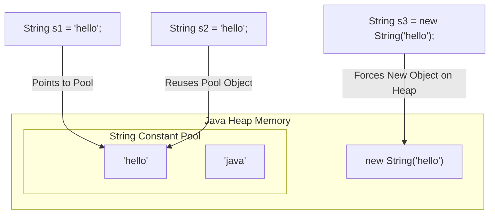

# 🧵 3.1 Deep String Manipulation (The String Pool)
**★★★ Deep**

> [!TIP]
> **The 30-Second Interview Pitch**
> "In Java, `String` is not a primitive; it is a full Object. More importantly, it is strictly **immutable**—once created, its data cannot be changed. This immutability guarantees thread-safety and allows the JVM to heavily optimize memory by caching string literals in a special Heap area called the **String Constant Pool** (Intern Pool). Because modifying a String actually creates a brand new object, frequent modifications (like in a loop) must use `StringBuilder` (fast, single-threaded) or `StringBuffer` (thread-safe) to avoid memory exhaustion."



## 🌉 Node.js & C++ Translation
> [!NOTE]
> **Node.js Developers:** V8 actually handles strings very similarly to Java (they are immutable and automatically interned/deduplicated to save memory). However, JS handles string concatenation (`+`) efficiently under the hood. In older Java versions, doing `+` in a loop was a massive performance killer.
> **C++ Developers:** `std::string` is mutable. You can change character `[0]` directly in memory. In Java, you CANNOT change a String's characters. You must create a new String or use a `StringBuilder`.

## 🔒 1. Why are Strings Immutable?
Under the hood, a Java 9+ String is backed by a `private final byte[]` (previously `char[]`). 
Why did Java's creators force strings to be immutable?

1. **Security:** Strings are used for database URLs, network connections, and file paths. If a string was mutable, a malicious thread could change the file path *after* security validation but *before* the file was opened.
2. **Thread Safety:** Because the internal byte array can never change, Strings are inherently thread-safe. You can share them across 1,000 threads without any synchronization blocks.
3. **Caching (The Pool):** If strings could change, the JVM couldn't safely cache and reuse them (modifying one reference would accidentally modify every other variable sharing that string in the pool!).

## 🏊 2. The String Constant Pool (Interning)
The **String Pool** is a special cache inside the Heap.

When you create a String using a **Literal** (e.g., `"hello"`), the JVM checks the Pool:
- If `"hello"` already exists, it returns a reference to the existing object.
- If it doesn't exist, it creates it in the Pool.

When you create a String using the **`new` keyword**, you explicitly tell the JVM to bypass the Pool and force a brand new object onto the main Heap.

```java
String s1 = "Java";          // Goes to Pool
String s2 = "Java";          // Reuses object from Pool (s1 == s2 is TRUE)

String s3 = new String("Java"); // Forces new object on Heap (s1 == s3 is FALSE)

// You can manually push a Heap string into the Pool:
String s4 = s3.intern();     // s1 == s4 is TRUE
```

## ⚖️ 3. `==` vs `.equals()` (The Classic Trap)
Because of the String Pool, comparing strings is the #1 most failed interview question for juniors.

- **`==`**: Compares the **Memory Address** (Are these the exact same object in RAM?).
- **`.equals()`**: Compares the **Actual Text Content**.

*Rule of Thumb:* **ALWAYS** use `.equals()` to compare strings in Java. Never use `==` unless you are explicitly testing memory optimization.

## 🏗️ 4. `StringBuilder` vs `StringBuffer`
Because Strings are immutable, doing `str = str + "a"` creates a *brand new String object* in memory and orphans the old one. If you do this in a loop 10,000 times, you will flood the Heap with 10,000 garbage objects and trigger a massive Garbage Collection pause.

If you need to mutate text, use a builder class. These classes hold a mutable array under the hood.

| Feature | `StringBuilder` | `StringBuffer` |
| :--- | :--- | :--- |
| **Introduced** | Java 1.5 | Java 1.0 |
| **Thread-Safe?** | ❌ No (Not synchronized) | ✅ Yes (All methods are `synchronized`) |
| **Performance** | 🚀 **Extremely Fast** | 🐢 Slow (Due to thread-locking overhead) |
| **When to use?** | 99% of the time. | Only if multiple threads are mutating the *same* string. |

## 🛑 5. Right vs Wrong: Loops

```java
// ❌ ERROR (Performance): Flooding the Heap with garbage objects
String result = "";
for (int i = 0; i < 10000; i++) {
    result += i; // Creates 10,000 new String objects!
}

// ✅ CORRECT: Using StringBuilder for mutations
StringBuilder sb = new StringBuilder();
for (int i = 0; i < 10000; i++) {
    sb.append(i); // Modifies the same internal array
}
String result = sb.toString(); // Creates exactly ONE string at the end.
```

## 🎯 Common Interview Questions

**Q1: Why is a String strictly immutable?**
To guarantee Security (database connections, file paths), ensure inherent Thread-Safety, and allow the JVM to aggressively optimize memory via the String Constant Pool.

**Q2: What is the difference between `StringBuilder` and `StringBuffer`?**
`StringBuffer` is thread-safe because its methods are `synchronized`, but this makes it slow. `StringBuilder` is not thread-safe, making it significantly faster and the preferred choice for 99% of single-threaded string manipulations.

**Q3: What does the `intern()` method do?**
It takes a String that is currently sitting on the main Heap (created via `new String()`) and checks the String Pool. If an equal string exists in the pool, it returns the pool's reference. If not, it moves the string into the pool.
