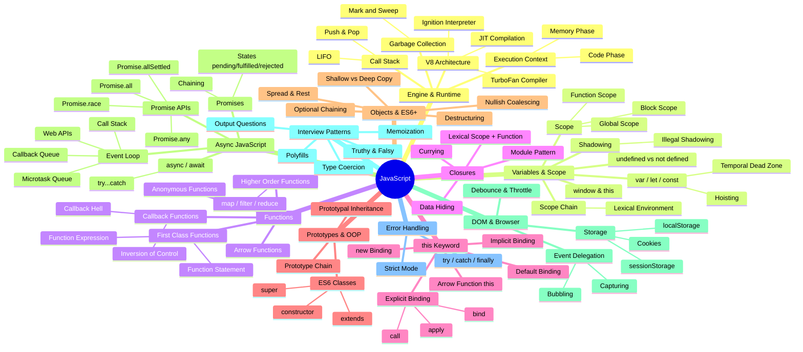

# 🗺️ JavaScript — The Complete Mind Map

This is your master navigation hub. Every concept below is covered in a dedicated note. Use this map to understand how all JavaScript concepts connect to each other!

---

## 📂 Section Index

| # | Section | Topics | Notes |
|:--|:--------|:-------|:------|
| 01 | **Basics** | Execution Context, Call Stack, Hoisting, `window` & `this`, `undefined` vs `not defined` | Universal |
| 02 | **Scope** | Scope Chain, Lexical Environment, `let`/`const`/TDZ, Block Scope, Shadowing | Universal |
| 03 | **Closures** | Closures Basics, Data Hiding, Module Pattern, Currying, `var` Loop Bug | Universal |
| 04 | **Functions** | First-Class Functions, Callbacks, Higher-Order Functions, `map`/`filter`/`reduce` | Universal |
| 05 | **Async** | Event Loop, V8 Architecture, Promises, `async`/`await`, Promise APIs | Universal |
| 06 | **`this` Keyword** | Binding Rules, `call`/`apply`/`bind` | Universal |
| 07 | **Prototypes** | Prototype Chain, Prototypal Inheritance, ES6 Classes | Universal |
| 08 | **Objects & ES6+** | Shallow/Deep Copy, Destructuring, Spread/Rest, Optional Chaining | Universal |
| 09 | **DOM & Browser** | Event Delegation, Debounce/Throttle, Storage & Cookies | ⚠️ Browser-specific (skip if Node.js only) |
| 10 | **Interview Patterns** | Currying, Polyfills, Type Coercion, Event Loop Output Questions, Memoization | Universal |
| 11 | **Error Handling** | `try`/`catch`/`finally`, Strict Mode | Universal |

> **💡 Note:** Section 09 (DOM & Browser) is specifically for browser-based JavaScript. If you only work with Node.js, feel free to skip it entirely — all other sections are runtime-agnostic!
