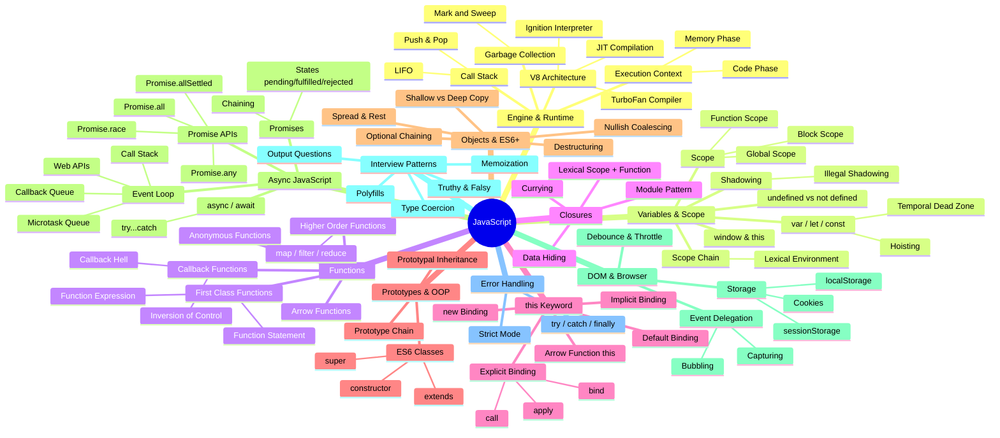

# 🗺️ JavaScript — The Complete Mind Map

This is your master navigation hub. Every concept below is covered in a dedicated note. Use this map to understand how all JavaScript concepts connect to each other!

---

## 📂 Section Index\n\n### ⚙️ 1. Core Mechanics\n| Section | Topics | Notes |\n|:--------|:-------|:------|\n| **01-basics** | Execution Context, Call Stack, Hoisting, `window` & `this`, `undefined` vs `not defined` | Universal |\n| **02-scope** | Scope Chain, Lexical Environment, `let`/`const`/TDZ, Block Scope, Shadowing | Universal |\n| **03-error-handling** | `try`/`catch`/`finally`, Strict Mode | Universal |\n\n### 🧩 2. Functional Programming\n| Section | Topics | Notes |\n|:--------|:-------|:------|\n| **01-functions** | First-Class Functions, Callbacks, Higher-Order Functions, `map`/`filter`/`reduce` | Universal |\n| **02-closures** | Closures Basics, Data Hiding, Module Pattern, Currying, `var` Loop Bug | Universal |\n\n### 📦 3. Object-Oriented Programming\n| Section | Topics | Notes |\n|:--------|:-------|:------|\n| **01-this-keyword** | Binding Rules, `call`/`apply`/`bind` | Universal |\n| **02-objects-and-es6** | Shallow/Deep Copy, Destructuring, Spread/Rest, Optional Chaining | Universal |\n| **03-prototypes** | Prototype Chain, Prototypal Inheritance, ES6 Classes | Universal |\n\n### ⏳ 4. Asynchronous JavaScript\n| Section | Topics | Notes |\n|:--------|:-------|:------|\n| **01-async** | Event Loop, V8 Architecture, Promises, `async`/`await`, Promise APIs | Universal |\n\n### 🌐 5. Web APIs\n| Section | Topics | Notes |\n|:--------|:-------|:------|\n| **01-dom-and-browser** | Event Delegation, Debounce/Throttle, Storage & Cookies | ⚠️ Browser-specific (skip if Node.js only) |\n\n### 🎓 6. Interview Prep\n| Section | Topics | Notes |\n|:--------|:-------|:------|\n| **01-interview-patterns** | Currying, Polyfills, Type Coercion, Event Loop Output Questions, Memoization | Universal |\n\n> **💡 Note:** Section `01-dom-and-browser` in the Web APIs tier is specifically for browser-based JavaScript. If you only work with Node.js, feel free to skip it entirely — all other sections are runtime-agnostic!\n