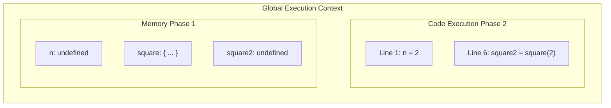
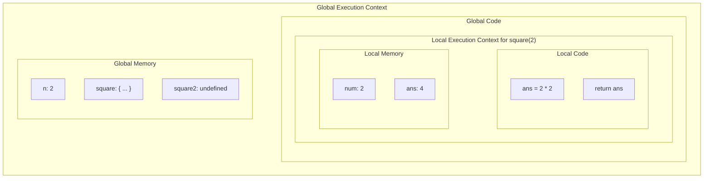
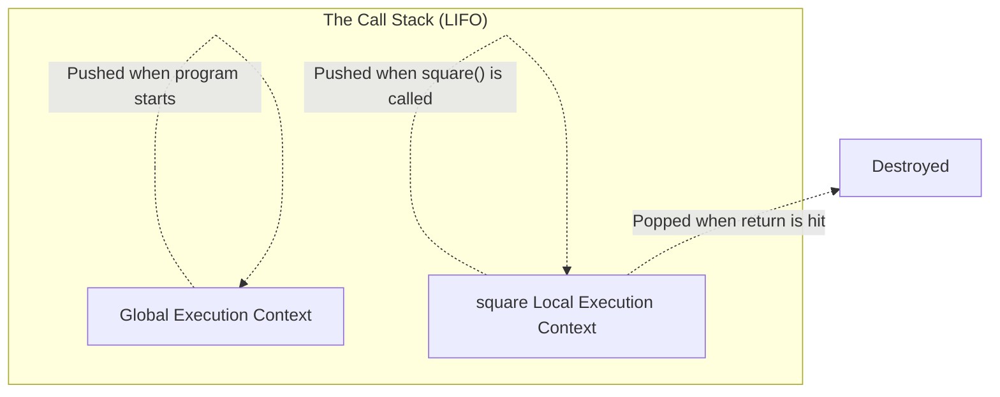

# 🧠 Execution Context & Call Stack

Everything in JavaScript happens inside an **Execution Context**. Think of it as a massive box where your code is evaluated and executed.

Imagine this simple code:
```javascript
var n = 2;
function square(num) {
    var ans = num * num;
    return ans;
}
var square2 = square(n);
```

When you run this code, an Execution Context is created. It has two distinct parts: **Memory** and **Code**.



## 📦 1. The Two Phases of Execution
When JavaScript runs, the Global Execution Context (GEC) is created in two phases:

### 🧠 Phase 1: Memory Creation
- JS skims through the code line by line.
- It finds `var n`, allocates memory, and assigns it `undefined`.
- It finds `function square`, and stores the *entire function code* in memory.
- It finds `var square2`, allocates memory, and assigns it `undefined`.
- *No code is actually run yet!*

### ⚡ Phase 2: Code Execution
- JS runs the code again, line by line.
- `n` is assigned the actual value of `2`.
- It skips the function declaration.
- On line 6, it sees `square(n)`. This is a function invocation!

---

## 🏗️ 2. Local Execution Contexts
Whenever a function is invoked (called), a brand new **Local Execution Context** is created *inside* the global one!



Once `return ans` happens, the Local Execution Context is completely **deleted**, and the value `4` is passed back to the Global Execution Context and assigned to `square2`.

---

## 🥞 3. The Call Stack

With all these Execution Contexts being created and deleted, how does JavaScript keep track? **The Call Stack**.



- 📥 It operates on the **LIFO (Last In, First Out)** principle.
- 🌍 The **Global Execution Context** is pushed to the bottom of the stack the moment the program starts.
- 📦 Whenever a function is invoked, its Execution Context is pushed to the top of the stack.
- 🗑️ When the function finishes executing, its context is popped off the stack.
- 🛑 When the whole program finishes, the GEC is popped off, and the Call Stack is empty!
