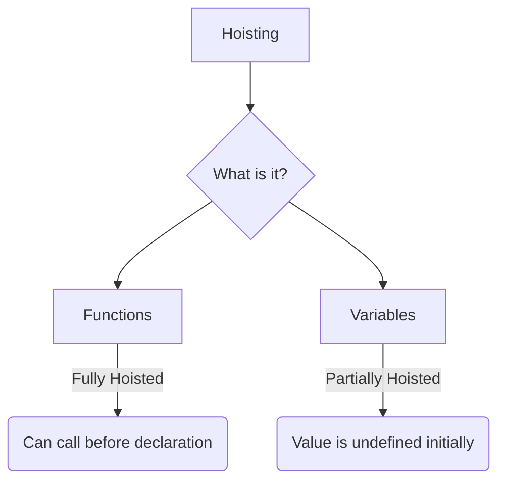
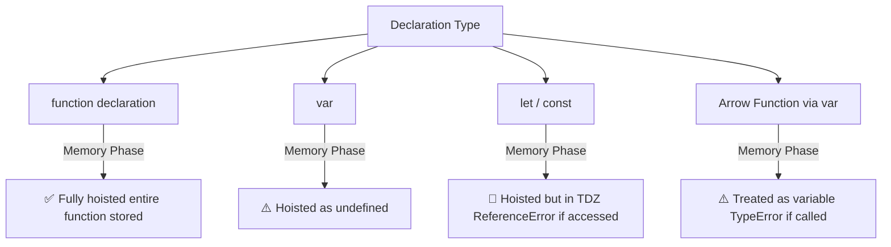

# 🎈 Hoisting in JavaScript

Hoisting is a phenomenon in JavaScript where you can access variables and functions **before** you've actually initialized them in the code.



## 🤔 How does it work?
Remember the two phases of the Execution Context?
In **Phase 1 (Memory Creation)**, JavaScript scans the code and allocates memory for variables and functions *before* executing a single line of code.

### 📝 1. Variable Hoisting
- Variables declared with `var` are allocated memory and initialized with `undefined`.
- If you try to print them before they are declared, they won't throw an error; they will just print `undefined`.

```javascript
console.log(x); // Output: undefined
var x = 7;
console.log(x); // Output: 7
```

### ⚙️ 2. Function Hoisting
- Regular function declarations are copied **entirely** into memory during the creation phase.
- You can invoke the function even before the line where it is written!

```javascript
getName(); // Output: "Hello World"

function getName() {
    console.log("Hello World");
}
```

---

## 🚫 The Arrow Function Catch

Arrow functions behave like **variables**, not regular functions!



If you try to call an arrow function before declaring it, you'll get an error, because in the memory phase, it is treated as a variable and set to `undefined` (and you can't invoke `undefined`).

```javascript
getName(); // TypeError: getName is not a function

var getName = () => {
    console.log("Hello World");
}
```

## 🔍 Key Takeaways
1. **Hoisting** is just the result of JavaScript creating memory for variables/functions before executing code.
2. `var` is initialized to `undefined`.
3. `function () {}` is fully loaded into memory.
4. Arrow functions are treated as variables, so they are initialized to `undefined`.
