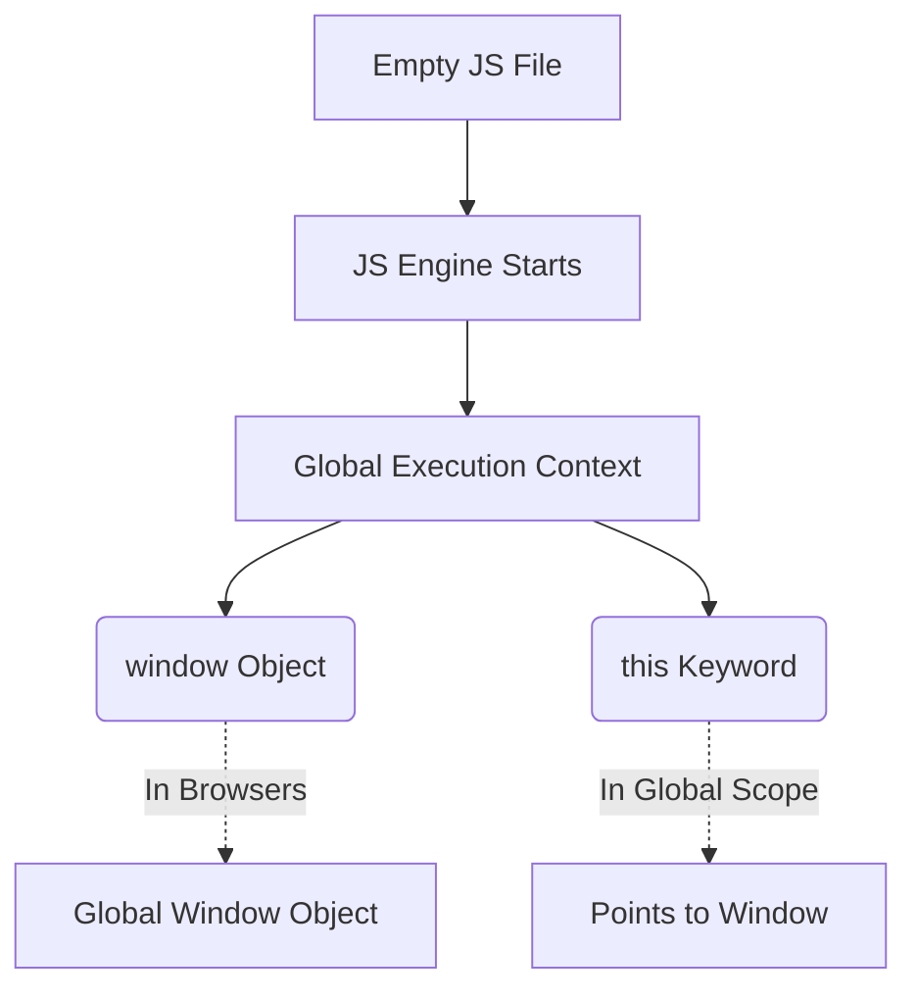
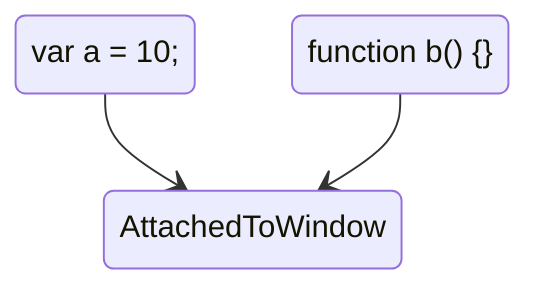

# 🪟 Window & `this` Keyword

Even if you run a completely empty JavaScript file, the JavaScript Engine still does a lot of work behind the scenes. 

It creates the **Global Execution Context** and sets up global objects for you.



## 🌍 1. The Global Object (`window`)
Wherever JavaScript runs, the engine provides a global object.
- In browsers, this global object is called `window`.
- In Node.js, it's called `global`.

It comes packed with functions and properties (like `setTimeout`, `console.log`) that you can use anywhere in your code.

## 🎯 2. The `this` Keyword
Along with the global object, the JS engine also creates the `this` keyword.

At the global level (outside of any function), `this` always points to the global object.

```javascript
console.log(this === window); // Output: true
```

---

## 🔗 3. Global Variables

Whenever you create variables or functions in the global scope (not inside any function), they are automatically attached to the global `window` object.



You can access them in three different ways, and they all mean the exact same thing:

```javascript
var a = 10;

console.log(a);         // Output: 10
console.log(window.a);  // Output: 10
console.log(this.a);    // Output: 10
```

> **Note:** Variables declared with `let` and `const` are *not* attached to the `window` object (they are kept in a separate block-scoped memory space), even if they are in the global scope!

```javascript
var x = 10;
let y = 20;
const z = 30;

console.log(window.x); // 10 ✅ — var attaches to window
console.log(window.y); // undefined ❌ — let does NOT attach to window
console.log(window.z); // undefined ❌ — const does NOT attach to window
```

> **Cross-platform tip:** Use `globalThis` to access the global object in any environment (Browser, Node.js, Web Workers). `globalThis === window` in browsers, `globalThis === global` in Node.js.

