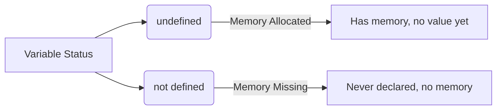

# ❓ Undefined vs Not Defined

In JavaScript, `undefined` and `not defined` might sound like the exact same thing in English, but they mean **two completely different things** to the JS Engine!



## 👻 1. `undefined` (The Placeholder)
When a variable is declared with `var`, JavaScript allocates memory for it during the Creation Phase. Before the code actually runs and assigns it a real value, it assigns it a special placeholder keyword: `undefined`.

- Think of it as a blank reserved seat at a theater. The seat exists, but no one is sitting in it yet.
- It is a specific data type in JavaScript.

```javascript
var a;
console.log(a); // Output: undefined (Memory exists, value is empty)
a = 10;
console.log(a); // Output: 10 (Value assigned!)
```

## 🚨 2. `not defined` (The Error)
If you try to access a variable that was *never declared* anywhere in your code, JavaScript hasn't allocated any memory for it. When it tries to find it in the Execution Context, it throws a `ReferenceError`.

- Think of it as trying to sit in row Z, when the theater only goes up to row F. The seat doesn't exist!

```javascript
console.log(x); // ReferenceError: x is not defined
```

---

## ⚠️ A Bad Practice

Since `undefined` is an actual value in JavaScript, you technically *can* manually assign it to a variable.

```javascript
var a = 10;
a = undefined; // ❌ DO NOT DO THIS!
```

**Why is it bad?** 
`undefined` is meant to be the system's way of saying "I haven't touched this yet." If you manually assign `undefined`, you destroy that meaning and make debugging very confusing. 

If you need to intentionally clear a variable's value, use `null` instead!
