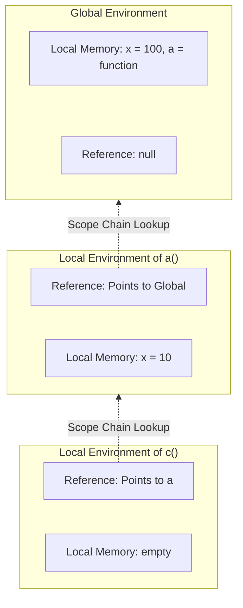

# 🔭 Scope Chain & Lexical Environment

Scope dictates where you can access a specific variable or function in your code. But how does JavaScript know where to look? The answer is the **Lexical Environment**.

Let's look at this nested function structure:

```javascript
function a() {
    var x = 10;
    function c() {
        console.log(x); // How does c find x?
    }
    c();
}
var x = 100;
a();
```

When this code executes, the JavaScript Engine builds a chain of Lexical Environments.



## 🧬 1. What is a Lexical Environment?
Whenever an Execution Context is created, a **Lexical Environment** is created with it. 

It consists of two things:
1. The **Local Memory** (the variables and functions defined inside it).
2. A **Reference to the Lexical Environment of its Parent**.

*Lexical* comes from the word "lexis" meaning **"relating to the text/source code"**. It refers to where the code is **physically written** in your script — not where it is called from, but where it was defined. Because `c` is *written inside* `a`, the lexical parent of `c` is `a`!

## 🔗 2. The Scope Chain Lookup

When you try to access `x` inside `c()`, JavaScript doesn't just give up if it can't find it in the local memory. It climbs the **Scope Chain**!

1. JS Engine looks for `x` inside `c`'s local memory. It's not there (empty).
2. It follows the reference to its parent's Lexical Environment (`a`).
3. It finds `x = 10` in `a`'s memory! It prints `10`. Note that it never reaches the global `x = 100` because it stops looking as soon as it finds a match!

## 🛑 3. When does it stop?
It keeps following the parent references all the way up to the **Global Execution Context**. 
The parent of the Global Execution Context is `null`. If the engine reaches `null` and still hasn't found the variable, it throws a `ReferenceError`.
