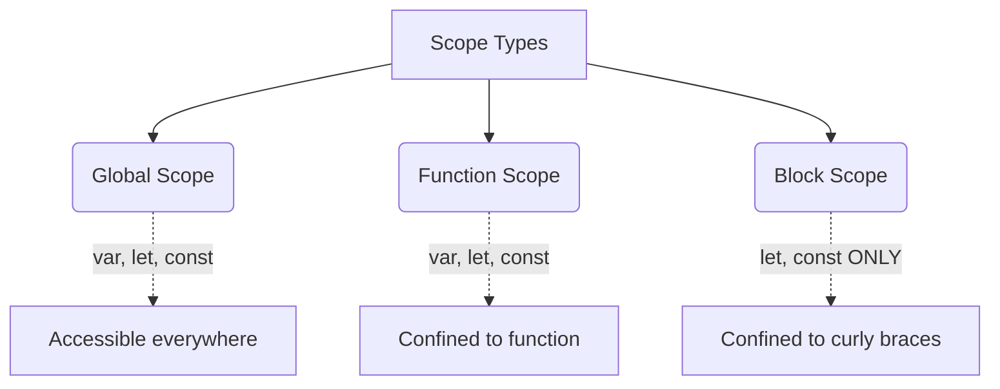
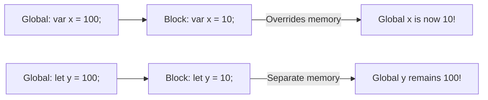

# 🧱 Block Scope & Shadowing

What exactly is a "Block" in JavaScript? It's simply code grouped together inside curly braces `{ ... }`. 
We use blocks to group multiple statements together in places where JavaScript expects only a single statement (like inside an `if` statement).



## 📦 1. Block Scope
`let` and `const` are **block-scoped**. This means if you declare them inside a `{ }` block, they are stuck inside that block. They cannot be accessed from the outside.

`var`, however, is **function-scoped**. It completely ignores blocks!

```javascript
{
    var a = 10;
    let b = 20;
    const c = 30;
}
console.log(a); // 10 (var leaked out!)
console.log(b); // ReferenceError (let is stuck inside)
console.log(c); // ReferenceError (const is stuck inside)
```

## 👥 2. Shadowing
When a variable is declared in an inner scope with the *exact same name* as a variable in an outer scope, the inner variable **shadows** the outer variable.



### The `var` Shadowing Trap
Because `var` is function-scoped (not block-scoped), if you shadow a global `var` inside a block, it overwrites the global variable because they point to the exact same memory space on the `window` object!

```javascript
var x = 100;
{
    var x = 10; 
    console.log(x); // 10
}
console.log(x); // 10 (The global value was destroyed!)
```

### The `let` Shadowing Safety
If you do the same thing with `let`, it is perfectly safe. The inner `let` gets its own block-scoped memory, and the outer `let` remains untouched in its script-scoped memory.

```javascript
let y = 100;
{
    let y = 10;
    console.log(y); // 10 (Points to Block memory)
}
console.log(y); // 100 (Points to Script memory)
```

## 🚨 3. Illegal Shadowing
You cannot shadow a `let` variable with a `var` variable inside a block. This is because the `var` tries to leak out to the outer scope, which clashes with the existing `let`!

```javascript
let a = 20;
{
    var a = 20; // ❌ SyntaxError: Identifier 'a' has already been declared
}
```
