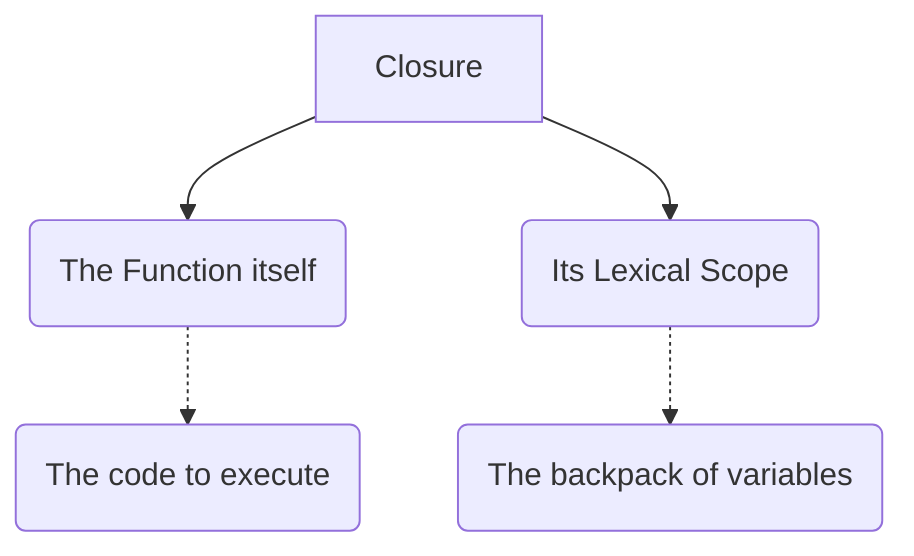
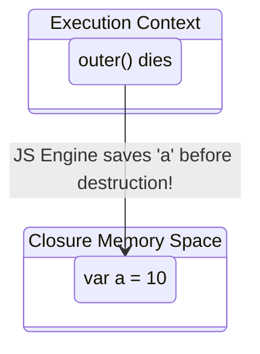
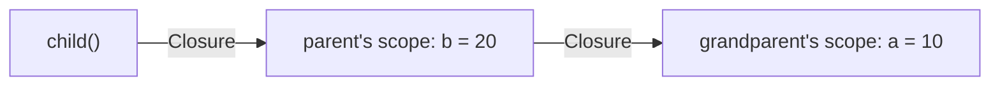

# 🎒 Closures (Basics)

A **Closure** is one of the most powerful and confusing concepts in JavaScript. 

In simple terms: **A function bundled together with its lexical environment forms a closure.**



## 🎒 The "Backpack" Analogy
Imagine a function is a person leaving their house (the outer function) to go on a trip. 
Even after the house is completely destroyed (the outer function's execution context is popped off the Call Stack), the person takes a **backpack** with them. That backpack contains all the variables they might need from the house!

```javascript
function outer() {
    let a = 10;
    function inner() {
        console.log(a);
    }
    return inner;
}

let z = outer(); 
// The outer() function has finished running and is GONE from the call stack.

z(); 
// Output: 10! How does it know 'a' is 10? Because of Closures!
```

## 🧠 How it works under the hood
1. When `outer()` finishes executing, its Execution Context is completely destroyed.
2. However, before it is destroyed, the JS Engine notices that `inner()` is being returned and that it relies on the variable `a`.
3. The JS Engine takes `a` out of the dying Execution Context and puts it into a special closure memory space.
4. `inner()` carries this memory space (the backpack) with it wherever it goes!



## ⚠️ The Reference Catch
Closures do not store the *value* of the variable at the time of creation. They store a **reference** to the actual variable!

```javascript
function outer() {
    let a = 10;
    function inner() {
        console.log(a);
    }
    a = 100; // We changed it!
    return inner;
}

let z = outer();
z(); // Output: 100! 
```
Since it stores a reference to the memory location of `a`, it prints the updated value, not the original value!

---

## 🔗 Nested Closures (Multi-Level Scope Chain)
Closures don't just capture from one parent — they capture from the **entire scope chain**!

```javascript
function grandparent() {
    let a = 10;
    function parent() {
        let b = 20;
        function child() {
            let c = 30;
            console.log(a + b + c); // child closes over BOTH parent AND grandparent
        }
        return child;
    }
    return parent;
}

const parentFn = grandparent(); // grandparent() is GONE
const childFn = parentFn();     // parent() is GONE
childFn(); // 60! — child still remembers a=10 AND b=20
```



> **Key Detail:** The closure captures the **entire lexical environment** of each ancestor, not just the variables the function actually uses. However, modern JS engines are smart enough to garbage-collect unused variables from closures for performance.
