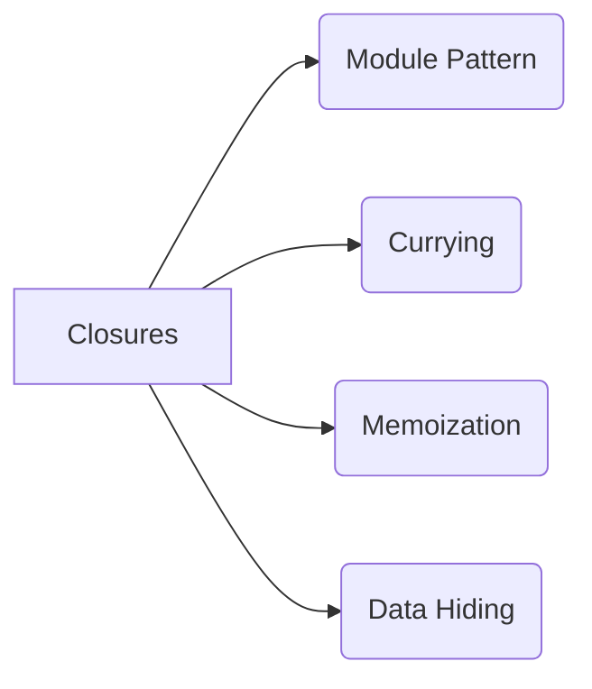
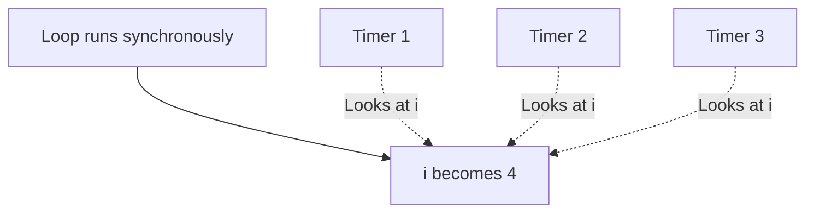

# 🎬 Closures in Action (Uses & Pitfalls)

Closures aren't just interview trivia; they are used everywhere in professional JavaScript development!



## 🛡️ 1. Data Hiding (Encapsulation)
JavaScript historically didn't have `private` variables for objects. We used closures to create variables that could not be accessed from the outside world.

```javascript
function createCounter() {
    let count = 0; // This is hidden!
    
    return {
        increment: function() { count++; },
        getCount: function() { return count; }
    };
}

const counter = createCounter();
counter.increment();
console.log(counter.getCount()); // 1
console.log(counter.count); // undefined (Can't access it directly!)
```

## 🐛 2. The Infamous `var` Loop Bug
This is the most common closure interview question. What does this code print?

```javascript
for (var i = 1; i <= 3; i++) {
    setTimeout(function() {
        console.log(i);
    }, 1000);
}
```
**You expect:** `1, 2, 3`
**It actually prints:** `4, 4, 4`

### 🕵️ Why does this happen?
1. The `for` loop finishes running instantly (synchronously).
2. `var` is function-scoped (or globally scoped here). There is only ONE memory location for `i`.
3. By the time the 1-second timers finish and the callbacks execute, the loop has already finished, and `i` has reached `4` in that single memory location.
4. All three callbacks look at that exact same memory location and print `4`.



### 🛠️ The Fix
Use `let` instead of `var`! 
`let` is **block-scoped**. It creates a brand new, separate memory location for `i` for *every single iteration* of the loop.

```javascript
for (let i = 1; i <= 3; i++) {
    setTimeout(function() {
        console.log(i); // Prints 1, 2, 3!
    }, 1000);
}
```
