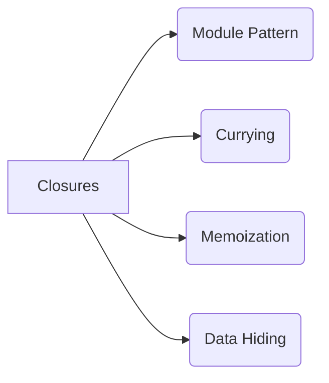
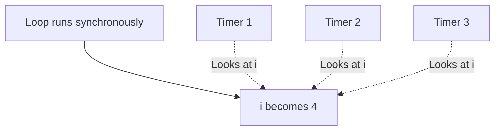
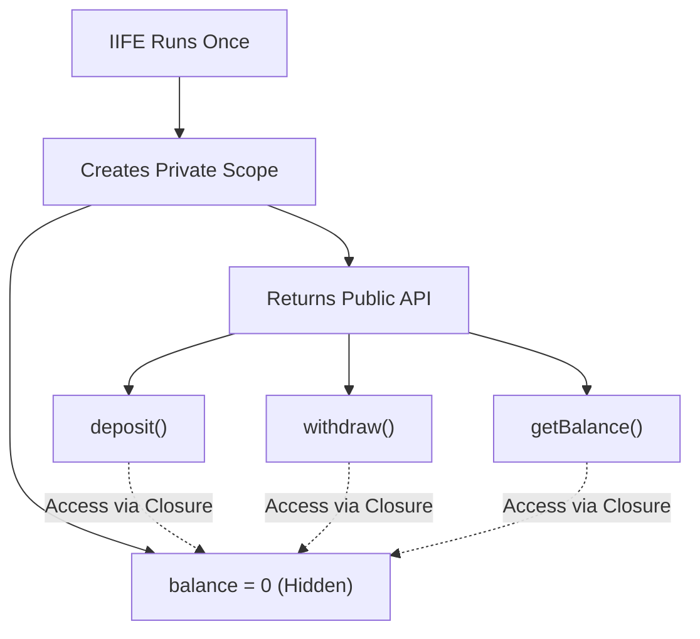

# 🎬 Closures in Action (Uses & Pitfalls)

Closures aren't just interview trivia; they are used everywhere in professional JavaScript development!



## 🛡️ 1. Data Hiding (Encapsulation)
JavaScript historically didn't have `private` variables for objects. We used closures to create variables that could not be accessed from the outside world.

```javascript
function createCounter() {
    let count = 0; // This is hidden!
    
    return {
        increment: function() { count++; },
        getCount: function() { return count; }
    };
}

const counter = createCounter();
counter.increment();
console.log(counter.getCount()); // 1
console.log(counter.count); // undefined (Can't access it directly!)
```

## 🐛 2. The Infamous `var` Loop Bug
This is the most common closure interview question. What does this code print?

```javascript
for (var i = 1; i <= 3; i++) {
    setTimeout(function() {
        console.log(i);
    }, 1000);
}
```
**You expect:** `1, 2, 3`
**It actually prints:** `4, 4, 4`

### 🕵️ Why does this happen?
1. The `for` loop finishes running instantly (synchronously).
2. `var` is function-scoped (or globally scoped here). There is only ONE memory location for `i`.
3. By the time the 1-second timers finish and the callbacks execute, the loop has already finished, and `i` has reached `4` in that single memory location.
4. All three callbacks look at that exact same memory location and print `4`.



### 🛠️ The Fix
Use `let` instead of `var`! 
`let` is **block-scoped**. It creates a brand new, separate memory location for `i` for *every single iteration* of the loop.

```javascript
for (let i = 1; i <= 3; i++) {
    setTimeout(function() {
        console.log(i); // Prints 1, 2, 3!
    }, 1000);
}
```

### 🛠️ The Classic Fix (Without `let` — Using IIFE + Closures)
Interviewers often follow up with: *"What if you can't use `let`? Fix it using only `var`."*

The trick is to create a **new function scope** for each iteration using an IIFE:

```javascript
for (var i = 1; i <= 3; i++) {
    (function(j) { // IIFE creates a new scope with its own 'j'
        setTimeout(function() {
            console.log(j); // Prints 1, 2, 3!
        }, 1000);
    })(i); // Pass current 'i' as 'j'
}
```

Each IIFE creates its own closure with a **separate copy** of `i` (captured as `j`), so each callback remembers a different value!

---

## 🧩 3. Module Pattern
Closures allow us to create a private scope with controlled public access — this is the **Module Pattern**, which was the standard way to organize JavaScript before ES6 modules.

```javascript
const BankAccount = (function() {
    let balance = 0; // Private! No one can touch this directly.
    
    return {
        deposit: function(amount) { balance += amount; },
        withdraw: function(amount) { balance -= amount; },
        getBalance: function() { return balance; }
    };
})();

BankAccount.deposit(500);
BankAccount.withdraw(200);
console.log(BankAccount.getBalance()); // 300
console.log(BankAccount.balance); // undefined (Private!)
```

The **IIFE** (Immediately Invoked Function Expression) runs once, creates the closure, and returns the public API. The `balance` variable lives on inside the closure forever, hidden from the outside world.



---

## 🍛 4. Currying
Currying is when you transform a function that takes multiple arguments into a **sequence of functions**, each taking a single argument. Closures make this possible!

```javascript
// Normal function
function add(a, b) {
    return a + b;
}
add(2, 3); // 5

// Curried version
function curriedAdd(a) {
    return function(b) { // This inner function closes over 'a'
        return a + b;
    }
}
curriedAdd(2)(3); // 5

// Create reusable partial functions!
const addFive = curriedAdd(5);
addFive(10); // 15
addFive(20); // 25
```

> **Why is this useful?** Currying lets you create specialized functions from generic ones. `addFive` will always remember `a = 5` because of closures!
