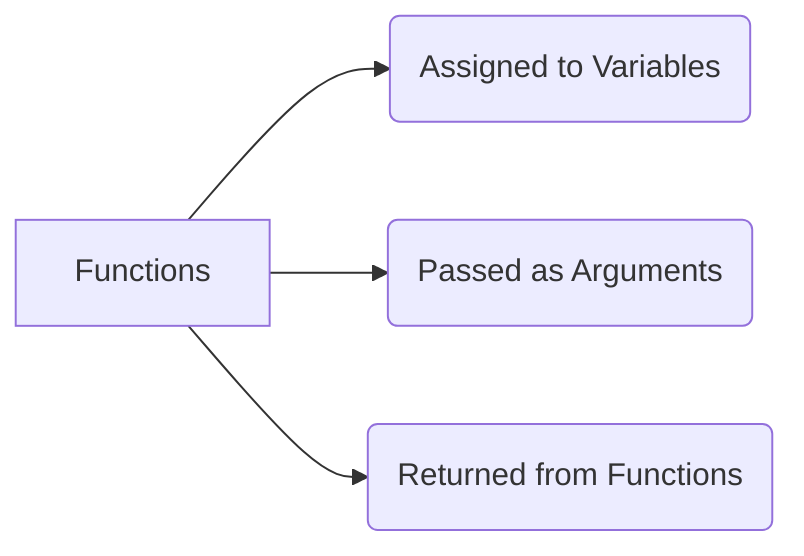

# 🥇 First Class Functions

In JavaScript, functions are treated as **First-Class Citizens**. This simply means that functions are treated exactly like regular variables. 



## 📝 1. Function Statement vs Expression

**Function Statement (Declaration)**
A standard way to create a function. These are *hoisted* and can be called before they are written.
```javascript
function a() {
    console.log("Called a");
}
```

**Function Expression**
Because functions act like variables, we can assign a function to a variable! These act like variables during hoisting (they are set to `undefined` initially).
```javascript
var b = function() {
    console.log("Called b");
}
```

## 🎭 2. Anonymous Functions
A function without a name is an anonymous function. They are primarily used in places where functions are used as values (like being assigned to a variable or passed as an argument).

```javascript
// This is an anonymous function assigned to a variable
const greet = function() {
    console.log("Hello!");
}
```

## 🚚 3. Passing and Returning Functions
Because functions are First-Class Citizens, we can pass them around like data!

```javascript
// 1. Passing a function as an argument
function doWork(callback) {
    callback();
}

// 2. Returning a function from another function
function createMultiplier(multiplier) {
    return function(num) {
        return num * multiplier;
    }
}
```
