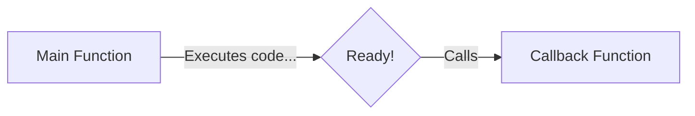

# 📞 Callback Functions

Because functions in JavaScript are First-Class Citizens, you can pass a function into another function as an argument. The function that you pass in is called a **Callback Function**.



## ⏳ Why do we need them?
JavaScript is highly asynchronous. We use callbacks to tell JavaScript: *"Hey, do this heavy task in the background. When you are completely finished, call this function."*

## 🎬 Callbacks in Action

```javascript
setTimeout(function() {
    console.log("Timer finished!");
}, 5000);
```
In this example, the anonymous function we pass into `setTimeout` is the callback function. It won't execute immediately; it waits in the Callback Queue until the 5 seconds are up!

## ⚠️ The Downside: Callback Hell
When you have multiple asynchronous tasks that depend on each other, you end up passing callbacks into callbacks into callbacks...

```javascript
api.createOrder(cart, function() {
    api.proceedToPayment(function() {
        api.showSummary(function() {
            console.log("Order complete!");
        });
    });
});
```
This deeply nested, hard-to-read structure is known as **Callback Hell**. It also causes **Inversion of Control** because we lose control of our program and blindly trust `api.createOrder` to execute our callback properly.

*(This is why Promises and `async/await` were invented!)*
