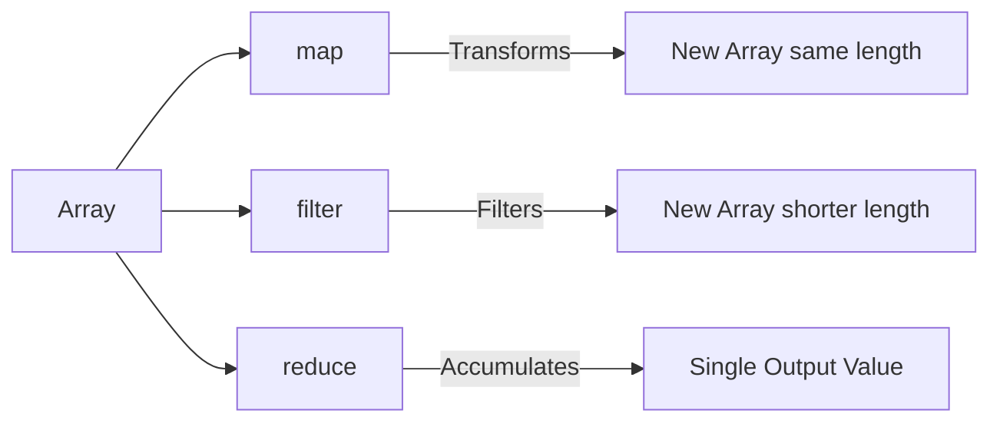
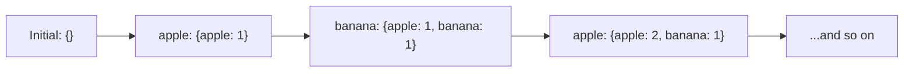

# 🗺️ Map, Filter, and Reduce

These three functions are the Holy Trinity of Higher-Order Functions in JavaScript. They are attached to `Array.prototype`, meaning you can use them on any array.



## 🗺️ 1. `map()`
Use `map` when you want to transform **every single item** in an array and return a brand new array of the exact same length.

```javascript
const arr = [5, 1, 3, 2, 6];

// Double all numbers
const doubled = arr.map((x) => x * 2);
console.log(doubled); // [10, 2, 6, 4, 12]
```

## 🚰 2. `filter()`
Use `filter` when you want to extract a specific subset of items from an array based on a condition. It returns a new array (usually shorter than the original).

```javascript
const arr = [5, 1, 3, 2, 6];

// Get only even numbers
const evens = arr.filter((x) => x % 2 === 0);
console.log(evens); // [2, 6]
```

## 📉 3. `reduce()`
Use `reduce` when you want to take all the elements of an array and crush (reduce) them down into a **single value** (like a sum, the maximum number, or a single combined object).

The callback function takes two special arguments:
1. `acc` (Accumulator): Accumulates the result over time.
2. `curr` (Current): The current item in the array.

```javascript
const arr = [5, 1, 3, 2, 6];

// Find the sum of all numbers
const sum = arr.reduce(function(acc, curr) {
    return acc + curr;
}, 0); // 0 is the initial value of the accumulator (acc)

console.log(sum); // 17
```

> **Pro Tip:** You can chain these together! Because `map` and `filter` return arrays, you can do `arr.filter(...).map(...).reduce(...)` to perform highly complex data transformations in just a few lines of code!

---

## 🧮 4. Common Interview Pattern: Frequency Counter with `reduce()`

A very popular interview question: *"Count the occurrences of each item in an array."*

```javascript
const fruits = ["apple", "banana", "apple", "orange", "banana", "apple"];

const count = fruits.reduce(function(acc, curr) {
    acc[curr] = (acc[curr] || 0) + 1;
    return acc;
}, {}); // Initial value is an empty object!

console.log(count); // { apple: 3, banana: 2, orange: 1 }
```



> **Key Insight:** `reduce()` is not just for numbers! The accumulator can be **any data type** — an object, an array, a string, or even a boolean. This is what makes `reduce` so powerful.
