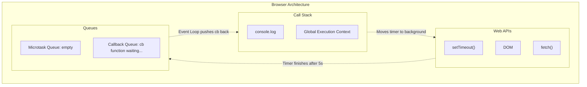
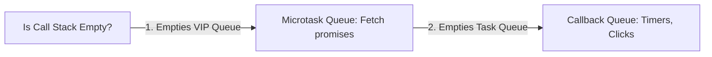

# 🔄 The Event Loop & Asynchronous JavaScript

JavaScript is a **synchronous, single-threaded language**, meaning it can only do one thing at a time. So how can it handle timers, network requests, and heavy tasks without freezing the browser? 

Enter **The Browser APIs & The Event Loop**.

Let's look at this code:
```javascript
console.log("Start");

setTimeout(function cb() {
    console.log("Timer");
}, 5000);

console.log("End");
```

How does JavaScript execute this?



## 🛠️ 1. Web APIs (The Superpowers)
The Call Stack doesn't have a timer, and it can't talk to servers. The browser provides these superpowers via **Web APIs**.

When JS hits `setTimeout`, the Call Stack hands the timer over to the Web API. The Web API starts the 5-second countdown in the background, and the Call Stack immediately moves on to the next line (`console.log("End")`).

---

## 🗂️ 2. The Queues

Once a Web API finishes its job (like a 5-second timer ending), it cannot just jump straight back into the Call Stack and interrupt whatever is running. It must wait its turn in a queue.

### 🚌 The Callback Queue (Task Queue)
Most callbacks go here. (e.g., `setTimeout`, click events). When the 5-second timer ends, the `cb` function is pushed into this queue.

### 🚀 The Microtask Queue (VIP Queue)
This queue has **higher priority** than the regular Callback Queue. If there are tasks in both queues, the Microtask Queue gets emptied first!
What goes here?
- Promises (`.then()`, `.catch()`)
- Mutation Observers



---

## 🔁 3. The Event Loop
The Event Loop is like a security guard at the door of the Call Stack. It has exactly one job: **Continuous Observation**.

1. It constantly checks: *Is the Call Stack empty?*
2. If the Call Stack is empty, it checks the **Microtask Queue** (VIP Queue).
3. If it has a task, it pushes it to the Call Stack.
4. Once the Microtask Queue is completely empty, it checks the **Callback Queue** and pushes tasks to the Call Stack.

> **Starvation:** If Microtasks keep generating more Microtasks, the regular Callback Queue will never get a chance to run! This is called starvation.
