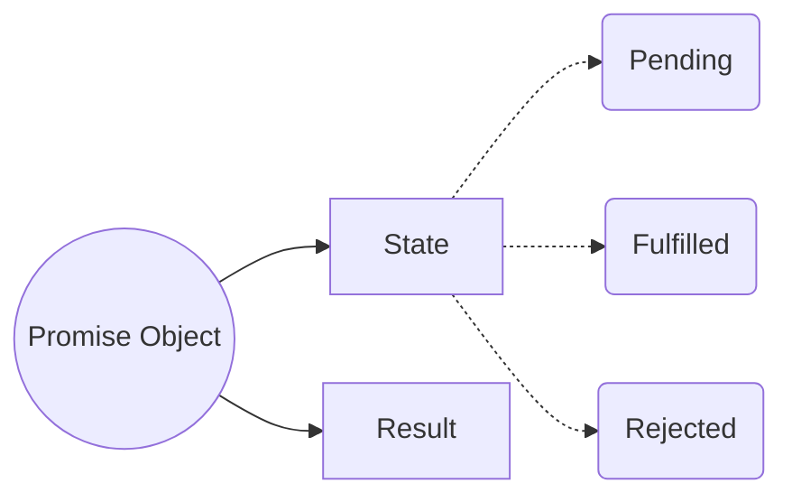
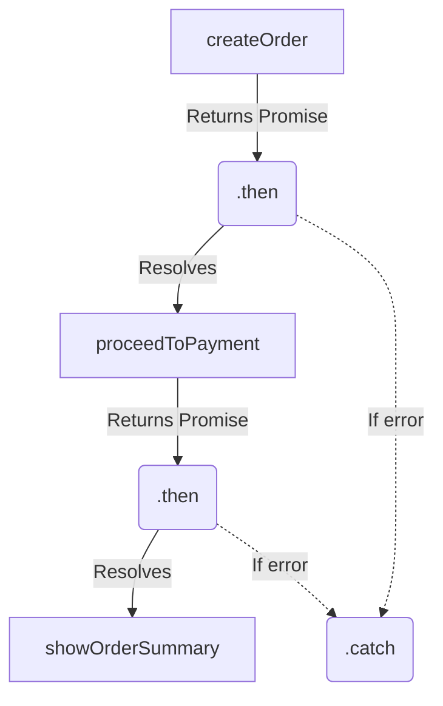

# 🤝 Promises

Before Promises, asynchronous code relied entirely on **callbacks**. Passing callbacks inside callbacks led to deeply nested, unreadable code known as **Callback Hell** (or the Pyramid of Doom), and suffered from **Inversion of Control** (giving up control of when/how your callback executes to an external API).

Promises were introduced to solve this!



## 📦 1. What is a Promise?
A Promise is an object representing the eventual completion (or failure) of an asynchronous operation.
- It acts as a **placeholder** for data that we hope to get back in the future.
- Unlike callbacks where you pass the function *into* the API, with Promises, the API returns an empty object *to you*, and you attach your callback to it. (This fixes Inversion of Control!)

## 🚦 2. The 3 States of a Promise
A Promise can only be in one of three states:
1. `pending`: The initial state. The async task is still running.
2. `fulfilled`: The operation completed successfully.
3. `rejected`: The operation failed.

**Crucial Rule:** A Promise is immutable once it settles. It can only transition from `pending` -> `fulfilled` OR `pending` -> `rejected`. It can never change its state or data after that!

## 🔗 3. Promise Chaining
To solve Callback Hell, Promises allow us to chain operations sequentially using `.then()`.



- Every `.then()` must return a value or a new Promise so the next `.then()` in the chain can receive it.
- A single `.catch()` at the end of the chain will catch an error thrown *anywhere* in the chain above it!

## 🛠️ 4. Creating a Promise

```javascript
const myPromise = new Promise(function(resolve, reject) {
    // Simulating an async task (e.g., a network request)
    setTimeout(function() {
        const data = { user: "Raj", id: 42 };
        
        if (data) {
            resolve(data); // ✅ Changes state to fulfilled
        } else {
            reject(new Error("Failed to fetch user!")); // ❌ Changes state to rejected
        }
    }, 2000);
});

// Consuming the promise
myPromise
    .then((result) => console.log("Got:", result))
    .catch((err) => console.error("Error:", err));
```
