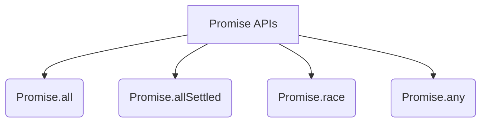

# 🚀 Promise APIs (Combinators)

When you need to handle multiple Promises at the same time, JavaScript provides four powerful Promise APIs (also known as Promise Combinators).



## 🏎️ 1. Promise.all()
`Promise.all([p1, p2, p3])` is used when you want all tasks to succeed. 
It waits for **ALL** promises to resolve. 

- **Success:** Returns an array of all results `[val1, val2, val3]`. Time taken is equal to the longest promise.
- **Failure:** **"All or Nothing!"** If *even one* promise rejects, the entire `Promise.all` immediately throws an error and cancels out, regardless of the others.

## 🛡️ 2. Promise.allSettled()
`Promise.allSettled([p1, p2, p3])` is the safer version of `Promise.all`.
It waits for **ALL** promises to settle (meaning it waits for them to either resolve OR reject).

- **Result:** It always returns an array of objects detailing the outcome of each promise. It never completely fails just because one promise rejected.

```javascript
[
  {status: "fulfilled", value: "Success data"},
  {status: "rejected", reason: "Error message"}
]
```

## 🏁 3. Promise.race()
`Promise.race([p1, p2, p3])` is exactly what it sounds like: a race.
It returns the result of the **FIRST** promise that settles (whether it resolves or rejects).

- **Success:** First person to cross the finish line wins! (Returns the value).
- **Failure:** If the first person to cross the finish line crashes (rejects), the whole race returns an error immediately.

## 🥇 4. Promise.any()
`Promise.any([p1, p2, p3])` is a race for the **FIRST SUCCESS**.
It waits for the first promise to *resolve* (ignoring any rejections along the way).

- **Success:** Returns the value of the first successful promise.
- **Failure:** What if they ALL reject? It returns an AggregateError: `"All promises were rejected"`.

---

## 📊 Summary Cheat Sheet

| API | Waits for... | Rejects when... |
| :--- | :--- | :--- |
| `Promise.all` | ALL to resolve | ANY ONE rejects (immediately) |
| `Promise.allSettled` | ALL to settle | **Never** |
| `Promise.race` | FIRST to settle | First to settle is a rejection |
| `Promise.any` | FIRST to resolve | ALL reject (AggregateError) |
