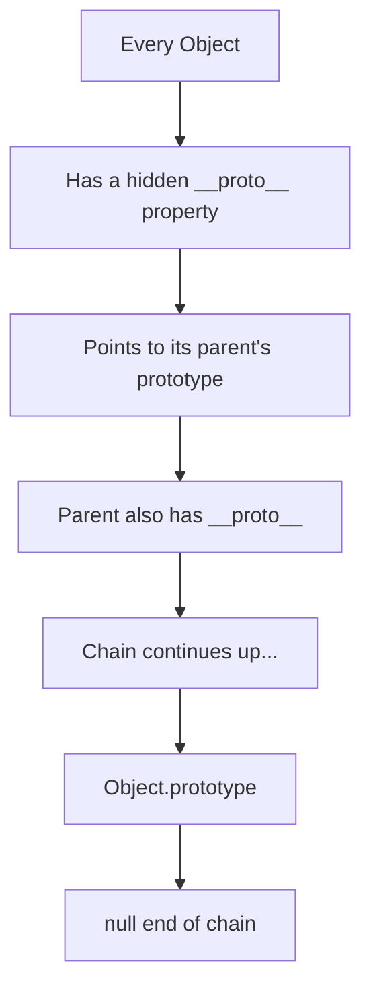
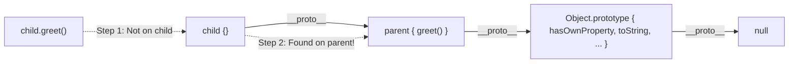
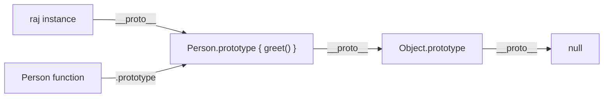

# 🧬 Prototypal Inheritance

JavaScript doesn't use classical inheritance like Java or C++. Instead, it uses **Prototypal Inheritance** — objects can inherit directly from other objects through a hidden link called the **prototype chain**.



---

## 🔗 1. The Prototype Chain

Every object in JavaScript has an internal property called `[[Prototype]]` (accessible via `__proto__`). When you access a property on an object, JavaScript looks for it on the object first. If it doesn't find it, it walks **up the prototype chain**.

```javascript
const parent = {
    greet: function() {
        console.log("Hello from parent!");
    }
};

const child = Object.create(parent); // child's __proto__ = parent

child.greet(); // "Hello from parent!" — Found via prototype chain!
console.log(child.hasOwnProperty("greet")); // false — it's inherited!
```



---

## 🏭 2. `prototype` vs `__proto__`

This is one of the **most confusing** parts of JavaScript. Let's clear it up:

| Term | What it is | Who has it |
|:---|:---|:---|
| `__proto__` | The **link** pointing to the parent object's prototype | Every object |
| `prototype` | A **property** on constructor functions that becomes the `__proto__` of objects created with `new` | Only functions |

```javascript
function Person(name) {
    this.name = name;
}

Person.prototype.greet = function() {
    console.log("Hi, I'm " + this.name);
};

const raj = new Person("Raj");

console.log(raj.__proto__ === Person.prototype); // true!
console.log(Person.prototype.__proto__ === Object.prototype); // true!
```



---

## 🔨 3. `Object.create()` — Pure Prototypal Inheritance

`Object.create(proto)` creates a new object with its `__proto__` set to the given `proto` object. This is the cleanest way to set up prototype chains!

```javascript
const animal = {
    isAlive: true,
    eat: function() {
        console.log(this.name + " is eating");
    }
};

const dog = Object.create(animal);
dog.name = "Buddy";
dog.bark = function() {
    console.log("Woof!");
};

dog.eat();  // "Buddy is eating" — inherited from animal
dog.bark(); // "Woof!" — own method
console.log(dog.isAlive); // true — inherited from animal
```

---

## 🛡️ 4. Checking the Chain

```javascript
// Check if a property is directly on the object (not inherited)
dog.hasOwnProperty("name"); // true
dog.hasOwnProperty("eat");  // false — it's inherited!

// Check if an object is in another's prototype chain
animal.isPrototypeOf(dog); // true

// Check the constructor
dog instanceof Object; // true — Object is in the chain
```

---

## 🔑 Key Takeaways
1. JavaScript uses **prototypal inheritance** — objects inherit from objects, not classes.
2. `__proto__` is the hidden link every object uses to find inherited properties.
3. `prototype` is a property on constructor functions that becomes the `__proto__` of instances.
4. The chain ends at `Object.prototype.__proto__` which is `null`.
5. `Object.create()` is the purest way to set up inheritance.
