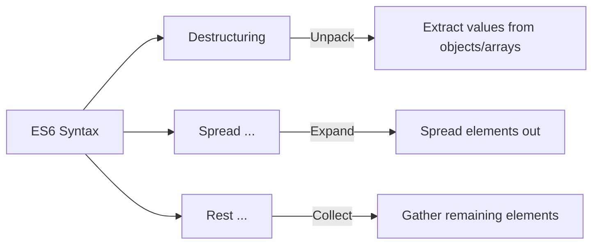
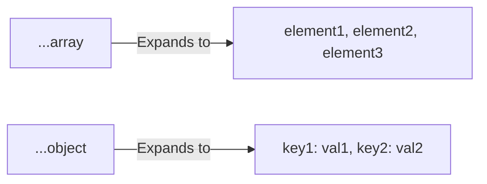
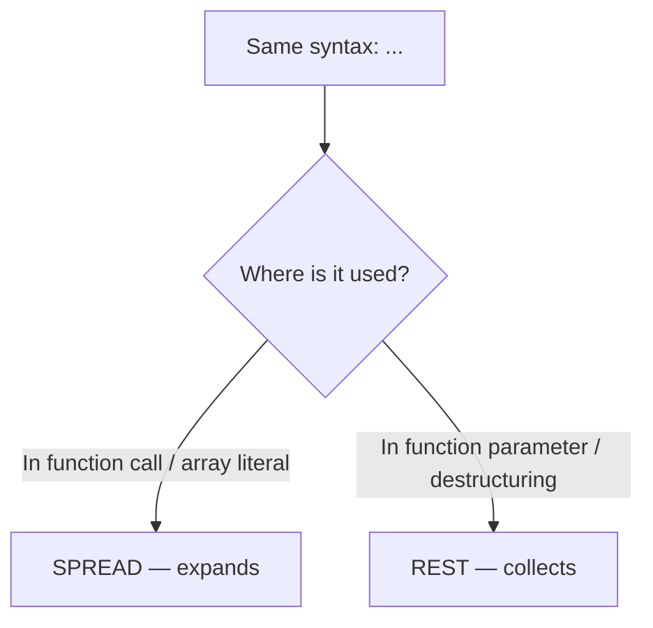

# 🎁 Destructuring, Spread & Rest

ES6 introduced three powerful syntactic features that make working with objects and arrays much cleaner. These are used **everywhere** in modern JavaScript and React.



---

## 📦 1. Object Destructuring

Instead of accessing properties one by one, destructuring lets you **unpack** them into variables in a single line.

```javascript
const user = { name: "Raj", age: 25, city: "Mumbai" };

// Without destructuring
const name = user.name;
const age = user.age;

// With destructuring ✨
const { name, age, city } = user;
console.log(name, age, city); // "Raj" 25 "Mumbai"
```

### Renaming & Defaults:
```javascript
const user = { name: "Raj" };

// Rename 'name' to 'userName', and set a default for 'age'
const { name: userName, age = 18 } = user;
console.log(userName); // "Raj"
console.log(age);      // 18 (default, since user.age doesn't exist)
```

### Nested Destructuring:
```javascript
const user = {
    name: "Raj",
    address: { city: "Mumbai", pin: "400001" }
};

const { address: { city, pin } } = user;
console.log(city); // "Mumbai"
console.log(pin);  // "400001"
```

---

## 🔢 2. Array Destructuring

Works the same way, but uses position instead of names:

```javascript
const colors = ["red", "green", "blue"];

const [first, second, third] = colors;
console.log(first);  // "red"
console.log(second); // "green"

// Skip elements with empty slots
const [, , last] = colors;
console.log(last); // "blue"
```

### Swap Variables (Classic Interview Trick):
```javascript
let a = 1, b = 2;
[a, b] = [b, a];
console.log(a, b); // 2, 1 — Swapped without a temp variable!
```

---

## 🌊 3. Spread Operator (`...`)

The spread operator **expands** (spreads out) the elements of an array or the properties of an object.



### With Arrays:
```javascript
const arr1 = [1, 2, 3];
const arr2 = [4, 5, 6];

const merged = [...arr1, ...arr2];
console.log(merged); // [1, 2, 3, 4, 5, 6]

const copy = [...arr1]; // Shallow copy!
```

### With Objects:
```javascript
const defaults = { theme: "dark", lang: "en" };
const userPrefs = { lang: "hi", fontSize: 16 };

const settings = { ...defaults, ...userPrefs };
console.log(settings);
// { theme: "dark", lang: "hi", fontSize: 16 }
// Note: 'lang' from userPrefs overrides 'lang' from defaults!
```

---

## 🎒 4. Rest Operator (`...`)

The rest operator **collects** the remaining elements into an array or object. It looks exactly like spread (`...`), but it's used on the **receiving** side.



### In Functions:
```javascript
function sum(...numbers) { // Rest collects all args into an array
    return numbers.reduce((acc, curr) => acc + curr, 0);
}

sum(1, 2, 3, 4); // 10
```

### In Destructuring:
```javascript
const [first, ...remaining] = [1, 2, 3, 4, 5];
console.log(first);     // 1
console.log(remaining); // [2, 3, 4, 5]

const { name, ...otherProps } = { name: "Raj", age: 25, city: "Mumbai" };
console.log(name);       // "Raj"
console.log(otherProps); // { age: 25, city: "Mumbai" }
```

> **Rule:** The rest element must always be the **last** element. `const [first, ...middle, last]` is a **SyntaxError**!

---

## 📊 Spread vs Rest — Quick Reference

| | Spread `...` | Rest `...` |
|:---|:---|:---|
| **Purpose** | Expand/unpack | Collect/gather |
| **Where** | Function calls, array/object literals | Function parameters, destructuring |
| **Example** | `Math.max(...arr)` | `function(...args)` |
