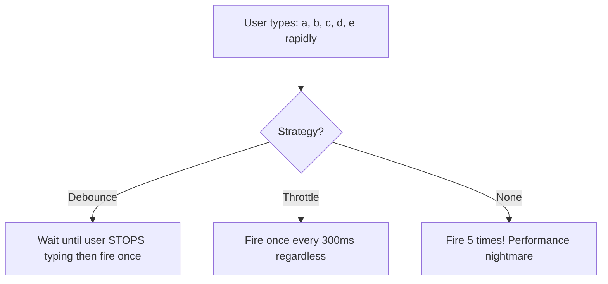
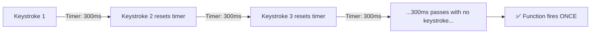
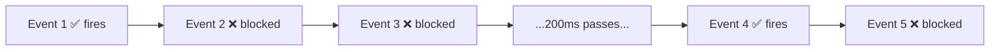
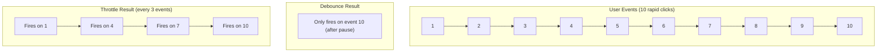

# ⏱️ Debounce & Throttle

> ⚠️ **Note:** This section covers **browser-specific** patterns. While the concepts are universal, debounce and throttle are most commonly used in browser event handling. Node.js developers may still find these useful for rate-limiting.

Debounce and Throttle are techniques to **control how often a function fires**. They are essential for optimizing performance when dealing with events that fire rapidly (scrolling, resizing, typing).



---

## 🔕 1. Debounce

Debounce ensures a function is only called **after the user has STOPPED performing an action** for a specified delay period. If the action is repeated before the delay ends, the timer resets.

### Real-world analogy:
Imagine an elevator door: it only closes after people **stop entering** for a few seconds. Every time someone new enters, the timer resets!

### Use cases:
- Search bar auto-suggestions (wait until user stops typing)
- Window resize handlers
- Save drafts (wait until user stops editing)

### Implementation:

```javascript
function debounce(fn, delay) {
    let timer;
    return function(...args) {
        clearTimeout(timer); // Reset the timer!
        timer = setTimeout(() => {
            fn.apply(this, args);
        }, delay);
    };
}

// Usage:
const search = debounce(function(query) {
    console.log("Searching for:", query);
}, 300);

// Even if called 100 times rapidly, it only fires ONCE
// (300ms after the LAST call)
inputElement.addEventListener("input", (e) => search(e.target.value));
```



---

## 🚦 2. Throttle

Throttle ensures a function is called **at most once** within a specified time window. Unlike debounce, it guarantees the function fires at regular intervals.

### Real-world analogy:
A machine gun that can only fire once per second, no matter how fast you pull the trigger.

### Use cases:
- Scroll event handlers (infinite scroll)
- Button click protection (prevent double-submit)
- API rate limiting
- Game loop updates

### Implementation:

```javascript
function throttle(fn, limit) {
    let inThrottle = false;
    return function(...args) {
        if (!inThrottle) {
            fn.apply(this, args);
            inThrottle = true;
            setTimeout(() => {
                inThrottle = false;
            }, limit);
        }
    };
}

// Usage:
const onScroll = throttle(function() {
    console.log("Scroll position:", window.scrollY);
}, 200);

// Even if scroll fires 100 times per second, 
// this only runs once every 200ms
window.addEventListener("scroll", onScroll);
```



---

## 🆚 3. Debounce vs Throttle — Side by Side

| | Debounce | Throttle |
|:---|:---|:---|
| **When it fires** | After user **stops** for X ms | Every X ms **at most** |
| **Guarantees execution?** | Only the last call | At regular intervals |
| **Best for** | Search input, resize | Scroll, button clicks |
| **If user keeps acting** | Never fires (timer keeps resetting) | Fires at fixed intervals |



---

## 🔑 Key Takeaways
1. **Debounce** = Wait until the storm passes. Great for search inputs.
2. **Throttle** = Allow one action per time window. Great for scroll/resize.
3. Both use **closures** to remember the timer/flag between calls!
4. Implementing these from scratch is a very common **interview question**.
