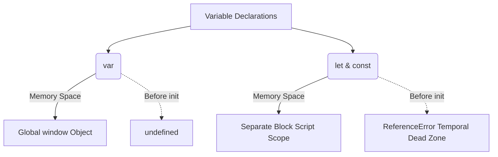

# ⏳ Let, Const, and the Temporal Dead Zone

`let` and `const` declarations were introduced in ES6 to fix the unpredictable behavior of `var`. They are hoisted, but they behave very differently!



## 🔒 1. A Separate Memory Space
When you declare a variable with `var`, it gets attached directly to the global `window` object. 
When you declare a variable with `let` or `const`, JavaScript still allocates memory for them during the Creation Phase (so they *are* hoisted), but it puts them in a **separate memory space** (often labeled `Script` or `Block` scope in dev tools), NOT on the `window` object.

## 💀 2. The Temporal Dead Zone (TDZ)
Because `let` and `const` are in a separate memory space, JavaScript actively prevents you from accessing them before they are initialized.

**The Temporal Dead Zone** is the phase (or time) from when a `let` or `const` variable is hoisted in memory, until the exact line where it is initialized with a value.

```javascript
// --- TDZ for 'a' starts here ---
console.log("Hello!"); 

console.log(a); // ❌ ReferenceError! Cannot access 'a' before initialization

let a = 10; // --- TDZ for 'a' ends here ---
console.log(a); // Output: 10
```

## 🏗️ 3. `let` vs `const`
Both share the TDZ and block-scoping rules, but they have one major difference:

| Keyword | Re-declaration (same scope) | Re-assignment | Initialization |
| :--- | :--- | :--- | :--- |
| `var` | ✅ Allowed | ✅ Allowed | Optional |
| `let` | ❌ SyntaxError | ✅ Allowed | Optional |
| `const`| ❌ SyntaxError | ❌ TypeError | **Required immediately** |

> **Pro Tip:** Always default to `const`. If you know the value will change (like in a loop), use `let`. Try to avoid `var` entirely in modern JavaScript!


## 🎯 Common Interview Questions

**Q: What is the Temporal Dead Zone (TDZ)?**
- **A:** It is the period between when a `let` or `const` variable is hoisted (memory allocated) and when it is explicitly initialized in the code. Accessing it during this period throws a `ReferenceError`.

**Q: Can you re-declare a `let` variable in the same scope?**
- **A:** No. Attempting to redeclare a `let` or `const` in the exact same scope throws a `SyntaxError`.