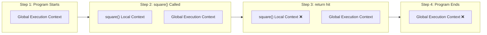

# 🧠 Execution Context & Call Stack

> [!TIP]
> **The 30-Second Interview Pitch**
> Everything in JavaScript happens inside an **Execution Context**, which is a physical workspace created in two phases: **Memory Creation** (where variables and functions are hoisted and allocated memory) and **Code Execution** (where the code is actually run line-by-line). To manage multiple nested function calls, JavaScript uses the **Call Stack**, a LIFO (Last In, First Out) data structure that keeps track of the currently running Execution Context.

---

## 👨‍🍳 The "Restaurant Kitchen" Analogy

To truly understand JavaScript, you must understand the Execution Context. Think of it like a **Restaurant Kitchen**.

When you give an order (run your code) to the kitchen, the Chef doesn't just start blindly throwing ingredients into a pan. They operate in **two strict phases**:

1. **Phase 1: The Setup (Memory Creation):** The Prep Cook looks at the recipe, gathers all the raw ingredients (variables) and puts them on the counter with a placeholder label (`undefined`). They also prepare the full instructions for any side-dishes (functions).
2. **Phase 2: The Cooking (Code Execution):** The Head Chef steps in, reads the recipe line-by-line, replaces the placeholder labels with the actual ingredients (assigning values), and executes the cooking instructions.

Let's look at exactly how this happens under the hood.

---

## 📦 1. The Two Phases of Execution

Imagine this simple code:
```javascript
var n = 2;
function square(num) {
    var ans = num * num;
    return ans;
}
var square2 = square(n);
```

When you run this code, the **Global Execution Context (GEC)** is created in two phases.

### 🧠 Phase 1: Memory Creation (The Setup)
JavaScript skims through the code line-by-line, looking *only* for declarations. **No code is actually run yet!**
- It finds `var n`, allocates memory for it, and assigns it a special placeholder value: `undefined`.
- It finds `function square`, allocates memory, and stores the *entire function code* inside it.
- It finds `var square2`, allocates memory, and assigns it `undefined`.

> [!IMPORTANT]
> **Gotcha: What about `let` and `const`?** 
> They are also allocated memory during this phase (they ARE hoisted!), but they are stored in a separate memory space (not on the `window` object) and are NOT initialized with `undefined`. They remain in an inaccessible state called the **Temporal Dead Zone** until their actual line of code is executed.

### ⚡ Phase 2: Code Execution (The Cooking)
JavaScript starts at line 1 again, this time actually executing the code.
- `n` is assigned the actual value of `2`. (The placeholder `undefined` is replaced).
- It skips the function declaration (it was already handled in Phase 1).
- On line 6, it sees `square(n)`. This is a **function invocation**! 

---

## 🏗️ 2. Local Execution Contexts

Whenever a function is invoked (called), JavaScript pauses the current execution and creates a brand new **Local Execution Context** *inside* the global one!

This new Local Execution Context goes through the exact same two phases:
1. **Memory Phase:** It allocates memory for the parameter `num` (assigned `undefined`), and the local variable `ans` (assigned `undefined`).
2. **Code Phase:** It assigns `2` to `num`, calculates `2 * 2`, assigns `4` to `ans`, and finally hits the `return` keyword.

> [!NOTE]
> Once the `return` keyword is hit, the Local Execution Context is **completely destroyed and deleted from memory**, and the returned value (`4`) is passed back to the Global Execution Context and assigned to `square2`.

---

## 🥞 3. The Call Stack

With all these Global and Local Execution Contexts being created and deleted constantly, how does JavaScript keep track of where it is? **The Call Stack**.

Think of the Call Stack like a literal **Stack of Plates** at a buffet.
- You can only put a new plate on the **top** of the stack.
- You can only remove a plate from the **top** of the stack.
- This is called **LIFO** (Last In, First Out).



1. 🌍 The **Global Execution Context** is pushed to the bottom of the stack the moment the program starts.
2. 📦 Whenever a function is invoked, its **Local Execution Context** is pushed to the top of the stack. JavaScript stops what it's doing and focuses *only* on the top plate.
3. 🗑️ When the function finishes executing (returns), its context is **popped** off the stack.
4. 🛑 When the whole program finishes, the GEC is popped off, and the Call Stack is empty!

---

## 💥 4. Stack Overflow

What happens if a function keeps calling itself forever? 

The call stack has a **fixed physical size limit** in the browser's memory. If too many execution contexts pile up, the stack literally overflows its memory limit, and the browser throws a **Stack Overflow** error!

```javascript
function infinite() {
    infinite(); // Calls itself forever — no base case!
}
infinite(); // ❌ RangeError: Maximum call stack size exceeded
```

> [!WARNING]
> **Gotcha:** This is exactly why **recursive functions** always need a "base case" — a condition that stops the function from calling itself endlessly and allows the contexts to finally start popping off the stack.

---

## 🎯 Common Interview Questions

**Q: What is the difference between Execution Context and Scope?**
- **A:** They are two completely different concepts that often get confused.
  - **Scope** is a set of *rules* about "who can see what variable". It is determined strictly by where you typed your code in the file (Lexical Environment).
  - **Execution Context** is the actual *physical workspace* created in memory when your code is running.

  **Example to make it click:**
  ```javascript
  const globalVar = "I am global";

  function makeCoffee() {
      // SCOPE: The rules say this function is allowed to see 'globalVar'.
      // EXECUTION CONTEXT: Nothing actually exists in memory yet until the function is called!
      console.log(globalVar); 
  }

  // The moment we call it, an Execution Context (a physical workspace) is created!
  makeCoffee(); 
  ```