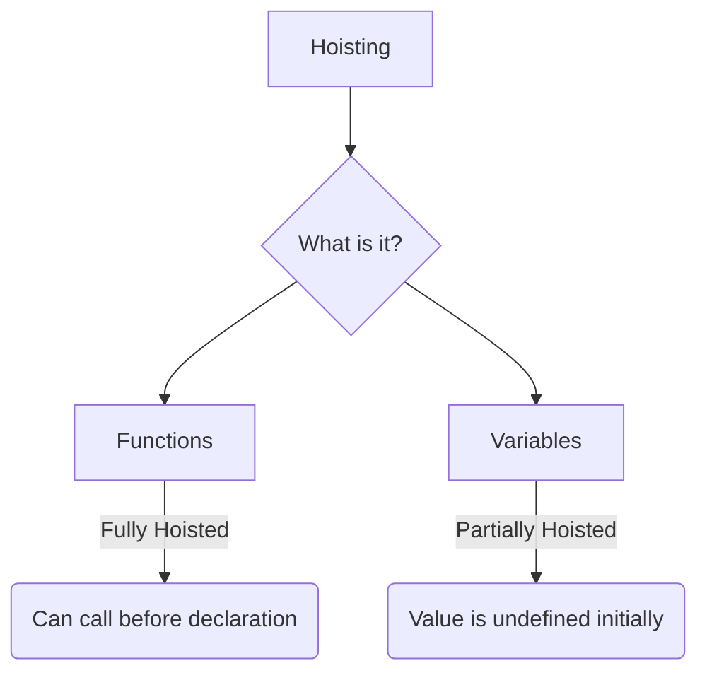
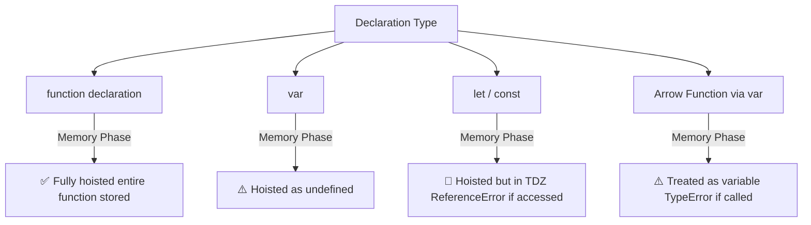

# 🎈 Hoisting in JavaScript

> [!TIP]
> **The 30-Second Interview Pitch**
> Hoisting is JavaScript's default behavior of moving variable and function declarations to the top of their respective scopes during the compilation (memory creation) phase, *before* code execution. While `var` variables are initialized with `undefined`, `let` and `const` remain uninitialized in the Temporal Dead Zone (TDZ), and function declarations are fully loaded into memory.

Hoisting is a phenomenon in JavaScript where you can access variables and functions **before** you've actually initialized them in the code.



## 🤔 How does it work?
Remember the two phases of the Execution Context?
In **Phase 1 (Compilation / Memory Creation)**, JavaScript scans the code and allocates memory for variables and functions *before* executing a single line of code.

### 📝 1. Variable Hoisting (`var`)
- Variables declared with `var` are allocated memory and initialized with `undefined`.
- If you try to print them before they are declared, they won't throw an error; they will just print `undefined`.

```javascript
console.log(name); // Output: undefined
var name = "Raj";
console.log(name); // Output: "Raj"
```

*Under the hood execution:*
```javascript
var name;             // Memory Phase: Hoisted as undefined
console.log(name);    // Execution Phase: Prints undefined
name = "Raj";       // Execution Phase: Value assigned
```

### 🔒 2. Variable Hoisting (`let` & `const`) & The Temporal Dead Zone (TDZ)
- Variables declared with `let` and `const` are also hoisted, but they are **not initialized**.
- They are placed in a state called the **Temporal Dead Zone (TDZ)** from the start of the block until the declaration is processed.
- Accessing them before initialization throws a `ReferenceError`.

```javascript
console.log(name); // ❌ ReferenceError: Cannot access 'name' before initialization
let name = "Raj";
```

> [!IMPORTANT]
> **What is the Temporal Dead Zone (TDZ)?**
> The TDZ is the period of time during execution where a `let` or `const` variable is hoisted but inaccessible. The TDZ ends exactly on the line where the variable is initialized.

### ⚙️ 3. Function Hoisting
- Regular function declarations are copied **entirely** into memory during the creation phase.
- You can invoke the function even before the line where it is written!

```javascript
sayHello(); // Output: "Hello World"

function sayHello() {
    console.log("Hello World");
}
```

---

## 🚫 The Arrow Function / Function Expression Catch

> [!WARNING]
> **Gotcha: Function Expressions are variables!**
> If you assign a function to a variable (using `var`, `let`, or `const`), it is hoisted according to the *variable's* rules, not the function's rules.



If you try to call an arrow function before declaring it, you'll get an error, because in the memory phase, it is treated as a variable and set to `undefined` (and you can't invoke `undefined`).

```javascript
// ❌ WRONG
getName(); // TypeError: getName is not a function

var getName = () => {
    console.log("Hello World");
}

// ✅ CORRECT
var getName = () => {
    console.log("Hello World");
}
getName(); // Output: "Hello World"
```

## 🔍 Key Takeaways
1. **Hoisting** is just the result of JavaScript creating memory for variables/functions before executing code.
2. `var` is initialized to `undefined`.
3. `let` and `const` remain in the Temporal Dead Zone.
4. `function () {}` is fully loaded into memory.
5. Arrow functions are treated as variables, so they are initialized to `undefined` (if `var`) or TDZ (if `let`/`const`).