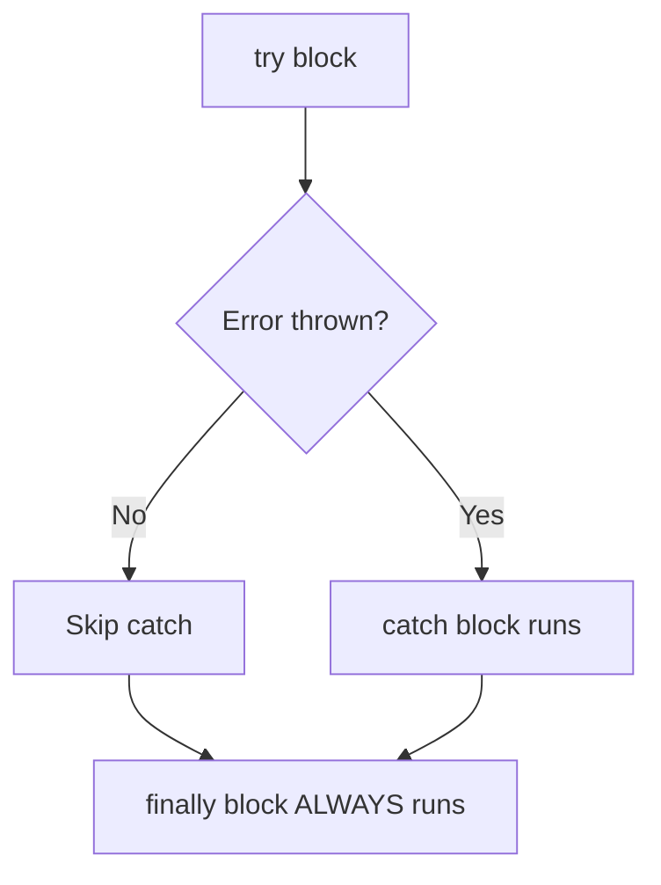

# 🛡️ try / catch / finally

> [!TIP]
> **The 30-Second Interview Pitch**
> Error handling in JavaScript is primarily managed using `try...catch...finally` blocks. This allows developers to gracefully handle runtime errors without crashing the entire application. The `throw` keyword lets you generate custom errors, and the `finally` block ensures cleanup code runs regardless of whether an error occurred.

Error handling is essential for writing robust JavaScript. The `try...catch...finally` construct lets you gracefully handle errors instead of crashing your entire application.



---

## 🧱 1. Basic Syntax

```javascript
try {
    // Code that might throw an error
    const data = JSON.parse("invalid json");
} catch (error) {
    // Runs ONLY if an error occurred in try
    console.error("Parsing failed:", error.message);
} finally {
    // Runs ALWAYS — whether error occurred or not
    console.log("Cleanup complete");
}
```

### The `finally` Block:
`finally` is guaranteed to execute no matter what — even if:
- The `try` block succeeds
- The `catch` block is triggered
- A `return` statement is hit in `try` or `catch`!

```javascript
function getData() {
    try {
        return "success";
    } finally {
        console.log("Finally runs even after return!");
    }
}

getData(); 
// Logs: "Finally runs even after return!"
// Returns: "success"
```

> [!NOTE]
> **Is the `catch` block mandatory?**
> No! A `try` block must be followed by either a `catch` block, a `finally` block, or both. You can completely omit the `catch` block if you provide a `finally` block (as seen above). 
> 
> **Why do this?** You use `try...finally` (without `catch`) when you *want* the error to crash the current function and bubble up to the caller, but you absolutely need to run some cleanup code first before it leaves the function (like closing a database connection or hiding a loading spinner).

---

## 🚨 2. Error Object

When an error is thrown, JavaScript creates an Error object with useful properties:

```javascript
try {
    undefinedFunction();
} catch (error) {
    console.log(error.name);    // "ReferenceError"
    console.log(error.message); // "undefinedFunction is not defined"
    console.log(error.stack);   // Full stack trace
}
```

### Built-in Error Types:

| Error Type | When it Occurs |
|:---|:---|
| `ReferenceError` | Accessing an undeclared variable |
| `TypeError` | Wrong type operation (e.g., calling non-function) |
| `SyntaxError` | Invalid JavaScript syntax (often caught at compile-time) |
| `RangeError` | Number out of range (e.g., invalid array length) |
| `URIError` | Invalid URI encoding/decoding |

---

## 🔨 3. Throwing Custom Errors

You can throw your own errors using the `throw` keyword. You can throw strings, numbers, or (best practice) built-in `Error` objects:

```javascript
function withdraw(amount) {
    const balance = 100;
    
    if (amount > balance) {
        throw new Error("Insufficient funds!");
    }
    
    return balance - amount;
}

try {
    withdraw(500);
} catch (err) {
    console.log(err.message); // "Insufficient funds!"
}
```

### Custom Error Classes:
```javascript
class ValidationError extends Error {
    constructor(field, message) {
        super(message);
        this.name = "ValidationError";
        this.field = field;
    }
}

function validateAge(age) {
    if (age < 0) {
        throw new ValidationError("age", "Age cannot be negative");
    }
}

try {
    validateAge(-5);
} catch (error) {
    if (error instanceof ValidationError) {
        console.log(`Field: ${error.field}, Error: ${error.message}`);
        // "Field: age, Error: Age cannot be negative"
    }
}
```

---

## ⚠️ 4. Common Pitfalls

### Pitfall 1: `catch` only catches runtime errors, not syntax errors
```javascript
try {
    // SyntaxError is caught at parse time, not runtime
    // This would crash BEFORE try even runs:
    // eval("var a = ;");
} catch (error) {
    // Won't catch compile-time syntax errors!
}
```

### Pitfall 2: Async errors need async handling

> [!WARNING]
> **Gotcha: Synchronous Only!**
> A standard `try...catch` only catches **synchronous** errors. If an error happens inside an asynchronous callback (like `setTimeout`), the `try...catch` will miss it!

```javascript
// ❌ This DOES NOT catch async errors!
try {
    setTimeout(() => {
        throw new Error("Async error!");
    }, 1000);
} catch (error) {
    // This will never run! The error is thrown in a different call stack.
}
```

*(To handle async errors, you must use `try...catch` inside an `async` function, or use `.catch()` on a Promise).*

**1. Using `.catch()` on a Promise:**
```javascript
fetch('https://invalid-url.com/data')
    .then(response => response.json())
    .catch(error => {
        console.error("Caught the async error here!", error.message);
    });
```

**2. Using `try...catch` inside an `async` function:**
```javascript
async function fetchData() {
    try {
        const response = await fetch("invalid-url");
        const data = await response.json();
    } catch (error) {
        console.error("Caught:", error.message);
    }
}
```

---

## 🔄 5. Error Propagation (Bubbling)

If an error is thrown inside a function and that function doesn't have a `try...catch`, the error "bubbles up" the call stack to the nearest `catch` block.

```javascript
function a() { b(); }
function b() { c(); }
function c() { 
    throw new Error("Deep error!"); 
}

try {
    a();
} catch (err) {
    // The error bubbles all the way up here!
    console.log("Caught at the top level:", err.message);
}
```

---

## 🔑 Key Takeaways
1. `try` wraps code that might fail. `catch` handles the error. `finally` always runs.
2. `finally` executes even after `return` statements — use it for cleanup (closing connections, hiding loaders).
3. Use `throw new Error("message")` to create meaningful error messages.
4. Extend the `Error` class for custom error types.
5. `try...catch` does NOT catch errors inside `setTimeout` or other async callbacks — use `async/await` with `try...catch` instead.


## 🎯 Common Interview Questions

**Q: When is the `finally` block executed?**
- **A:** The `finally` block executes *always*, regardless of whether the `try` block succeeded or threw an error, and even if a `return` statement is encountered inside `try` or `catch`.