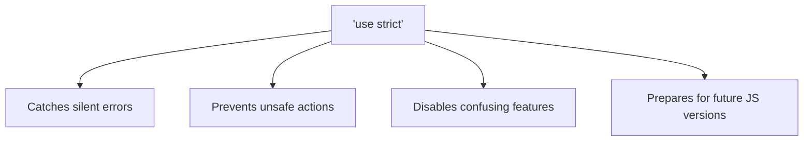

# 🔒 Strict Mode

Strict mode is a way to opt into a **restricted variant of JavaScript**. It makes several changes to normal JavaScript behavior — catching common coding mistakes and preventing unsafe actions.



---

## 🔧 1. How to Enable

### For an entire script:
```javascript
"use strict"; // Must be the FIRST line of the file!

x = 10; // ❌ ReferenceError: x is not defined
```

### For a single function:
```javascript
function strictFunction() {
    "use strict";
    y = 20; // ❌ ReferenceError
}

function normalFunction() {
    z = 30; // ✅ Works (creates global variable — bad practice!)
}
```

> **Note:** ES6 modules (`import`/`export`) and ES6 classes are **automatically** in strict mode!

---

## 🚫 2. What Strict Mode Prevents

### 2.1 — Accidental Global Variables
```javascript
"use strict";
mistypedVariable = 17; // ❌ ReferenceError
// Without strict mode, this silently creates a global variable!
```

### 2.2 — Duplicate Parameter Names
```javascript
"use strict";
function sum(a, a, c) { // ❌ SyntaxError: Duplicate parameter name
    return a + a + c;
}
```
> [!NOTE]
> **What happens without strict mode?** 
> It actually executes without an error! However, the last parameter silently overwrites the previous ones. If you called `sum(1, 2, 3)`, inside the function `a` would equal `2` (the second argument), and the `1` is lost. This is almost always a bug, which is why strict mode blocks it.

### 2.3 — Assigning to Read-Only Properties
```javascript
"use strict";
const obj = {};
Object.defineProperty(obj, "x", { value: 42, writable: false });
obj.x = 100; // ❌ TypeError: Cannot assign to read only property
// Without strict mode, this fails SILENTLY — no error, no change!
```

### 2.4 — Deleting Plain Variables
```javascript
"use strict";
var myVar = 10;
delete myVar; // ❌ SyntaxError: Delete of an unqualified identifier in strict mode
// Without strict mode, this fails silently (you can't delete plain variables anyway)
```

### 2.5 — `this` in Functions
```javascript
"use strict";
function showThis() {
    console.log(this);
}
showThis(); // undefined (NOT window!)
// Without strict mode, this = window (global object)
```
> [!NOTE]
> **Why is this beneficial?**
> Without strict mode, calling a plain function binds `this` to the global object (`window`). If you accidentally wrote `this.name = "John"` inside a plain function, you would silently pollute the global namespace and overwrite global variables! 
> 
> With strict mode, `this` remains `undefined`. If you accidentally write `this.name = "John"`, it immediately throws a `TypeError: Cannot set properties of undefined`, saving you from hard-to-find global state bugs.

### 2.6 — Octal Literals
```javascript
"use strict";
const num = 010; // ❌ SyntaxError: Octal literals are not allowed
// Without strict mode, 010 = 8 (octal) — very confusing!
```

---

## 📊 Strict Mode Changes Summary

| Behavior | Normal Mode | Strict Mode |
|:---|:---|:---|
| Undeclared variable | Creates global (silently!) | ❌ `ReferenceError` |
| Duplicate params | Allowed (last wins) | ❌ `SyntaxError` |
| `this` in plain function | `window` | `undefined` |
| Writing to read-only | Fails silently | ❌ `TypeError` |
| Deleting plain variables | Fails silently | ❌ `SyntaxError` |
| Octal literals (`010`) | Interpreted as 8 | ❌ `SyntaxError` |
| `with` statement | Allowed | ❌ `SyntaxError` |
| `eval` creating variables | Leaks to surrounding scope | Contained in eval scope |

---

## 🔑 Key Takeaways
1. Always use `"use strict"` — it catches bugs that would otherwise fail silently.
2. Place it at the **very top** of a file or function.
3. ES6 modules and classes are strict mode by default.
4. The biggest changes: no accidental globals, `this = undefined` in functions, and read-only property errors.
5. Modern JavaScript (with `let`, `const`, modules) already enforces most strict mode rules!


## 🎯 Common Interview Questions

**Q: What are two key things `strict mode` prevents you from doing?**
- **A:** 1. It prevents accidental global variables (you cannot assign a value to an undeclared variable). 2. It sets `this` to `undefined` instead of the global object in default function calls.