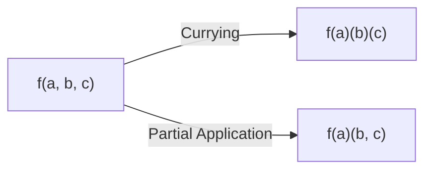
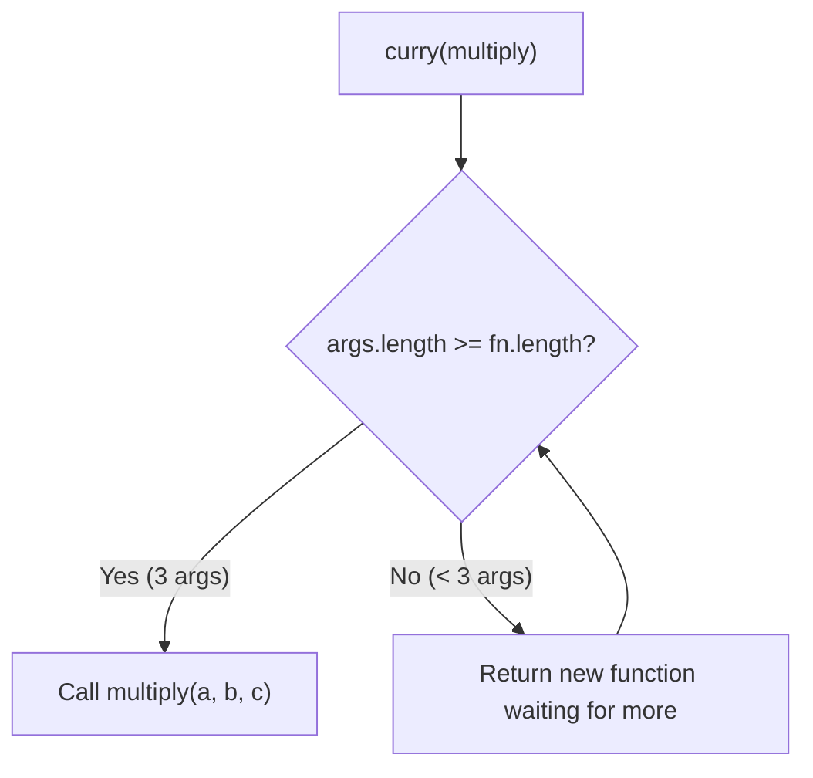

# 🍛 Currying & Partial Application

Currying is a technique where a function with multiple arguments is transformed into a **sequence of functions**, each taking a single argument. It's heavily used in functional programming and is a very popular interview topic.



---

## 🍛 1. What is Currying?

```javascript
// Normal function
function add(a, b, c) {
    return a + b + c;
}
add(1, 2, 3); // 6

// Curried version
function curriedAdd(a) {
    return function(b) {
        return function(c) {
            return a + b + c;
        };
    };
}
curriedAdd(1)(2)(3); // 6
```

### Why is this useful?
Currying lets you create **specialized functions** from generic ones:

```javascript
// Generic logger
function log(level) {
    return function(component) {
        return function(message) {
            console.log(`[${level}] [${component}]: ${message}`);
        };
    };
}

// Create specialized loggers
const errorLog = log("ERROR");
const errorAuth = errorLog("Auth");
const errorDB = errorLog("Database");

errorAuth("Login failed");   // [ERROR] [Auth]: Login failed
errorDB("Connection lost");  // [ERROR] [Database]: Connection lost
```

---

## 🔧 2. Generic Curry Utility (Interview Question!)

*"Write a function that converts any regular function into a curried version."*

```javascript
function curry(fn) {
    return function curried(...args) {
        // If we have enough arguments, call the original function
        if (args.length >= fn.length) {
            return fn.apply(this, args);
        }
        // Otherwise, return a function that waits for more arguments
        return function(...nextArgs) {
            return curried.apply(this, [...args, ...nextArgs]);
        };
    };
}

// Usage:
function multiply(a, b, c) {
    return a * b * c;
}

const curriedMultiply = curry(multiply);

curriedMultiply(2)(3)(4);    // 24
curriedMultiply(2, 3)(4);    // 24 — partial application also works!
curriedMultiply(2)(3, 4);    // 24
curriedMultiply(2, 3, 4);    // 24
```



---

## 🧩 3. Partial Application

Partial application is related but different: you fix (pre-fill) **some** arguments and return a function that takes the rest. With currying, each function takes exactly one argument; with partial application, a function can take any number.

```javascript
// Using bind for partial application
function greet(greeting, name) {
    return `${greeting}, ${name}!`;
}

const sayHello = greet.bind(null, "Hello");
sayHello("Raj");    // "Hello, Raj!"
sayHello("Alice");  // "Hello, Alice!"
```

---

## 🆚 4. Currying vs Partial Application

| | Currying | Partial Application |
|:---|:---|:---|
| **Arguments per call** | Exactly 1 | Any number |
| **Chain length** | Always N calls (for N args) | Fewer calls (some args pre-filled) |
| **Example** | `f(a)(b)(c)` | `f(a, b)(c)` |
| **Creates** | Chain of unary functions | A new function with fewer params |

---

## 🎯 5. Common Interview Questions

### Q: Implement `sum(1)(2)(3)...()` that stops when called with no args
```javascript
function sum(a) {
    return function(b) {
        if (b !== undefined) {
            return sum(a + b);
        }
        return a;
    };
}

sum(1)(2)(3)();  // 6
sum(5)(10)(15)(20)(); // 50
```

### Q: Implement `add(1,2)(3)(4,5,6)()` — infinite currying with multiple args
```javascript
function add(...args) {
    const total = args.reduce((sum, n) => sum + n, 0);
    
    return function(...nextArgs) {
        if (nextArgs.length === 0) return total;
        return add(total, ...nextArgs);
    };
}

add(1, 2)(3)(4, 5, 6)(); // 21
```
