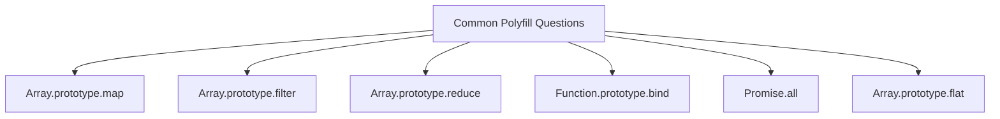
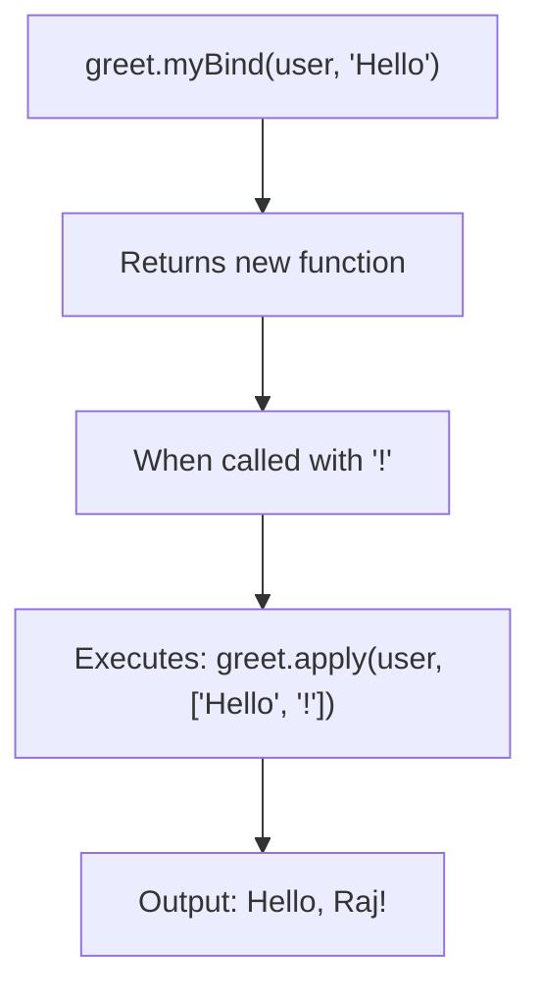

# 🔨 Polyfills

A **Polyfill** is a custom implementation of a built-in method that may not be available in older browsers. Writing polyfills from scratch is one of the most popular interview exercises because it tests your understanding of JavaScript internals.



---

## 🗺️ 1. Polyfill for `Array.prototype.map()`

```javascript
Array.prototype.myMap = function(callback) {
    const result = [];
    for (let i = 0; i < this.length; i++) {
        result.push(callback(this[i], i, this));
    }
    return result;
};

// Usage:
[1, 2, 3].myMap((x) => x * 2); // [2, 4, 6]
```

---

## 🚰 2. Polyfill for `Array.prototype.filter()`

```javascript
Array.prototype.myFilter = function(callback) {
    const result = [];
    for (let i = 0; i < this.length; i++) {
        if (callback(this[i], i, this)) {
            result.push(this[i]);
        }
    }
    return result;
};

// Usage:
[1, 2, 3, 4, 5].myFilter((x) => x % 2 === 0); // [2, 4]
```

---

## 📉 3. Polyfill for `Array.prototype.reduce()`

```javascript
Array.prototype.myReduce = function(callback, initialValue) {
    let accumulator = initialValue;
    let startIndex = 0;
    
    // If no initial value is provided, use the first element
    if (accumulator === undefined) {
        accumulator = this[0];
        startIndex = 1;
    }
    
    for (let i = startIndex; i < this.length; i++) {
        accumulator = callback(accumulator, this[i], i, this);
    }
    
    return accumulator;
};

// Usage:
[1, 2, 3, 4].myReduce((acc, curr) => acc + curr, 0); // 10
```

---

## 🔒 4. Polyfill for `Function.prototype.bind()`

This is the **most commonly asked** polyfill in interviews!

```javascript
Function.prototype.myBind = function(context, ...bindArgs) {
    const fn = this; // The original function
    
    return function(...callArgs) {
        return fn.apply(context, [...bindArgs, ...callArgs]);
    };
};

// Usage:
function greet(greeting, punctuation) {
    console.log(`${greeting}, ${this.name}${punctuation}`);
}

const user = { name: "Raj" };
const boundGreet = greet.myBind(user, "Hello");
boundGreet("!"); // "Hello, Raj!"
```



---

## 🚀 5. Polyfill for `Promise.all()`

```javascript
Promise.myAll = function(promises) {
    return new Promise(function(resolve, reject) {
        const results = [];
        let completed = 0;
        
        if (promises.length === 0) {
            resolve(results);
            return;
        }
        
        promises.forEach(function(promise, index) {
            Promise.resolve(promise).then(function(value) {
                results[index] = value; // Maintain order!
                completed++;
                
                if (completed === promises.length) {
                    resolve(results);
                }
            }).catch(reject); // If ANY one fails, reject immediately
        });
    });
};

// Usage:
const p1 = Promise.resolve(1);
const p2 = Promise.resolve(2);
const p3 = Promise.resolve(3);

Promise.myAll([p1, p2, p3]).then(console.log); // [1, 2, 3]
```

---

## 📏 6. Polyfill for `Array.prototype.flat()`

```javascript
Array.prototype.myFlat = function(depth = 1) {
    const result = [];
    
    const flatten = function(arr, d) {
        for (let i = 0; i < arr.length; i++) {
            if (Array.isArray(arr[i]) && d > 0) {
                flatten(arr[i], d - 1);
            } else {
                result.push(arr[i]);
            }
        }
    };
    
    flatten(this, depth);
    return result;
};

// Usage:
[1, [2, [3, [4]]]].myFlat();     // [1, 2, [3, [4]]]
[1, [2, [3, [4]]]].myFlat(2);    // [1, 2, 3, [4]]
[1, [2, [3, [4]]]].myFlat(Infinity); // [1, 2, 3, 4]
```

---

## 🔑 Key Takeaways
1. Polyfills test your understanding of **how built-in methods work internally**.
2. Always accept the same arguments as the original (`callback`, `index`, `array`).
3. Use `this` to refer to the array the method is called on.
4. `bind` polyfill uses `apply` internally — this connection is important!
5. `Promise.all` polyfill must maintain **order** and reject on **first failure**.
