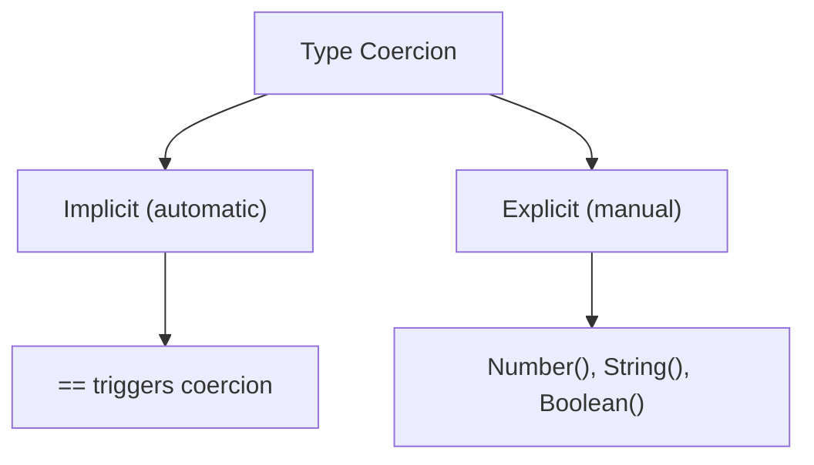
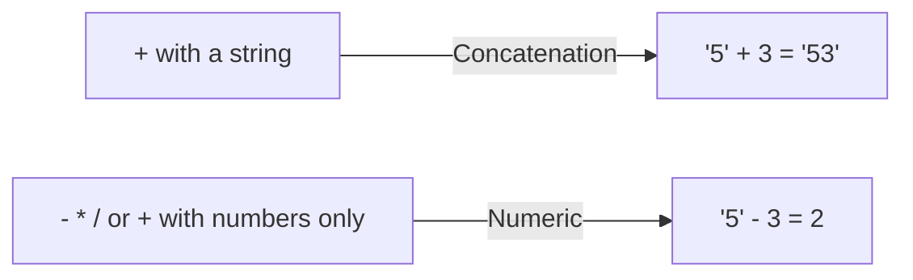
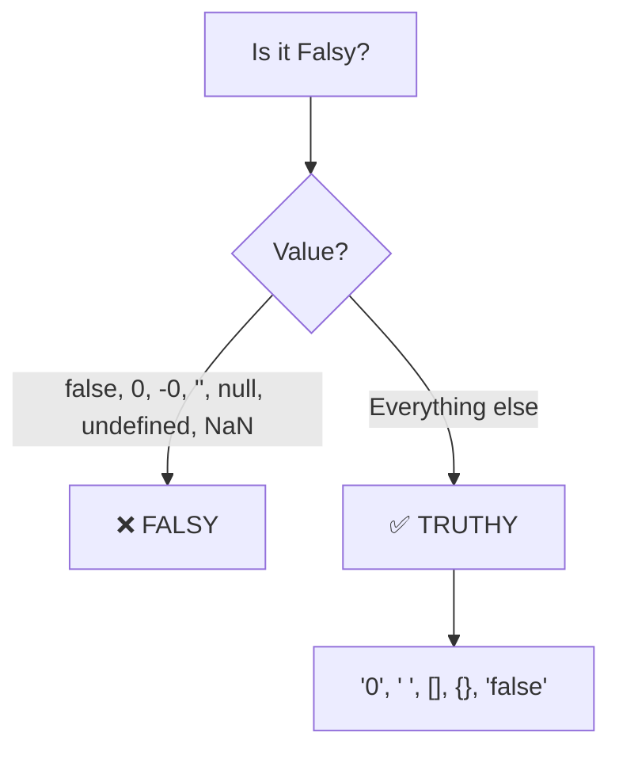

# 🎭 Type Coercion, `==` vs `===` & Truthy/Falsy

JavaScript is a **loosely typed** language, which means it tries to "help" you by automatically converting types behind the scenes. This automatic conversion is called **Type Coercion**, and it causes some of the most confusing behavior in the language.



---

## ⚖️ 1. `==` vs `===`

This is asked in **every** JavaScript interview.

| Operator | Name | Checks | Coercion? |
|:---|:---|:---|:---|
| `==` | Abstract Equality | Value only | ✅ Yes (converts types first) |
| `===` | Strict Equality | Value AND type | ❌ No |

```javascript
// == (Abstract Equality) — performs type coercion
"5" == 5      // true  — string "5" is coerced to number 5
0 == false    // true  — false is coerced to 0
"" == false   // true  — "" is coerced to 0, false is coerced to 0
null == undefined // true  — special rule!
null == 0     // false — null only == undefined, nothing else

// === (Strict Equality) — no coercion
"5" === 5     // false — different types!
0 === false   // false — different types!
null === undefined // false — different types!
```

> **Best Practice:** Always use `===` unless you have a specific reason to use `==`. The only acceptable use of `==` is checking for `null == undefined`.

---

## 🎪 2. Implicit Coercion Rules

### String Coercion (using `+` with a string):
The `+` operator with a string converts everything to a string (concatenation):
```javascript
"5" + 3       // "53" (number 3 → string "3")
"5" + true    // "5true"
"5" + null    // "5null"
"5" + undefined // "5undefined"
```

### Numeric Coercion (using `-`, `*`, `/`, or `+` with no strings):
All other math operators convert to numbers:
```javascript
"5" - 3       // 2 (string "5" → number 5)
"5" * "2"     // 10
true + 1      // 2 (true → 1)
false + 1     // 1 (false → 0)
"abc" - 1     // NaN (can't convert "abc" to number)
```



---

## 🌓 3. Truthy & Falsy Values

Every value in JavaScript can be evaluated as either **truthy** or **falsy** in a boolean context (like `if` statements).

### The 7 Falsy Values (MEMORIZE THESE!):

```javascript
// These are ALL the falsy values in JavaScript:
false
0
-0
"" (empty string)
null
undefined
NaN
```

**Everything else is truthy!** Including some surprising ones:

```javascript
// These are all TRUTHY (common gotchas!):
"0"       // truthy! (non-empty string)
" "       // truthy! (string with a space)
[]        // truthy! (empty array)
{}        // truthy! (empty object)
function(){} // truthy! (function)
"false"   // truthy! (non-empty string)
```



---

## 🧩 4. Explicit Coercion

You can manually convert types using built-in functions:

```javascript
// To Number
Number("42")     // 42
Number("")       // 0
Number(true)     // 1
Number(false)    // 0
Number(null)     // 0
Number(undefined)// NaN
Number("abc")    // NaN
parseInt("42px") // 42 (parses until non-numeric)

// To String
String(42)       // "42"
String(true)     // "true"
String(null)     // "null"
(42).toString()  // "42"

// To Boolean
Boolean(0)       // false
Boolean("")      // false
Boolean("hello") // true
Boolean([])      // true (empty array is truthy!)
!!value          // double-bang shortcut for Boolean(value)
```

---

## 🧪 5. Interview Tricky Questions

```javascript
// What does each of these evaluate to?
[] + []           // "" (arrays coerced to strings)
[] + {}           // "[object Object]"
{} + []           // 0 (block statement + unary plus)
true + true       // 2
true + false      // 1
"2" + "3"         // "23" (string concatenation)
"2" - "3"         // -1 (numeric subtraction)
null + 1          // 1 (null → 0)
undefined + 1     // NaN (undefined → NaN)
```

---

## 🔍 6. The `typeof` Operator (Gotchas!)

`typeof` returns a string indicating the type of a value. But it has some famous gotchas:

```javascript
typeof 42           // "number"
typeof "hello"      // "string"
typeof true         // "boolean"
typeof undefined    // "undefined"
typeof Symbol()     // "symbol"
typeof BigInt(1)    // "bigint"

// The gotchas:
typeof null         // "object" ← BUG! null is NOT an object. This is a 25-year-old JS bug that can never be fixed.
typeof []           // "object" ← arrays are objects
typeof {}           // "object"
typeof function(){} // "function" ← functions get their own type!
typeof NaN          // "number" ← NaN is technically a number!

// Undeclared vs TDZ:
typeof undeclaredVar // "undefined" — safe, no error!
typeof tdzVar        // ❌ ReferenceError! — let/const in TDZ
```

> **Interview Tip:** To properly check for `null`, use `value === null`. To check for arrays, use `Array.isArray(value)`.

---

## 📊 Quick Reference: Type Conversion

| Value | `Number()` | `String()` | `Boolean()` | `typeof` |
|:---|:---|:---|:---|:---|
| `""` | 0 | `""` | **false** | `"string"` |
| `"0"` | 0 | `"0"` | **true** | `"string"` |
| `"42"` | 42 | `"42"` | true | `"string"` |
| `true` | 1 | `"true"` | true | `"boolean"` |
| `false` | 0 | `"false"` | **false** | `"boolean"` |
| `null` | 0 | `"null"` | **false** | ⚠️ `"object"` |
| `undefined` | NaN | `"undefined"` | **false** | `"undefined"` |
| `[]` | 0 | `""` | **true** | `"object"` |
| `{}` | NaN | `"[object Object]"` | **true** | `"object"` |
| `function(){}` | NaN | `"function(){}"` | **true** | `"function"` |

