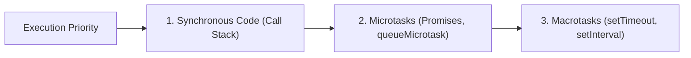
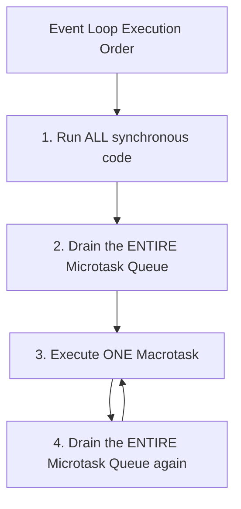

# 🧪 Event Loop Output Questions

These are the **most popular interview questions** to test your understanding of the Event Loop, Microtask Queue, and Callback Queue. For each question, try to predict the output before reading the answer!



---

## ❓ Question 1: The Classic

```javascript
console.log("1");

setTimeout(() => console.log("2"), 0);

Promise.resolve().then(() => console.log("3"));

console.log("4");
```

<details>
<summary>✅ Click to reveal answer</summary>

```
1
4
3
2
```

**Why?**
1. `"1"` — Synchronous, runs immediately.
2. `setTimeout` — Callback goes to **Macrotask Queue**.
3. `Promise.then` — Callback goes to **Microtask Queue**.
4. `"4"` — Synchronous, runs immediately.
5. Call Stack empty → Microtask Queue: `"3"` prints.
6. Microtask Queue empty → Macrotask Queue: `"2"` prints.
</details>

---

## ❓ Question 2: Nested Promises

```javascript
console.log("Start");

setTimeout(() => {
    console.log("Timeout 1");
    Promise.resolve().then(() => console.log("Promise inside Timeout"));
}, 0);

Promise.resolve().then(() => {
    console.log("Promise 1");
    setTimeout(() => console.log("Timeout inside Promise"), 0);
});

console.log("End");
```

<details>
<summary>✅ Click to reveal answer</summary>

```
Start
End
Promise 1
Timeout 1
Promise inside Timeout
Timeout inside Promise
```

**Why?**
1. `"Start"` — Sync.
2. First `setTimeout` → Macrotask Queue.
3. `Promise.then` → Microtask Queue.
4. `"End"` — Sync.
5. Microtasks first: `"Promise 1"` prints. This schedules a new `setTimeout` → Macrotask Queue.
6. Macrotask: `"Timeout 1"` prints. This schedules a new Promise → Microtask Queue.
7. Before next macrotask, drain microtasks: `"Promise inside Timeout"` prints.
8. Next macrotask: `"Timeout inside Promise"` prints.
</details>

---

## ❓ Question 3: Async/Await Transformation

```javascript
async function foo() {
    console.log("foo start");
    await bar();
    console.log("foo end");
}

async function bar() {
    console.log("bar");
}

console.log("script start");
foo();
console.log("script end");
```

<details>
<summary>✅ Click to reveal answer</summary>

```
script start
foo start
bar
script end
foo end
```

**Why?**
1. `"script start"` — Sync.
2. `foo()` is called. Inside foo: `"foo start"` — Sync.
3. `await bar()`: calls `bar()`, which prints `"bar"` synchronously.
4. `await` pauses `foo` here — everything after `await` goes to the **Microtask Queue**.
5. `"script end"` — Sync (back in global scope).
6. Call Stack empty → Microtask: resume `foo` → `"foo end"` prints.
</details>

---

## ❓ Question 4: setTimeout vs setInterval

```javascript
console.log("Start");

setTimeout(() => console.log("Timeout"), 0);

setInterval(() => {
    console.log("Interval");
}, 0);

Promise.resolve().then(() => console.log("Promise"));

console.log("End");
```

<details>
<summary>✅ Click to reveal answer</summary>

```
Start
End
Promise
Timeout
Interval
Interval
Interval... (keeps repeating!)
```

**Why?**
- `setInterval` keeps pushing callbacks to the Macrotask Queue at the specified interval.
- `Promise` (microtask) still runs before `setTimeout` and `setInterval` (macrotasks).
</details>

---

## ❓ Question 5: The Ultimate Challenge

```javascript
console.log("1");

setTimeout(() => console.log("2"), 0);

Promise.resolve()
    .then(() => {
        console.log("3");
        setTimeout(() => console.log("4"), 0);
    })
    .then(() => console.log("5"));

setTimeout(() => {
    console.log("6");
    Promise.resolve().then(() => console.log("7"));
}, 0);

console.log("8");
```

<details>
<summary>✅ Click to reveal answer</summary>

```
1
8
3
5
2
6
7
4
```

**Why?**
1. `"1"` — Sync.
2. First `setTimeout("2")` → Macrotask Queue.
3. Promise chain → Microtask Queue.
4. Second `setTimeout("6")` → Macrotask Queue.
5. `"8"` — Sync.
6. Drain Microtasks: `"3"` prints, schedules `setTimeout("4")`. Chained `.then("5")` also goes to microtasks.
7. Continue draining Microtasks: `"5"` prints.
8. Macrotask 1: `"2"` prints.
9. Macrotask 2: `"6"` prints, schedules `Promise("7")` → Microtask Queue.
10. Drain Microtasks: `"7"` prints.
11. Macrotask 3: `"4"` prints.
</details>

---

## 🧠 The Golden Rules



1. **Synchronous code always runs first** — line by line on the Call Stack.
2. **Microtasks drain completely** before any Macrotask — ALL `.then()`, `queueMicrotask`, `MutationObserver`.
3. **One Macrotask at a time** — after each macrotask, the microtask queue is drained again.
4. If a microtask schedules another microtask, it runs **immediately** (in the same drain cycle).
5. If a macrotask schedules a microtask, that microtask runs **before the next macrotask**.
