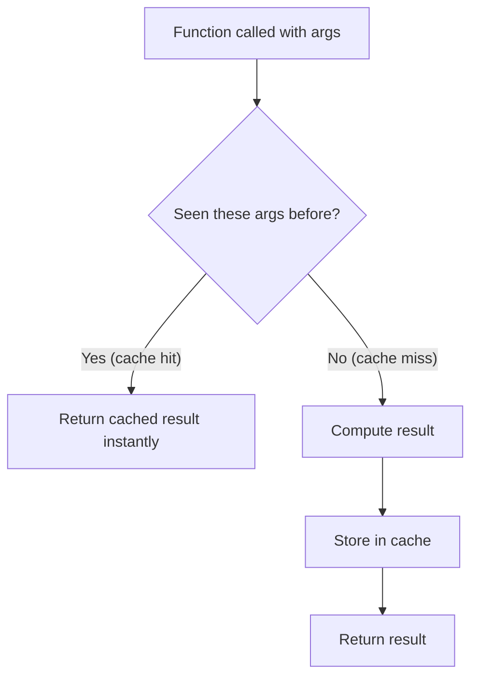
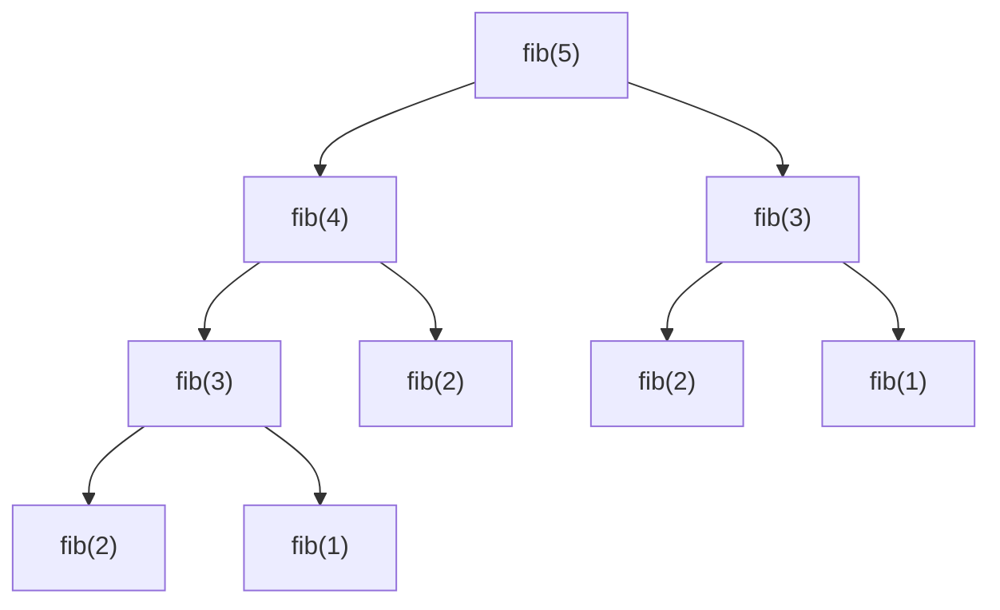
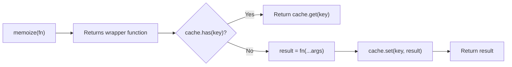

# 🧠 Memoization

Memoization is a performance optimization technique that **caches the results** of expensive function calls. If the function is called again with the **same arguments**, it returns the cached result instead of recomputing.



---

## 🐢 1. The Problem: Expensive Computations

Consider a function that calculates Fibonacci numbers:

```javascript
function fib(n) {
    if (n <= 1) return n;
    return fib(n - 1) + fib(n - 2);
}

fib(40); // Takes several SECONDS — same subproblems computed millions of times!
```



Notice how `fib(3)` and `fib(2)` are calculated **multiple times**! This is wasted work.

---

## ⚡ 2. The Solution: Memoize!

```javascript
function memoizedFib() {
    const cache = {};
    
    return function fib(n) {
        if (n in cache) return cache[n]; // Cache hit!
        if (n <= 1) return n;
        
        cache[n] = fib(n - 1) + fib(n - 2);
        return cache[n];
    };
}

const fib = memoizedFib();
fib(40); // Returns INSTANTLY! Each subproblem computed only once.
```

---

## 🔧 3. Generic Memoize Utility (Interview Question!)

*"Write a generic memoize function that works with any function."*

```javascript
function memoize(fn) {
    const cache = new Map();
    
    return function(...args) {
        const key = JSON.stringify(args);
        
        if (cache.has(key)) {
            console.log("Cache hit for:", key);
            return cache.get(key);
        }
        
        const result = fn.apply(this, args);
        cache.set(key, result);
        return result;
    };
}

// Usage:
const expensiveMultiply = memoize((a, b) => {
    console.log("Computing...");
    return a * b;
});

expensiveMultiply(4, 5); // "Computing..." → 20
expensiveMultiply(4, 5); // "Cache hit for: [4,5]" → 20 (instant!)
expensiveMultiply(3, 7); // "Computing..." → 21
```



---

## 🌍 4. Real-World Use Cases

| Use Case | Why Memoize? |
|:---|:---|
| **API Responses** | Avoid duplicate network requests for the same data |
| **DOM Queries** | Cache expensive `querySelector` results |
| **Complex Calculations** | Fibonacci, factorial, dynamic programming |
| **React Components** | `React.memo()`, `useMemo()`, `useCallback()` |
| **Recursive Algorithms** | Prevent exponential time complexity |

---

## ⚠️ 5. Caveats

1. **Memory trade-off:** Memoization trades memory for speed. If your function has millions of unique inputs, the cache will grow very large.
2. **Only works for pure functions:** Memoization assumes the same inputs always produce the same output. Don't memoize functions with side effects!
3. **Cache invalidation:** In production, use a cache with expiry (LRU cache) to prevent memory leaks.

---

## 🔑 Key Takeaways
1. Memoization = **cache function results** for repeated calls.
2. Uses **closures** to maintain the cache between calls.
3. `JSON.stringify(args)` is a simple way to create cache keys.
4. Only memoize **pure functions** (no side effects).
5. This is closely related to **Dynamic Programming** in algorithms!
