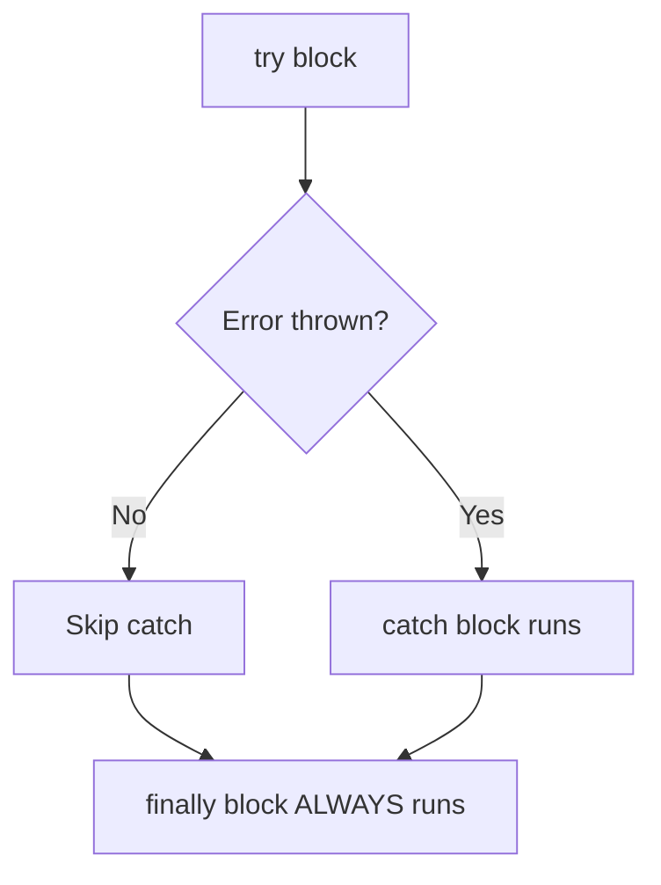

# 🛡️ try / catch / finally

Error handling is essential for writing robust JavaScript. The `try...catch...finally` construct lets you gracefully handle errors instead of crashing your entire application.



---

## 🧱 1. Basic Syntax

```javascript
try {
    // Code that might throw an error
    const data = JSON.parse("invalid json");
} catch (error) {
    // Runs ONLY if an error occurred in try
    console.error("Parsing failed:", error.message);
} finally {
    // Runs ALWAYS — whether error occurred or not
    console.log("Cleanup complete");
}
```

### The `finally` Block:
`finally` is guaranteed to execute no matter what — even if:
- The `try` block succeeds
- The `catch` block is triggered
- A `return` statement is hit in `try` or `catch`!

```javascript
function getData() {
    try {
        return "success";
    } finally {
        console.log("Finally runs even after return!");
    }
}

getData(); 
// Logs: "Finally runs even after return!"
// Returns: "success"
```

---

## 🚨 2. Error Object

When an error is thrown, JavaScript creates an Error object with useful properties:

```javascript
try {
    undefinedFunction();
} catch (error) {
    console.log(error.name);    // "ReferenceError"
    console.log(error.message); // "undefinedFunction is not defined"
    console.log(error.stack);   // Full stack trace
}
```

### Built-in Error Types:

| Error Type | When it Occurs |
|:---|:---|
| `ReferenceError` | Accessing an undeclared variable |
| `TypeError` | Wrong type operation (e.g., calling non-function) |
| `SyntaxError` | Invalid JavaScript syntax |
| `RangeError` | Number out of range (e.g., invalid array length) |
| `URIError` | Invalid URI encoding/decoding |

---

## 🔨 3. Throwing Custom Errors

You can throw your own errors using the `throw` keyword:

```javascript
function divide(a, b) {
    if (b === 0) {
        throw new Error("Cannot divide by zero!");
    }
    return a / b;
}

try {
    divide(10, 0);
} catch (error) {
    console.error(error.message); // "Cannot divide by zero!"
}
```

### Custom Error Classes:
```javascript
class ValidationError extends Error {
    constructor(field, message) {
        super(message);
        this.name = "ValidationError";
        this.field = field;
    }
}

function validateAge(age) {
    if (age < 0) {
        throw new ValidationError("age", "Age cannot be negative");
    }
}

try {
    validateAge(-5);
} catch (error) {
    if (error instanceof ValidationError) {
        console.log(`Field: ${error.field}, Error: ${error.message}`);
        // "Field: age, Error: Age cannot be negative"
    }
}
```

---

## ⚠️ 4. Common Pitfalls

### Pitfall 1: `catch` only catches runtime errors, not syntax errors
```javascript
try {
    // SyntaxError is caught at parse time, not runtime
    // This would crash BEFORE try even runs:
    // eval("var a = ;");
} catch (error) {
    // Won't catch compile-time syntax errors!
}
```

### Pitfall 2: Async errors need async handling
```javascript
// ❌ This DOES NOT catch async errors!
try {
    setTimeout(() => {
        throw new Error("Async error!");
    }, 1000);
} catch (error) {
    // This will never run! The error is thrown in a different call stack.
}

// ✅ Use try/catch INSIDE async functions
async function fetchData() {
    try {
        const response = await fetch("invalid-url");
        const data = await response.json();
    } catch (error) {
        console.error("Caught:", error.message);
    }
}
```

---

## 🔑 Key Takeaways
1. `try` wraps code that might fail. `catch` handles the error. `finally` always runs.
2. `finally` executes even after `return` statements — use it for cleanup (closing connections, hiding loaders).
3. Use `throw new Error("message")` to create meaningful error messages.
4. Extend the `Error` class for custom error types.
5. `try...catch` does NOT catch errors inside `setTimeout` or other async callbacks — use `async/await` with `try...catch` instead.
