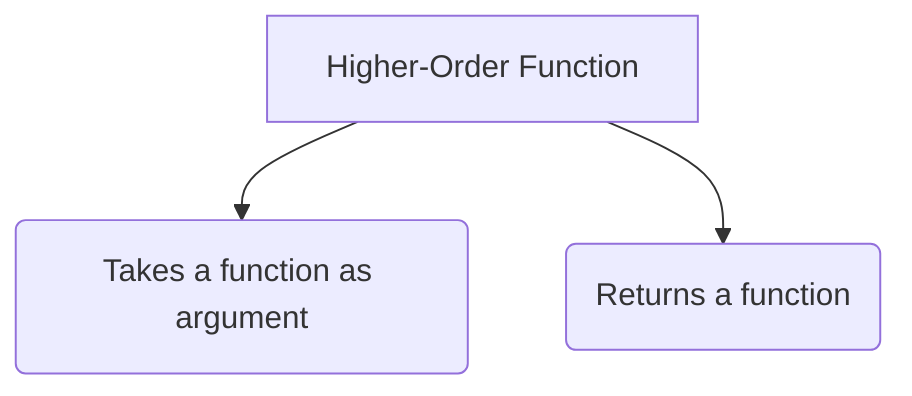

# 🦅 Higher-Order Functions

A **Higher-Order Function (HOF)** is simply a function that does at least one of the following:
1. Takes one or more functions as arguments.
2. Returns a function as its result.



## 🧠 Why use HOFs?
Higher-Order Functions allow us to write highly modular, reusable, and declarative code. Instead of writing a massive loop that calculates areas, circumferences, and diameters of circles, we can abstract the logic!

## 🛠️ Building our own HOF

Let's say we have an array of circle radii and we want to calculate the area for each one.

Instead of writing a specific function for calculating Area, we write a generic HOF called `calculate` that accepts the logic (the callback function) as an argument!

```javascript
const radii = [3, 1, 2, 4];

// The logic functions (Callbacks)
const area = function(radius) {
    return Math.PI * radius * radius;
}
const circumference = function(radius) {
    return 2 * Math.PI * radius;
}

// Our generic Higher-Order Function
const calculate = function(arr, logic) {
    const output = [];
    for (let i = 0; i < arr.length; i++) {
        output.push(logic(arr[i]));
    }
    return output;
}

// Using our HOF!
console.log(calculate(radii, area));
console.log(calculate(radii, circumference));
```

This makes our code incredibly **DRY (Don't Repeat Yourself)**!

*(Fun Fact: The `calculate` function we just wrote is essentially a custom implementation of `Array.prototype.map`!)*


## 🎯 Common Interview Questions

**Q: What defines a Higher-Order Function (HOF)?**
- **A:** A function is a HOF if it does at least one of two things: it takes one or more functions as arguments (callbacks), OR it returns a function as its result.

**Q: Why use HOFs?**
- **A:** They promote DRY (Don't Repeat Yourself) code by abstracting logic, allowing you to pass specific behaviors (callbacks) into generic wrappers.