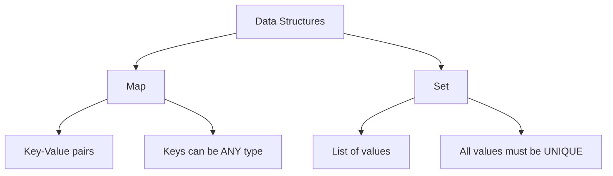

# 🗺️ Maps and Sets

ES6 introduced two powerful new data structures: **Map** and **Set** (along with their weak variants). They solve many of the shortcomings of standard Objects and Arrays.



---

## 🗺️ 1. Map (vs Object)

A `Map` is a collection of keyed data items, just like an `Object`. But the main difference is that **Map allows keys of any type**, whereas Object keys are always forced into strings or symbols.

```javascript
const map = new Map();

// Keys can be ANY data type!
map.set('1', 'string key');
map.set(1, 'number key');
map.set(true, 'boolean key');

const userObj = { name: "Alice" };
map.set(userObj, 'object key!'); // Yes, an object can be a key!

console.log(map.get(1)); // "number key"
console.log(map.get(userObj)); // "object key!"
console.log(map.size); // 4
```

### Why use Map instead of Object?
1. **Key Types**: Objects convert all keys to strings. Maps preserve the type.
2. **Size**: You can easily get the size of a Map with `map.size`. For objects, you have to do `Object.keys(obj).length`.
3. **Iteration**: Maps are **Iterables**, meaning you can loop over them directly with `for...of`.
4. **Order**: Maps guarantee that keys are iterated in the exact order they were inserted.

---

## 🎲 2. Set (vs Array)

A `Set` is a special type collection — a "set of values" (without keys), where **each value may occur only once**.

```javascript
const set = new Set();

set.add("apple");
set.add("banana");
set.add("apple"); // Ignored! Already exists.

console.log(set.size); // 2
console.log(set.has("apple")); // true
```

### 🧠 The Ultimate Set Interview Trick
Because Sets automatically enforce uniqueness, they are the fastest and cleanest way to remove duplicates from an Array!

```javascript
const numbers = [1, 1, 2, 2, 3, 4, 4, 5];

// 1. Pass the array into a Set to remove duplicates
// 2. Spread the Set back into a new array
const unique = [...new Set(numbers)]; 

console.log(unique); // [1, 2, 3, 4, 5]
```

---

## 👻 3. WeakMap and WeakSet

`WeakMap` and `WeakSet` are similar to their normal counterparts, but with two major restrictions:
1. They **only accept Objects as keys/values** (no primitives like numbers or strings).
2. They hold **weak references** to the objects. 

### What is a "Weak Reference"?
If you use an object as a key in a normal `Map`, that object will stay in memory forever as long as the Map exists.

If you use an object as a key in a `WeakMap`, and all other references to that object are deleted elsewhere in your code, the Garbage Collector will automatically delete the object from the `WeakMap` too! This prevents **Memory Leaks**.

*(Note: Because the Garbage Collector can delete items unpredictably, WeakMaps and WeakSets are **not iterable** and do not have a `.size` property).*

---

## 🎯 Common Interview Questions

**Q: What is the main difference between an Object and a Map?**
- **A:** Objects only allow strings and symbols as keys, whereas Maps allow *any* data type (including functions and other objects) as keys. Maps also maintain insertion order and have a built-in `.size` property.

**Q: How do you remove all duplicates from an array in one line of code?**
- **A:** By using a Set and the spread operator: `const unique = [...new Set(myArray)];`

**Q: Why would you use a `WeakMap`?**
- **A:** To prevent memory leaks. WeakMaps allow the garbage collector to safely delete their keys (which must be objects) if those objects are no longer referenced anywhere else in the application.
