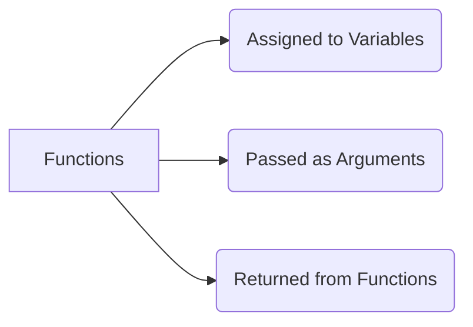

# 🥇 First-Class Functions & Function Types

> [!TIP]
> **The 30-Second Interview Pitch**
> In JavaScript, functions are "First-Class Citizens," meaning they are treated exactly like regular variables. They can be assigned to variables, passed as arguments (callbacks), and returned from other functions (Higher-Order Functions). This enables powerful functional programming patterns like closures and currying.

## 1. What does "First-Class" mean?



1. **Assigned to a variable:**
```javascript
const greet = function() {
    console.log("Hello World");
};
greet();
```

2. **Passed as an argument (Callback):**
```javascript
function executeFunction(fn) {
    fn(); // Calling the passed function
}
executeFunction(greet);
```

3. **Returned from a function:**
```javascript
function returnAFunction() {
    return function() {
        console.log("Returned function executed!");
    };
}
const myFunc = returnAFunction();
myFunc(); // Closure in action
```

---

## 2. Types of Functions

JavaScript offers several ways to define functions, each with unique behaviors.

### 📝 Named Function (Function Declaration)
A standard way to create a function. These are *fully hoisted* and can be called before they are written.
```javascript
raj(); // Works!
function raj() {
    console.log("Hello!");
}
```

### 🎭 Anonymous Function & Function Expression
A function without a name is an anonymous function. When assigned to a variable, it becomes a **Function Expression**. These are hoisted based on `var`/`let`/`const` rules (not fully hoisted).
```javascript
const my_fun = function() {
    console.log("Hello World");
}
```

### 🏹 Arrow Function (ES6)
A concise syntax that also inherits `this` from the surrounding lexical scope (it does not have its own `this` or `arguments` object).
```javascript
const rajzz = () => console.log("Hello World!");
```

### ⚡ IIFE (Immediately Invoked Function Expression)
A function that runs immediately after it is defined. It creates an isolated scope, avoiding global namespace pollution.
```javascript
(function() {
    console.log("I run immediately!");
})();
```

---

## 3. Advanced Function Patterns

### 🔄 Callbacks & Higher-Order Functions (HOF)

- **Callback Function:** A function passed *into* another function as an argument.
- **Higher-Order Function:** A function that *takes* a function as an argument OR *returns* a function.

```javascript
// Callback
function sayHello() {
    console.log("Hello Brother");
}

// Higher-Order Function (Takes a function as argument)
function executeIt(higher_funct) {
    higher_funct(); 
}

executeIt(sayHello); // Passing sayHello as a callback
```

### 🧼 Pure vs Impure Functions

> [!IMPORTANT]
> Understanding pure functions is critical for React (especially Redux and `useMemo`).

**Pure Function:** Always returns the same output for the same input and produces **no side effects** (does not modify external state).
```javascript
// ✅ Pure
function add(a, b) {
    return a + b;
}
```

**Impure Function:** The output can change depending on external state, or it modifies external variables.
```javascript
let total = 0;

// ❌ Impure (Modifies external state 'total')
function addToTotal(num) {
    return total += num;
}
```

---

## 🎯 Common Interview Questions

**Q: Difference between Function Declaration and Function Expression?**
- **A:** Function Declarations are fully hoisted (you can call them before they are written). Function Expressions are assigned to variables, so they are hoisted based on variable rules (`undefined` for `var`, or TDZ for `let`).

**Q: What is a Pure Function?**
- **A:** A function that always returns the exact same result for the exact same arguments and has no observable side effects (like mutating global variables or making network requests).