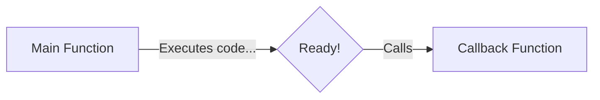

# 📞 Callback Functions

Because functions in JavaScript are First-Class Citizens, you can pass a function into another function as an argument. The function that you pass in is called a **Callback Function**.



## 🎬 Callbacks in Action (Synchronous)

Here is a basic example of passing a function into another function:

```javascript
function greet(name) {
    console.log("Hello, " + name + "!");
}

function processUserInput(callback) {
    const name = "Alice";
    // We call the function that was passed in!
    callback(name); 
}

// Pass the 'greet' function as an argument
processUserInput(greet); 
// Output: Hello, Alice!
```
Notice we passed `greet` (without parentheses). If we used `greet()`, it would execute immediately. By passing `greet`, we let `processUserInput` decide *when* to execute it.

## 🔗 Callbacks + Closures 
Callbacks form closures! This is very common in JavaScript.

```javascript
function createCounter() {
    let count = 0; // Closed over by the callback below
    
    return function() { // This returned function is often used as a callback!
        count++;
        console.log("Count is now: " + count);
    };
}
const increment = createCounter();

// We could pass 'increment' as a callback somewhere else in our code.
// increment() will remember 'count' even though createCounter() finished!
```

> **💡 Note on Asynchronous Callbacks:**
> While the example above is synchronous (it runs immediately), callbacks are heavily used for **Asynchronous** tasks in JavaScript (like waiting for a timer or fetching data from a server). We will cover "Callback Hell", "Inversion of Control", and Async Callbacks in detail in the **Asynchronous JavaScript** section!

## 🎯 Common Interview Questions

**Q: Why don't we put parentheses after a callback when passing it? (e.g., `processUserInput(greet)`)**
- **A:** If you put parentheses `greet()`, you are calling the function *immediately* and passing its return value (which might be `undefined`). By omitting the parentheses, you pass the function definition itself, allowing the receiving function to call it later.