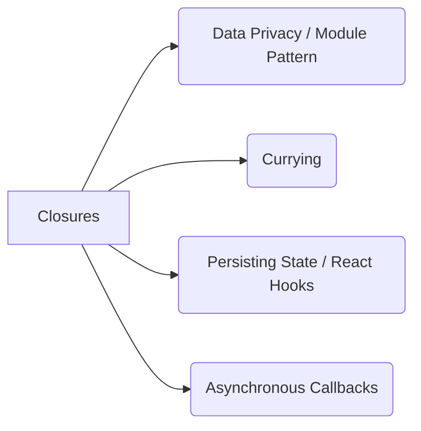

# 🎬 Closures in Action (Uses & Pitfalls)

> [!TIP]
> **The 30-Second Interview Pitch**
> A Closure is created when a nested function remembers and has access to the variables of its outer (lexical) scope, even after the outer function has finished executing. Closures are heavily used in JavaScript for data encapsulation (private variables), currying, and persisting state across asynchronous callbacks or React Hooks.

Closures aren't just interview trivia; they are used everywhere in professional JavaScript development!



## 🛡️ 1. Data Privacy & Encapsulation
JavaScript historically didn't have `private` variables for objects. We use closures to bundle data and functions to provide data security—variables that cannot be accessed from the outside world.

```javascript
function createAccount(initialBalance) {
    let balance = initialBalance; // This is hidden in the closure!
    
    return {
        deposit(amount) {
            balance += amount;
            console.log("Balance: ", balance);
        },
        withdraw(amount) {
            balance -= amount;
            console.log("Balance: ", balance);
        }
    };
}

const account = createAccount(1000);
account.deposit(500); // 1500
console.log(account.balance); // undefined (Data is completely private!)
```

> [!WARNING]
> **Gotcha: Memory Leaks**
> Because closures keep outer variables alive in memory, they can cause memory leaks if not handled properly. If the closure is no longer needed, you should release the reference by setting it to `null` (e.g., `account = null;`) so the Garbage Collector can free the memory.

## ⚛️ 2. Persisting State (React Hooks)
Closures are automatically used when working with `setTimeout`, Event Listeners, and **React Hooks**. `useState` and `useEffect` rely heavily on closures to remember state between renders!

```javascript
function Counter() {
    // React's useState uses closures under the hood to persist 'count'
    const [count, setCount] = useState(0);

    function handleClick() {
        setCount(count + 1); // The click handler "closes over" the count variable
    }

    return <button onClick={handleClick}>{count}</button>;
}
```

## 🍛 3. Currying
Currying is when you transform a function that takes multiple arguments into a **sequence of nested functions**, each taking a single argument. Closures make this possible because each inner function remembers the arguments of the outer functions!

```javascript
function curriedMultiply(a) {
    return function(b) { // This inner function closes over 'a'
        return a * b;
    }
}

// Create reusable partial functions!
const double = curriedMultiply(2); // Remembers a = 2
console.log(double(5)); // 10

const triple = curriedMultiply(3); // Remembers a = 3
console.log(triple(5)); // 15
```

## 🐛 4. The Infamous `var` Loop Bug
This is the most common closure interview question. What does this code print?

```javascript
for (var i = 1; i <= 3; i++) {
    setTimeout(function() {
        console.log(i);
    }, 1000);
}
```
**You expect:** `1, 2, 3`
**It actually prints:** `4, 4, 4`

### 🕵️ Why does this happen?
1. The `for` loop finishes running instantly (synchronously).
2. `var` is function-scoped. There is only ONE memory location for `i`.
3. By the time the 1-second timers finish, `i` has reached `4` in that single memory location.
4. All three closure callbacks look at that exact same memory location and print `4`.

### 🛠️ The Fix
Use `let` instead of `var`! `let` is **block-scoped**. It creates a brand new, separate memory location for `i` for *every single iteration* of the loop.

```javascript
for (let i = 1; i <= 3; i++) {
    setTimeout(function() {
        console.log(i); // Prints 1, 2, 3!
    }, 1000);
}
```

---

## 🎯 Common Interview Questions

**Q: How can closures be used to create private variables?**
- **A:** By encapsulating a variable within an outer function's scope, and returning an object or inner function that interacts with that variable. The outside world cannot access the variable directly.

**Q: How does React use Closures?**
- **A:** React Hooks like `useState` and `useEffect` rely on closures to capture and remember state variables and props from a specific render cycle.