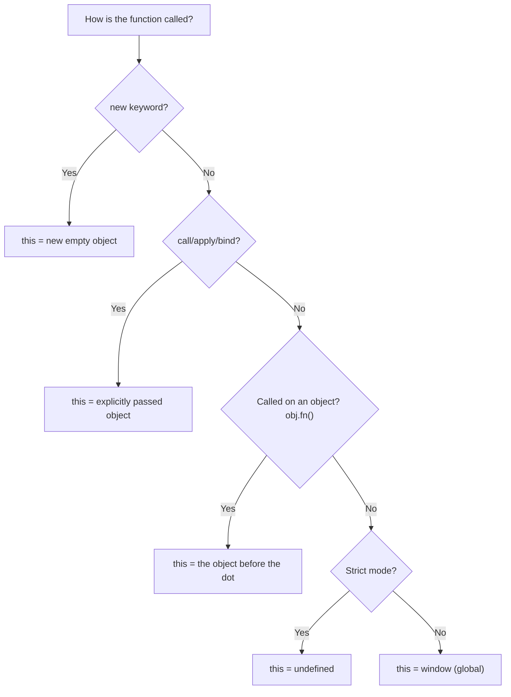
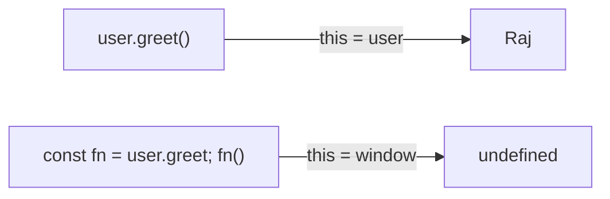
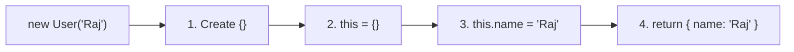
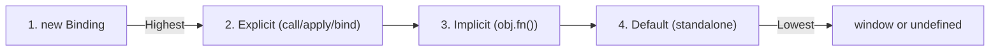

# 🎯 The `this` Keyword — Binding Rules

The `this` keyword is one of the most confusing parts of JavaScript. Unlike most languages where `this` always refers to the current object, in JavaScript, **`this` depends on HOW and WHERE a function is called**, not where it is written.



> This flowchart is the **master key** to solving any `this` interview question. Walk through it top to bottom!

---

## 📌 1. Default Binding (Standalone Function Call)
When a function is called without any context (no object, no `new`, no `call/apply/bind`), `this` falls back to the **global object** (`window` in browsers, `global` in Node.js).

```javascript
function showThis() {
    console.log(this);
}
showThis(); // window (in browser) / global (in Node.js)
```

In **strict mode**, the default binding gives `undefined` instead of the global object:
```javascript
"use strict";
function showThis() {
    console.log(this);
}
showThis(); // undefined
```

---

## 🔗 2. Implicit Binding (Object Method Call)
When a function is called as a **method of an object** (using the dot notation), `this` refers to the object that is **left of the dot**.

```javascript
const user = {
    name: "Raj",
    greet: function() {
        console.log(this.name);
    }
};

user.greet(); // "Raj" — this = user (left of the dot)
```

### ⚠️ The Implicit Binding Trap
If you extract the method and call it standalone, you **lose** the implicit binding!

```javascript
const greetFn = user.greet; // Extracting the method
greetFn(); // undefined — this = window (default binding!)
```



---

## 🎛️ 3. Explicit Binding (`call`, `apply`, `bind`)
You can **force** `this` to be a specific object using `call`, `apply`, or `bind`. These are covered in detail in the next note!

```javascript
function greet() {
    console.log(this.name);
}

const user = { name: "Raj" };
greet.call(user); // "Raj" — this is explicitly set to user
```

---

## 🆕 4. `new` Binding (Constructor Call)
When a function is called with the `new` keyword, JavaScript does 4 things behind the scenes:

1. Creates a **brand new empty object** `{}`
2. Sets `this` to point to that new object
3. Links the object's prototype to the function's prototype
4. Returns the object (unless the function explicitly returns something else)

```javascript
function User(name) {
    // this = {} (new empty object, created by 'new')
    this.name = name;
    // return this (implicit)
}

const user1 = new User("Raj");
console.log(user1.name); // "Raj"
```



---

## ➡️ 5. Arrow Functions & `this`
Arrow functions **do NOT have their own `this`**. They inherit `this` from their surrounding (lexical) scope — the place where they were **defined**, not where they were called.

```javascript
const user = {
    name: "Raj",
    // Regular function — has its own 'this'
    greetRegular: function() {
        console.log(this.name); // "Raj"
    },
    // Arrow function — inherits 'this' from the surrounding scope (global)
    greetArrow: () => {
        console.log(this.name); // undefined (this = window!)
    }
};

user.greetRegular(); // "Raj"
user.greetArrow();   // undefined
```

### ✅ When Arrow Functions Save the Day
Arrow functions shine inside callbacks where you *want* to preserve the outer `this`:

```javascript
const user = {
    name: "Raj",
    friends: ["Alice", "Bob"],
    showFriends: function() {
        this.friends.forEach((friend) => {
            // Arrow function inherits 'this' from showFriends
            console.log(this.name + " knows " + friend);
        });
    }
};
user.showFriends();
// "Raj knows Alice"
// "Raj knows Bob"
```

> **Key Rule:** You can **never** change an arrow function's `this` with `call`, `apply`, or `bind`. It always uses the `this` from where it was written!

---

## 🏆 6. Binding Priority (When Rules Conflict)
What happens if multiple binding rules apply at the same time? JavaScript resolves conflicts using this priority order:



```javascript
function greet() { console.log(this.name); }
const user = { name: "Raj", greet };

// Implicit vs Explicit — Explicit wins!
user.greet.call({ name: "Alice" }); // "Alice"

// Explicit vs new — new wins!
const BoundGreet = greet.bind({ name: "Bob" });
const obj = new BoundGreet(); // 'this' is the new object, NOT { name: "Bob" }
```

> **Memory trick:** **N**ew → **E**xplicit → **I**mplicit → **D**efault (think: **NEID** — from highest to lowest priority)

---

## 📊 Summary Cheat Sheet

| Binding Type | How it's Called | `this` Points To |
|:---|:---|:---|
| **Default** | `fn()` | `window` (or `undefined` in strict mode) |
| **Implicit** | `obj.fn()` | The object left of the dot |
| **Explicit** | `fn.call(obj)` / `fn.apply(obj)` / `fn.bind(obj)` | The explicitly passed object |
| **`new`** | `new Fn()` | The newly created object |
| **Arrow** | `() => {}` | Inherited from lexical (parent) scope |

\n\n## 🎯 Common Interview Questions\n\n**Q: How does `this` behave differently in an arrow function compared to a regular function?**\n- **A:** Arrow functions do not have their own `this` binding. They inherit `this` lexically from the parent scope at the time they are defined, unlike regular functions where `this` is determined by how the function is called.\n\n**Q: What is the value of `this` in a standalone function call in strict mode?**\n- **A:** In strict mode, default binding sets `this` to `undefined` rather than the global window object.