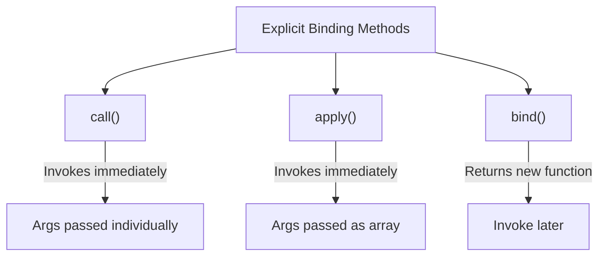

# 📞 `call()`, `apply()`, and `bind()`

These three methods exist on **every function** in JavaScript (via `Function.prototype`). They allow you to **explicitly set** the value of `this` when calling a function.



---

## 📞 1. `call()` — Call Immediately with Arguments
`call()` invokes the function **immediately** and lets you pass `this` as the first argument. Additional arguments are passed **one by one**.

```javascript
function greet(city, country) {
    console.log(`${this.name} from ${city}, ${country}`);
}

const user = { name: "Raj" };

greet.call(user, "Mumbai", "India");
// Output: "Raj from Mumbai, India"
```

### 🧠 How it works:
1. `greet.call(user, ...)` — Sets `this = user` inside `greet`.
2. The remaining arguments `"Mumbai"` and `"India"` are passed as normal parameters.

### 🎯 Real-World Use Case: Borrowing Methods
You can borrow a method from one object and use it on another!

```javascript
const person1 = {
    name: "Raj",
    introduce: function() {
        console.log("Hi, I'm " + this.name);
    }
};

const person2 = { name: "Alice" };

// Borrow person1's method for person2
person1.introduce.call(person2); // "Hi, I'm Alice"
```

---

## 📋 2. `apply()` — Same as `call`, but Arguments as Array
`apply()` is **identical** to `call()`, except it takes arguments as an **array** (or array-like object) instead of individually.

```javascript
function greet(city, country) {
    console.log(`${this.name} from ${city}, ${country}`);
}

const user = { name: "Raj" };

greet.apply(user, ["Mumbai", "India"]);
// Output: "Raj from Mumbai, India"
```

> **Memory Trick:** **A**pply takes an **A**rray. **C**all takes **C**omma-separated args.

### 🎯 Real-World Use Case: Finding Max in Array

```javascript
const numbers = [5, 6, 2, 3, 7];

// Math.max doesn't accept arrays, but with apply:
const max = Math.max.apply(null, numbers);
console.log(max); // 7

// Modern alternative (spread operator):
const max2 = Math.max(...numbers); // 7
```

---

## 🔒 3. `bind()` — Create a New Function for Later
Unlike `call` and `apply`, `bind()` does **NOT** invoke the function immediately. Instead, it returns a **brand new function** with `this` permanently bound to the object you specified.

```javascript
function greet() {
    console.log("Hello, " + this.name);
}

const user = { name: "Raj" };

const boundGreet = greet.bind(user); // Does NOT call greet yet
boundGreet(); // "Hello, Raj" — Can call it anytime later!
boundGreet(); // "Hello, Raj" — 'this' is permanently locked!
```

### 🎯 Real-World Use Case: Event Handlers
In event listeners, `this` often refers to the DOM element. Use `bind` to lock it to your object:

```javascript
const app = {
    name: "MyApp",
    handleClick: function() {
        console.log(this.name + " was clicked!");
    }
};

// Without bind: 'this' would be the button element!
document.getElementById("btn")
    .addEventListener("click", app.handleClick.bind(app));
// With bind: 'this' is always 'app'
```

### Partial Application with `bind`
`bind` can also pre-fill arguments (this is called partial application):

```javascript
function multiply(a, b) {
    return a * b;
}

const double = multiply.bind(null, 2); // Pre-fill 'a' as 2
console.log(double(5));  // 10
console.log(double(10)); // 20
```

---

## 🛠️ 4. Polyfill: Build Your Own `bind()`

This is a **very common interview question**: *"Implement your own `bind` function."*

```javascript
Function.prototype.myBind = function(...args) {
    const fn = this; // The original function
    const context = args[0]; // The 'this' context
    const bindArgs = args.slice(1); // Pre-filled arguments
    
    return function(...callArgs) {
        // Merge pre-filled args with new args
        return fn.apply(context, [...bindArgs, ...callArgs]);
    };
};

// Usage:
function greet(city) {
    console.log(this.name + " from " + city);
}

const user = { name: "Raj" };
const boundGreet = greet.myBind(user, "Mumbai");
boundGreet(); // "Raj from Mumbai"
```

---

## 📊 Summary Cheat Sheet

| Method | Invokes Immediately? | Arguments Format | Returns |
|:---|:---|:---|:---|
| `call()` | ✅ Yes | `fn.call(this, a, b, c)` | Function result |
| `apply()` | ✅ Yes | `fn.apply(this, [a, b, c])` | Function result |
| `bind()` | ❌ No | `fn.bind(this, a, b)` | New bound function |
\n\n## 🎯 Common Interview Questions\n\n**Q: What is the main difference between `call`, `apply`, and `bind`?**\n- **A:** `call` and `apply` immediately invoke the function with a specific `this` context (`call` takes comma-separated arguments, `apply` takes an array of arguments). `bind` returns a *new function* with the `this` context bound to it, to be executed later.