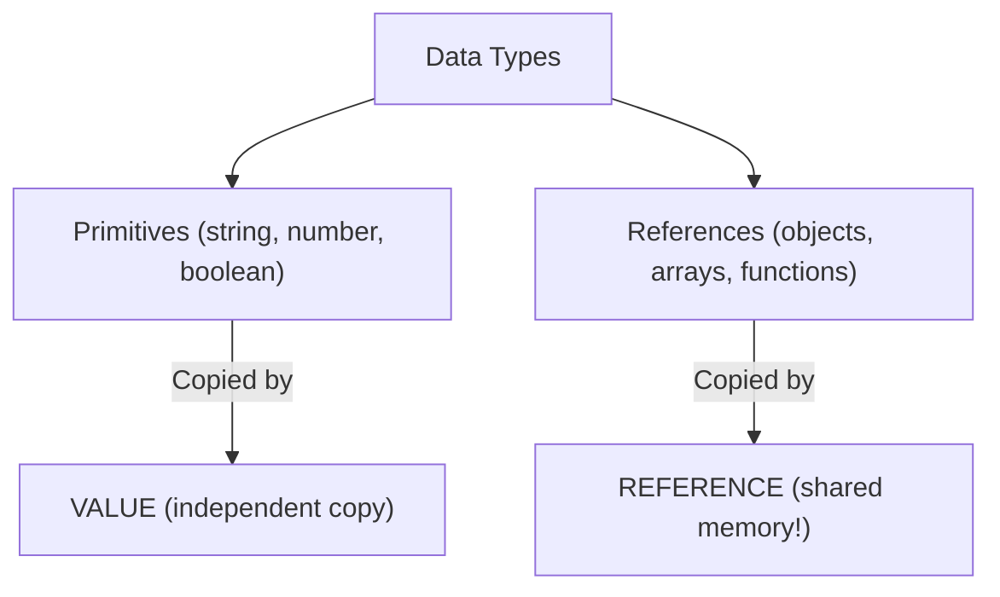
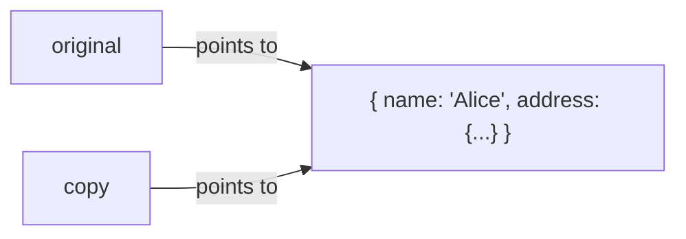
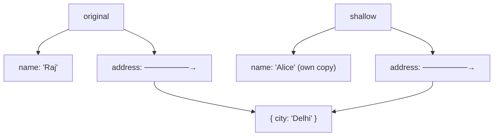

# 📋 Shallow Copy vs Deep Copy

Understanding the difference between shallow and deep copies is critical because JavaScript handles **primitive types** and **reference types** completely differently.



---

## 🧱 1. The Problem: Reference Sharing

When you assign an object to a new variable, you're NOT creating a copy — you're creating another **pointer** to the same memory location!

```javascript
const original = { name: "Raj", address: { city: "Mumbai" } };
const copy = original; // NOT a copy! Just another reference!

copy.name = "Alice";
console.log(original.name); // "Alice" — BOTH changed! 😱
```



---

## 📄 2. Shallow Copy

A shallow copy creates a **new object** and copies the top-level properties. But if a property is itself an object (nested), it still copies the **reference**, not the value!

### Methods to Shallow Copy:

```javascript
const original = { name: "Raj", scores: [10, 20] };

// Method 1: Spread operator (most common)
const copy1 = { ...original };

// Method 2: Object.assign()
const copy2 = Object.assign({}, original);

// Method 3: Array-specific
const arrCopy = [...original.scores];
```

### ⚠️ The Shallow Copy Trap:

```javascript
const original = { name: "Raj", address: { city: "Mumbai" } };
const shallow = { ...original };

shallow.name = "Alice";
console.log(original.name); // "Raj" ✅ — Top-level is independent!

shallow.address.city = "Delhi";
console.log(original.address.city); // "Delhi" ❌ — Nested object is SHARED!
```



---

## 🏊 3. Deep Copy

A deep copy recursively copies **everything** — including nested objects. The original and the copy are completely independent.

### Method 1: `JSON.parse(JSON.stringify())` (Quick & Dirty)

```javascript
const original = { name: "Raj", address: { city: "Mumbai" } };
const deep = JSON.parse(JSON.stringify(original));

deep.address.city = "Delhi";
console.log(original.address.city); // "Mumbai" ✅ — Completely independent!
```

**Limitations:**
- ❌ Loses `undefined`, `functions`, `Symbol`, `Date` objects, `RegExp`
- ❌ Cannot handle circular references
- ❌ Slow for very large objects

### Method 2: `structuredClone()` (Modern — Recommended! ✅)

```javascript
const original = { name: "Raj", date: new Date(), address: { city: "Mumbai" } };
const deep = structuredClone(original);

deep.address.city = "Delhi";
console.log(original.address.city); // "Mumbai" ✅
console.log(deep.date instanceof Date); // true ✅ — Date preserved!
```

**Advantages over JSON method:**
- ✅ Handles `Date`, `Map`, `Set`, `ArrayBuffer`, `RegExp`
- ✅ Handles circular references
- ❌ Still cannot clone functions or DOM nodes

---

## 📊 Summary Cheat Sheet

| Method | Type | Handles Nested? | Handles Functions? | Handles Dates? |
|:---|:---|:---|:---|:---|
| `=` assignment | ❌ No copy | ❌ | ✅ | ✅ |
| `{ ...obj }` / `Object.assign` | Shallow | ❌ | ✅ | ✅ |
| `JSON.parse(JSON.stringify())` | Deep | ✅ | ❌ | ❌ |
| `structuredClone()` | Deep | ✅ | ❌ | ✅ |
| Custom recursive / Lodash `_.cloneDeep` | Deep | ✅ | ✅ | ✅ |
\n\n## 🎯 Common Interview Questions\n\n**Q: How does `structuredClone()` differ from `JSON.parse(JSON.stringify())`?**\n- **A:** `structuredClone()` is a modern built-in API that can deep copy complex data types like `Date`, `Set`, `Map`, and cyclic references, which JSON serialization destroys or fails on.\n\n**Q: Does the Spread Operator (`...`) create a shallow or deep copy?**\n- **A:** It creates a **shallow copy**. Nested objects inside the copied object will still share the same memory reference as the original.