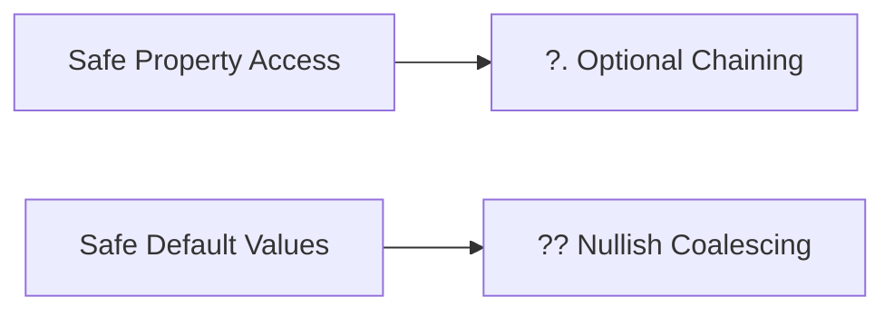
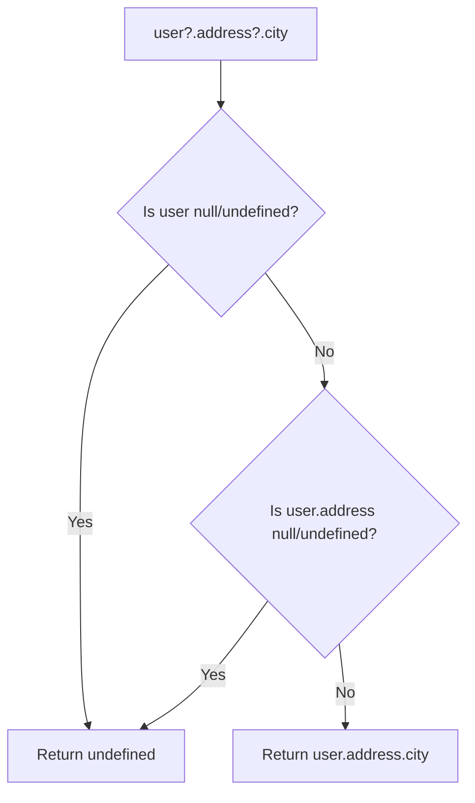
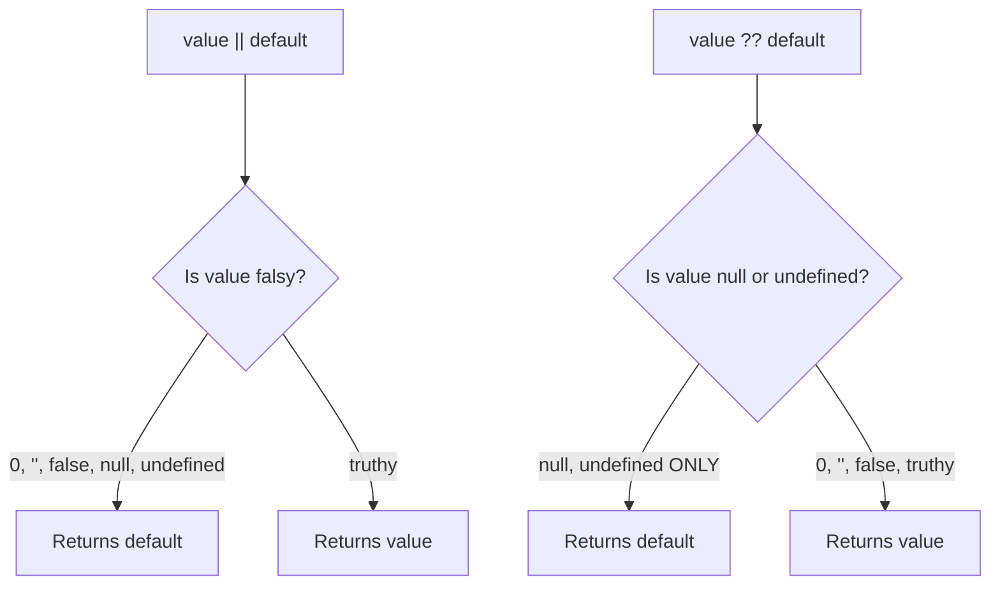

# ❓ Optional Chaining & Nullish Coalescing

Two modern JavaScript operators that make dealing with `null` and `undefined` values much safer and cleaner.



---

## 🔗 1. Optional Chaining (`?.`)

The optional chaining operator `?.` lets you safely access deeply nested properties **without** manually checking if each level exists.

### The Problem:
```javascript
const user = { name: "Raj", address: null };

// Without optional chaining — CRASHES!
console.log(user.address.city); // ❌ TypeError: Cannot read property 'city' of null

// Old workaround — verbose and ugly
console.log(user.address && user.address.city); // undefined

// With optional chaining — clean! ✨
console.log(user?.address?.city); // undefined (no crash!)
```

### How it works:
`?.` checks if the value **before** it is `null` or `undefined`. If it is, it **short-circuits** and returns `undefined` instead of throwing an error.



### Works with methods and arrays too:
```javascript
const user = { name: "Raj" };

// Optional method call — won't crash if method doesn't exist
user.greet?.(); // undefined (no error)

// Optional array access
const arr = null;
arr?.[0]; // undefined (no error)
```

---

## 🔄 2. Nullish Coalescing (`??`)

The nullish coalescing operator `??` provides a default value, but **only** when the left side is `null` or `undefined`.

### The Problem with `||`:
The logical OR `||` operator has a flaw: it treats `0`, `""`, and `false` as falsy, which is often not what you want!

```javascript
const count = 0;
const result1 = count || 10; // 10 — WRONG! 0 is a valid count!
const result2 = count ?? 10; // 0  — CORRECT! 0 is not null/undefined
```



### Examples:
```javascript
// || treats 0, "", false as falsy
"" || "default"     // "default"
0 || 42             // 42
false || true       // true

// ?? only cares about null/undefined
"" ?? "default"     // "" (empty string is NOT null/undefined)
0 ?? 42             // 0 (zero is NOT null/undefined)
false ?? true       // false (false is NOT null/undefined)
null ?? "fallback"  // "fallback" ✅
undefined ?? "fallback" // "fallback" ✅
```

---

## 🤝 3. Using Them Together

Optional chaining and nullish coalescing are a perfect pair:

```javascript
const user = {
    name: "Raj",
    settings: null
};

// Safely access nested property AND provide a default!
const theme = user?.settings?.theme ?? "dark";
console.log(theme); // "dark"
```

---

## 📊 Quick Reference

| Operator | Purpose | Triggers on |
|:---|:---|:---|
| `?.` | Safe property access | `null` or `undefined` |
| `??` | Default value | `null` or `undefined` only |
| `\|\|` | Default value (old way) | Any falsy value (`0`, `""`, `false`, `null`, `undefined`) |
\n\n## 🎯 Common Interview Questions\n\n**Q: What is the difference between Nullish Coalescing (`??`) and Logical OR (`||`)?**\n- **A:** `||` falls back on *any* falsy value (like `0`, `""`, `false`). `??` only falls back if the value is strictly `null` or `undefined`. This makes `??` much safer when `0` or `""` are valid values.