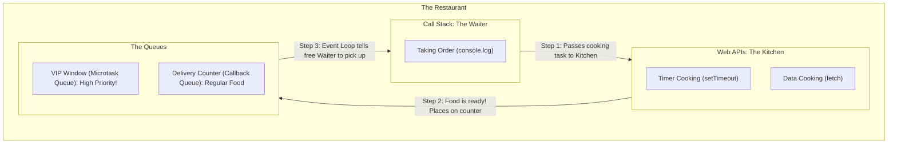
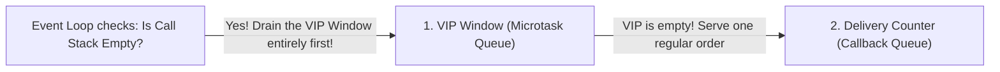

# 🔄 The Event Loop & The Restaurant Analogy

JavaScript is a **synchronous, single-threaded language**. It only has one thread of execution, meaning it can literally only do **one thing at a time**. 

So how can it handle timers, network requests, and heavy tasks without freezing the entire browser? Enter the **Web APIs** and the **Event Loop**.

To understand how this works without confusing jargon, let's look at the **Restaurant Analogy**.

---

## 🍽️ 1. The Restaurant Analogy

Imagine a busy restaurant.

- **The Waiter (Call Stack):** There is only ONE waiter in this restaurant (Single-Threaded). The waiter can only do one thing at a time: take an order, serve a dish, or clean a table.
- **The Kitchen (Web APIs):** The kitchen runs in the background. It has many chefs who can cook multiple meals at the same time (timers, network requests, DOM events).
- **The Delivery Counter (Callback Queue / Macrotask Queue):** When the kitchen finishes cooking a regular meal, they place it on this counter. The waiter will pick it up when they are free.
- **The VIP Window (Microtask Queue):** When the manager has an urgent request (Promises), it goes to this special VIP window. The waiter **must** serve everything in the VIP window before serving the regular food on the Delivery Counter.
- **The Maître D' (The Event Loop):** A manager whose *only job* is to constantly watch the Waiter and the Counters. If the Waiter is idle (Call Stack is empty), the Maître D' tells the Waiter to pick up food from the VIP Window first, and if that's empty, pick up food from the Delivery Counter.



---

## 💻 2. The Code Translation

Let's translate the restaurant analogy into actual code execution:

```javascript
console.log("Start");

setTimeout(function timerCallback() {
    console.log("Timer");
}, 5000);

console.log("End");
```

1. **Waiter takes order:** `console.log("Start")` goes to the Call Stack. Output: `Start`.
2. **Waiter passes order to kitchen:** The Call Stack hits `setTimeout`. It passes the 5-second timer to the Web APIs (The Kitchen). The Call Stack immediately moves on.
3. **Waiter takes next order:** `console.log("End")` goes to the Call Stack. Output: `End`.
4. **Kitchen cooks in background:** The Web API counts down 5 seconds. The rest of the app doesn't freeze!
5. **Food placed on counter:** After 5 seconds, the `timerCallback` is pushed to the Callback Queue (Delivery Counter).
6. **Maître D' checks:** The Event Loop checks if the Call Stack (Waiter) is empty. It is!
7. **Waiter serves food:** The Event Loop pushes `timerCallback` to the Call Stack. Output: `Timer`.

---

## 🚀 3. The Microtask Queue (VIP Window)

The Event Loop treats the Queues differently. It gives **absolute priority** to the Microtask Queue.

What goes in the VIP Microtask Queue?
- **Promises** (`.then()`, `.catch()`, `.finally()`)
- **Mutation Observers** (DOM change listeners)

What goes in the regular Callback (Macrotask) Queue?
- **Timers** (`setTimeout`, `setInterval`)
- **UI Events** (Clicks, Scrolls, Keypresses)
- **Network Callbacks**



> **The Starvation Problem:** Because the Event Loop *must* empty the entire Microtask Queue before touching the Callback Queue, if Microtasks keep generating more Microtasks endlessly, the regular Callback Queue will NEVER run! This is called **starvation**.

---

## 🧪 4. The Golden Rule of the Event Loop

To predict the output of any JavaScript code, memorize this sequence:

1. **Run ALL synchronous code** (Top-to-bottom on the Call Stack).
2. **Drain the ENTIRE Microtask Queue** (Promises). If a microtask creates another microtask, run it immediately!
3. **Execute EXACTLY ONE Macrotask** from the Callback Queue (like one `setTimeout` callback).
4. **Repeat Step 2** (Drain the Microtask Queue again).
5. **Repeat Step 3** (Execute the next Macrotask).

*(For advanced step-by-step code execution walkthroughs of the Event Loop, see `06-execution-walkthroughs.md`)*

---

## 🤯 5. The Biggest Misconception: "Who does the work?"

A very common interview question is: *"If JavaScript is single-threaded, how does the background work (like fetching data or counting a timer) actually happen while JS is busy?"*

**The Answer:** JavaScript does **not** do the background work! 

- The JavaScript Engine (V8) is single-threaded.
- But the **Browser** (or Node.js) is **Multi-Threaded**!

When you call `fetch()` or `setTimeout()`, JavaScript just says, *"Hey Browser, start this timer/network request in one of your background threads, and let me know when you're done."* 

1. The heavy lifting (waiting for the server, counting seconds) happens in the **Web APIs (written in C++ by the browser)**, totally outside of the JavaScript thread.
2. The queues (Microtask/Callback) do **zero computation**. They are literally just waiting rooms for the callbacks.
3. Once the callback moves from the queue back to the Call Stack, *then* the single JavaScript thread takes over again to run your final code.
\n\n## 🎯 Common Interview Questions\n\n**Q: What happens if a microtask keeps recursively queueing another microtask?**\n- **A:** It causes starvation. The Event Loop must drain the entire Microtask Queue before it moves on to the Macrotask Queue. A never-ending microtask loop will freeze the browser and prevent UI rendering or `setTimeout` callbacks from executing.