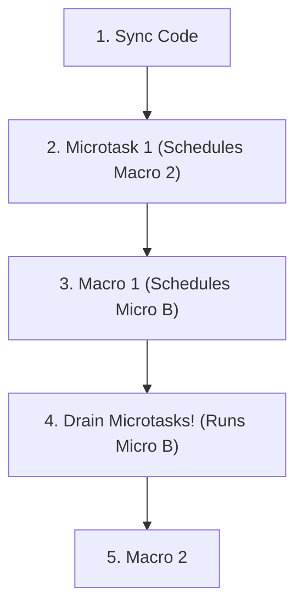

# 🕵️ Event Loop Execution Walkthroughs

To truly master the Event Loop, you must be able to trace how JavaScript executes complex asynchronous code step-by-step. Let's break down exactly what happens in the Call Stack, the Web APIs, and the Queues during execution.

---

## 🏃 Walkthrough 1: The Basics (Sync vs Macro)

```javascript
console.log("Start");

setTimeout(() => {
    console.log("Timer done");
}, 2000);

console.log("End");
```

### Execution Timeline:

**`t = 0` (Code begins executing)**
- `console.log("Start")` is pushed to the Call Stack.
- **Output:** `"Start"`
- Call Stack pops `console.log`.

**`t = 0` (Next line)**
- `setTimeout(...)` is pushed to the Call Stack.
- Call Stack sees it's an async Web API function. It hands the timer (2000ms) and the callback to the **Web APIs (Kitchen)**.
- Call Stack pops `setTimeout`.

**`t = 0` (Next line)**
- `console.log("End")` is pushed to the Call Stack.
- **Output:** `"End"`
- Call Stack pops `console.log`.
- *Call Stack is now empty. Event Loop starts checking queues.*

**`t = 2000ms` (Timer finishes)**
- The Web API finishes counting to 2000ms.
- It pushes the callback `() => { console.log("Timer done") }` into the **Callback Queue (Delivery Counter)**.

**`t = 2001ms` (Event Loop triggers)**
- **Event Loop checks:** Is Call Stack empty? Yes. Is Microtask Queue empty? Yes. Is Callback Queue empty? No!
- Event Loop moves the callback from the Callback Queue to the Call Stack.
- `console.log("Timer done")` executes.
- **Output:** `"Timer done"`
- Call Stack is empty. Program ends.

---

## 🏎️ Walkthrough 2: Macro vs Micro (The Interview Classic)

```javascript
console.log("1");

setTimeout(() => console.log("2"), 0);

Promise.resolve().then(() => console.log("3"));

console.log("4");
```

### Execution Timeline:

**`t = 0` (Synchronous Execution)**
1. `console.log("1")` runs. **Output: `1`**.
2. `setTimeout` runs. The Web API gets a 0ms timer. Because it's 0ms, it finishes *instantly* and pushes the callback `() => console.log("2")` to the **Callback Queue (Macrotask)**.
3. `Promise.resolve()` runs. It resolves instantly. Its `.then()` callback `() => console.log("3")` is pushed to the **Microtask Queue (VIP Window)**.
4. `console.log("4")` runs. **Output: `4`**.

**`t = 1` (Event Loop kicks in)**
- *The Call Stack is now empty! The synchronous code is done.*
- **Event Loop checks:** Are there any Microtasks? Yes! 
- It grabs `() => console.log("3")` from the VIP Microtask Queue and pushes it to the Call Stack.
- **Output: `3`**.
- *Microtask Queue is now empty.*

**`t = 2` (Macrotasks run)**
- **Event Loop checks:** Microtasks are empty. Are there any Macrotasks? Yes!
- It grabs `() => console.log("2")` from the Callback Queue and pushes it to the Call Stack.
- **Output: `2`**.

**Final Output:** `1`, `4`, `3`, `2`.

---

## 🤯 Walkthrough 3: The Boss Level (Nested Async)

What happens if a Microtask spawns a Macrotask, and a Macrotask spawns a Microtask?

```javascript
setTimeout(() => {
    console.log("Macrotask 1");
    Promise.resolve().then(() => console.log("Microtask inside Macro"));
}, 0);

Promise.resolve().then(() => {
    console.log("Microtask 1");
    setTimeout(() => console.log("Macrotask inside Micro"), 0);
});

console.log("Sync Code");
```

### Execution Timeline:

**Step 1: Synchronous Phase**
- Line 1: `setTimeout` sends Callback 1 to the **Callback Queue**.
- Line 6: `Promise.then` sends Callback A to the **Microtask Queue**.
- Line 11: `console.log` runs. **Output: `"Sync Code"`**.

**Step 2: Drain the Microtasks**
- Call Stack is empty. Event Loop checks Microtask Queue. It finds Callback A.
- Callback A runs: `console.log("Microtask 1")`. **Output: `"Microtask 1"`**.
- Callback A also runs `setTimeout`, which sends Callback 2 to the **Callback Queue**.
- *Microtask Queue is now empty.*

**Step 3: Run ONE Macrotask**
- Event Loop checks Callback Queue. It grabs the first one (Callback 1).
- Callback 1 runs: `console.log("Macrotask 1")`. **Output: `"Macrotask 1"`**.
- Callback 1 also creates a Promise, which sends Callback B to the **Microtask Queue**.
- *Wait! We DO NOT run the next Macrotask yet! After every single Macrotask, the Event Loop MUST check the Microtask queue again.*

**Step 4: Drain Microtasks Again**
- Event Loop checks Microtask Queue. It finds Callback B!
- Callback B runs. **Output: `"Microtask inside Macro"`**.
- *Microtask Queue is empty again.*

**Step 5: Run Next Macrotask**
- Event Loop checks Callback Queue. It grabs Callback 2.
- Callback 2 runs. **Output: `"Macrotask inside Micro"`**.
- Queues are empty. Program ends!

**Final Output:**
```
Sync Code
Microtask 1
Macrotask 1
Microtask inside Macro
Macrotask inside Micro
```


